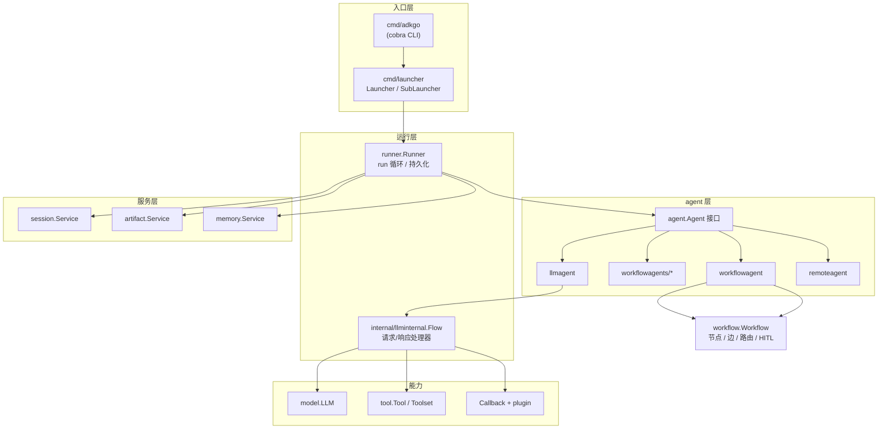

# ADK Go 是什么（Overview）

> ADK Go（`google.golang.org/adk/v2`）是 Google 的 Agent Development Kit 的 Go 实现：一套 code-first 的框架，用来构建、评测和部署 AI agent。它模型无关（默认优化 Gemini），把「agent、工具、会话状态、多 agent 编排、部署」拆成一组可替换的接口，本地的这份检出当前是 **2.x 线**。

## 涉及代码

- `go.mod` —— 模块路径 `google.golang.org/adk/v2`、`go 1.26.6`、全部依赖。
- `README.md` / `README-v2.md` —— 项目定位、安装方式、v2 的破坏性变更清单。
- `AGENTS.md` —— 仓库自己的开发约定：目录布局、命令、边界、测试回放机制。
- `plugin/agentanalytics/go.mod` —— 第二个 Go module。
- `internal/httprr/LICENSE` —— 唯一一处非 Apache 2.0 的例外。

## 定位与生态

ADK 是一个横跨多语言的家族，各实现共享概念模型但是**独立代码库**：

| 实现 | 仓库 | 与本仓库的关系 |
| --- | --- | --- |
| Python | `google/adk-python` | **行为的事实来源**：本仓库改行为前要求先读 Python 实现并引用文件与行号 |
| Go | `google/adk-go` | 本仓库 |
| Java / Kotlin / TypeScript | `google/adk-java` / `-kotlin` / `-js` | 遇到设计问题时可参考，已有解就照着做 |
| Web UI | `google/adk-web` | `webui` sublauncher 加载的前端资源 |

对使用者的定位是「cloud-native agent 应用」：Go 的并发模型与部署体验（单二进制、容器、Cloud Run）是这套实现的主要理由。

## 模块与版本线

- 模块路径带 `/v2` 后缀，**v2 是当前主线**：`main` 分支即 2.x。
- `v1` 是 1.x 的维护分支（远端分支 `upstream/v1`），只接受必须回补到 1.x 的修复。
- 仓库是**多模块**的：根模块 `google.golang.org/adk/v2` 加 `plugin/agentanalytics` 一个独立 module。`golangci-lint` 与 `go mod tidy` 都按模块运行，从根目录跑只覆盖根模块——因此本地开发要先建 `go.work`（详见 [02-getting-started.md](./02-getting-started.md)）。
- 本地 `go list ./...` 得到 171 个包，其中 52 个在 `internal/` 下（非公开 API），45 个在 `examples/` 下。

## v2 相对 1.x 的破坏性变更

本地 `README-v2.md` 记了两条，都是从调用方需要改代码的角度写的：

1. **`session.NewEvent` 现在要求 `context.Context` 作为第一个参数**：

   ```go
   func NewEvent(ctx context.Context, invocationID string) *Event
   ```

   事件 ID 与时间戳改由 `platform` 包提供，所以装在 ctx 上的 provider（`platform.WithTimeProvider`、`platform.WithUUIDProvider`）能控制它们。这让 workflow 引擎之类的调用方能产出**确定性、可重放**的事件。原来的无参形式与过渡用的 `NewEventWithContext` 都已移除。

2. **`ToolContext` 与 `CallbackContext` 合并为统一的 `agent.Context`**（PR #945）。影响的是测试替身：按旧接口写的 mock 会缺方法。两条出路是用 `agent.StrictContextMock` 嵌入（未覆写的方法会 panic，而不是静默返回零值），或者手工补齐那批方法。

   这一合并也解释了为什么工具实现里能直接拿到 `RequestConfirmation`、`SearchMemory` 这类能力——它们现在同属一个上下文面。

## 仓库布局

| 目录 | 职责 |
| --- | --- |
| `agent/` | agent 接口与各类型：`llmagent`、`remoteagent`、`workflowagent`；`workflowagents/` 下是 `loop`/`parallel`/`sequential` |
| `runner/` | 执行引擎，驱动 run 循环 |
| `workflow/` | 节点/图式工作流引擎 |
| `model/` | LLM 抽象（`gemini`、`apigee`、`openaimodel`） |
| `tool/` | Tool/Toolset 接口与内置工具（含 `skilltoolset/`、`mcptoolset/`） |
| `session/` | 会话状态与事件 |
| `memory/`、`artifact/` | 长期记忆与文件/数据服务 |
| `auth/` | 出站请求的凭据与认证 provider |
| `agentregistry/` | Google Cloud Agent Registry 客户端（A2A agent、MCP server、model） |
| `plugin/` | 跨阶段生命周期钩子；`plugin/agentanalytics` 是独立模块 |
| `server/` | HTTP 服务端（主推 `adkrest`；另有 `adka2a`、`agentengine`） |
| `cmd/` | CLI（`adkgo`）与服务启动器 |
| `telemetry/`、`util/` | 公开辅助包 |
| `platform/` | 时间与 UUID 的可替换接缝（确定性测试用） |
| `internal/` | 私有包，不是公开 API；`internal/httprr` 是 vendored 代码 |
| `examples/` | 可运行的示例 agent |
| `scripts/` | 仓库工具（ADK Web 容器构建与资源刷新） |

## 架构总览



要点：**入口层只负责把 agent 跑起来**（console、HTTP、A2A、触发式），**运行层负责一次运行的全部编排与落库**，**agent 层是可组合的执行单元**，**服务层是可替换的持久化后端**。四层之间靠接口而非具体类型连接，这是全仓库最重要的结构性约定。

## 贯穿全局的设计约定

这些是 `AGENTS.md` 明文写下的惯用法（idiom），读任何一页代码时都用得上：

- **接口优先**：核心抽象都是接口——`agent.Agent`、`tool.Tool`、`tool.Toolset`，以及 `session`/`artifact`/`memory` 各自定义的 `Service`。具体实现放在子包或 `internal/` 里，只有内存实现例外，它和接口放一起。
- **流式是默认形态**：agent 的运行结果是 `iter.Seq2[*session.Event, error]`，用 `for event, err := range …` 拉取，**不要**先收集成切片再处理。
- **回调优先于继承**：`Before*`/`After*` 钩子分 Agent / Model / Tool 三类。短路规则三者不同：模型与工具回调返回非 nil 结果**或**非 nil 错误都会短路；`BeforeAgentCallback` 只有返回非 nil content 才短路，返回错误只是把错误抛出，agent 仍会继续运行。
- **新构造器用 config struct**：`New(cfg Config)`（如 `runner.New`、`llmagent.New`、`agenttool.New`）。仓库里 `workflow.New` 与 `telemetry.New` 用的是 options 风格，属于历史写法——**新代码用 config struct，改老包就先跟着那个包的风格**。
- **错误用 `%w` 包**，哨兵错误是包级变量、用 `errors.Is` 判定，`%w` 不要退化成 `%v`。
- **不把用户内容写进日志或错误信息**：prompt、模型输出、工具参数与结果、会话内容、请求响应体、header、凭据都算，日志里只记形状（类型、数量、长度、自己生成的 ID）。
- **确定性靠 `platform` 接缝**：时间与 UUID 都从 ctx 上的 provider 取，测试里替换即可得到可重放的输出。

## 可观测与部署

- **遥测**是 OpenTelemetry 原生：`telemetry.New(ctx, opts...)` 装配 Tracer/Logger provider，ADK 内部按 GenAI 语义约定发 `invoke_agent`、`generate_content`、`execute_tool` 等 span，可导出到任意 OTLP HTTP 端点或 Google Cloud。见 [10-telemetry-observability.md](./10-telemetry-observability.md)。
- **部署**两条路：`adkgo deploy cloudrun` 与 `adkgo deploy agentengine`。同一个 agent 通过 launcher 关键字切换运行形态（console / web / api / a2a / 触发式）。见 [09-launcher-deployment.md](./09-launcher-deployment.md)。

## 许可与对外文档

- 许可：Apache 2.0（`LICENSE`），唯一例外是 vendored 的 `internal/httprr`（见其自带 `LICENSE`）。提交代码需要 CLA，且提交邮箱要用 GitHub 账号已验证的邮箱。
- 官方文档：`google.github.io/adk-docs`；面向 AI 编码助手的机器可读版本是 `adk.dev/llms.txt` 与 `adk.dev/llms-full.txt`。

## 相关页面

- [index.md](./index.md) —— 本 wiki 的首页与阅读路径。
- [02-getting-started.md](./02-getting-started.md) —— 装上并跑起来。
- [03-core-concepts.md](./03-core-concepts.md) —— 核心抽象逐个讲。
- [04-agent-execution.md](./04-agent-execution.md) —— 一次运行内部到底发生了什么。
- [14-api-reference.md](./14-api-reference.md) —— 全部公开包与代表符号。
