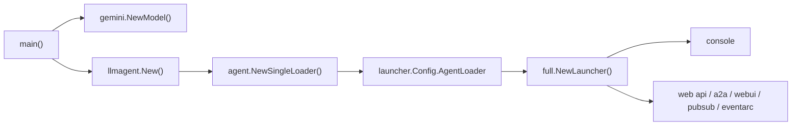

# 上手（Getting Started）

> 三步走：`go get google.golang.org/adk/v2` 引入依赖，用 `gemini.NewModel` + `llmagent.New` 写一个 agent，再用 `full.NewLauncher()` 把它跑起来（`console` 或 `web`）；开发本仓库本身则先建 `go.work`，再跑 build/test/lint/tidy。

## 涉及代码

- `go.mod` —— 声明模块路径 `google.golang.org/adk/v2` 与最低 Go 版本。
- `README.md` —— 安装命令与包文档入口。
- `AGENTS.md` —— 「Setup & core commands」「Definition of done」「Testing」三节是本地开发命令与测试录制规则的权威来源。
- `examples/quickstart/main.go` —— 官方最小可运行 agent：Gemini 模型 + `GoogleSearch` 工具 + `full.NewLauncher()`。
- `examples/README.md` —— launcher 的关键字与各子 launcher 的用途。
- `cmd/adkgo/adkgo.go`、`cmd/adkgo/internal/root/root.go` —— `adkgo` CLI 入口与根命令。
- `cmd/adkgo/internal/deploy/deploy.go` —— `adkgo deploy` 父命令。
- `cmd/adkgo/internal/deploy/cloudrun/cloudrun.go`、`cmd/adkgo/internal/deploy/agentengine/agentengine.go` —— 两个部署子命令及其 flag。
- `cmd/launcher/full/full.go`、`cmd/launcher/console/console.go`、`cmd/launcher/web/web.go` —— launcher 的实现与 flag。
- `internal/httprr/rr.go` —— HTTP 录制/回放（LLM 流量）。
- `internal/testutil/genai.go` —— 测试里构造录制/回放 `genai.ClientConfig` 的辅助函数。
- `session/vertexai/service_test.go` —— RPC 录制/回放（`rpcreplay`）与 `UPDATE_REPLAYS`。

## 安装

模块路径在 `go.mod` 第 1 行：`module google.golang.org/adk/v2`；`README.md` 给出的安装命令：

```bash
go get google.golang.org/adk/v2
```

最低 Go 版本由 `go.mod` 的 `go` 指令决定，本检出是：

```
go 1.26.6
```

ADK Go 采用**多模块**结构：根模块 `google.golang.org/adk/v2`，外加一个独立模块 `plugin/agentanalytics`。用 `find . -name go.mod` 能列出这两个模块，引入时默认只需根模块。

## 最小可运行 agent

`examples/quickstart/main.go` 是最小的完整程序，全部走真实导出符号：`gemini.NewModel` 建模型，`llmagent.New` 建 agent，`agent.NewSingleLoader` 包成 loader，交给 `full.NewLauncher()` 执行。

```go
package main

import (
	"context"
	"log"
	"os"

	"google.golang.org/genai"

	"google.golang.org/adk/v2/agent"
	"google.golang.org/adk/v2/agent/llmagent"
	"google.golang.org/adk/v2/cmd/launcher"
	"google.golang.org/adk/v2/cmd/launcher/full"
	"google.golang.org/adk/v2/model/gemini"
	"google.golang.org/adk/v2/tool"
	"google.golang.org/adk/v2/tool/geminitool"
)

func main() {
	ctx := context.Background()

	model, err := gemini.NewModel(ctx, "gemini-flash-latest", &genai.ClientConfig{
		APIKey: os.Getenv("GOOGLE_API_KEY"),
	})
	if err != nil {
		log.Fatalf("Failed to create model: %v", err)
	}

	a, err := llmagent.New(llmagent.Config{
		Name:        "weather_time_agent",
		Model:       model,
		Description: "Agent to answer questions about the time and weather in a city.",
		Instruction: "Your SOLE purpose is to answer questions about the current time and weather in a specific city.",
		Tools:       []tool.Tool{geminitool.GoogleSearch{}},
	})
	if err != nil {
		log.Fatalf("Failed to create agent: %v", err)
	}

	config := &launcher.Config{AgentLoader: agent.NewSingleLoader(a)}

	l := full.NewLauncher()
	if err := l.Execute(ctx, config, os.Args[1:]); err != nil {
		log.Fatalf("Run failed: %v\n\n%s", err, l.CommandLineSyntax())
	}
}
```

关键点：

- `gemini.NewModel(ctx context.Context, modelName string, cfg *genai.ClientConfig)`（`model/gemini/gemini.go`）返回 `model.LLM`。
- `llmagent.New(llmagent.Config) (agent.Agent, error)`（`agent/llmagent/llmagent.go`）；`Config` 里 `Tools` 是 `[]tool.Tool`。
- `agent.NewSingleLoader(a agent.Agent) agent.Loader`（`agent/loader.go`），把单个 agent 适配成 loader。
- `launcher.Config` 只要求 `AgentLoader` 非空；`cmd/launcher/launcher.go` 的 `Validate` 会先校验 compaction 配置。

运行方式（`examples/README.md`）：`full.NewLauncher()` 返回的是 universal launcher，第一个参数是子 launcher 关键字。

```bash
go run ./examples/quickstart console      # 默认，没有参数时即 console
go run ./examples/quickstart web api      # 只起 REST API
go run ./examples/quickstart web api webui # API + Web UI 资源
```

| 关键字 | 作用 |
|---|---|
| `console` | 终端交互；不传参数时的默认值 |
| `web api` | 提供 ADK REST API |
| `web a2a` | 以 A2A 协议暴露 agent |
| `web webui` | 提供 Web UI 静态资源，需与 `api` 搭配才有后端路由 |
| `web pubsub` | Pub/Sub 触发端点 |
| `web eventarc` | Eventarc 触发端点 |

`web` 后必须至少跟一个子 launcher，单独 `web` 会以 "no active sublaunchers found" 退出。可用关键字定义在 `cmd/launcher/console/console.go`、`cmd/launcher/web/web.go` 及各子包（`webui`、`a2a`、`api`、`triggers/pubsub`、`triggers/eventarc`）的 `Keyword()`。若部署环境只要 REST API 与 A2A，用 `cmd/launcher/prod` 的 `prod.NewLauncher()`。



## `cmd/adkgo` CLI

`adkgo` 是**部署与测试**用的 CLI（`cmd/adkgo/adkgo.go`），与 launcher 无关。根命令定义在 `cmd/adkgo/internal/root/root.go`（`RootCmd`，`Use: "adkgo"`）。它目前只有一个子命令树：

```
adkgo deploy            # cmd/adkgo/internal/deploy/deploy.go
adkgo deploy cloudrun   # cmd/adkgo/internal/deploy/cloudrun/cloudrun.go
adkgo deploy agentengine# cmd/adkgo/internal/deploy/agentengine/agentengine.go
```

两个部署子命令的 flag（均定义在各自文件的 `init()` 中）：

`deploy cloudrun`：

| flag | 缩写 | 默认 | 含义 |
|---|---|---|---|
| `--region` | `-r` | 空 | GCP Region |
| `--project_name` | `-p` | 空 | GCP Project |
| `--service_name` | `-s` | 空 | Cloud Run 服务名 |
| `--temp_dir` | `-t` | 空（用 `os.TempDir()`） | 构建临时目录 |
| `--proxy_port` | | `8081` | 本地代理端口 |
| `--server_port` | | `8080` | 服务端口 |
| `--entry_point_path` | `-e` | 空 | Go `main` 入口路径 |
| `--a2a` | | `true` | 启用 A2A |
| `--a2a_agent_url` | `-a` | `http://127.0.0.1:8081` | 公开 agent card 里宣告的 A2A URL |
| `--api` | | `true` | 启用 REST API |
| `--debug_api` | | `false` | 在 REST API 中开 debug（依赖 `--api`） |
| `--webui` | | `true` | 启用 Web UI |
| `--pubsub` / `--eventarc` | | `false` | 启用对应触发器子路由 |

`deploy agentengine`：

| flag | 缩写 | 默认 | 含义 |
|---|---|---|---|
| `--region` | `-r` | 空 | GCP Region |
| `--project_name` | `-p` | 空 | GCP Project |
| `--name` | `-s` | 空 | Agent Engine 名称 |
| `--temp_dir` | `-t` | 空 | 构建临时目录 |
| `--server_port` | | `8080` | 服务端口 |
| `--entry_point_path` | `-e` | 空 | Go `main` 入口路径 |
| `--source_dir` | `-d` | 空（当前工作目录） | 要打包的目录 |
| `--agent_engine_id` | | 空 | 要更新的实例 ID，空表示新建 |
| `--mem_deploy` | | `false` | 同时部署 memory bank |
| `--mem_model` | | `publishers/google/models/gemini-2.5-flash` | memory 生成模型 |
| `--mem_ttl` | | `8760h` | memory TTL |

例：

```bash
go run ./cmd/adkgo deploy cloudrun -r=us-central1 -p=my-project \
    -s=my-service -e=./examples/quickstart/main.go
```

## 本地开发环境

本仓库是多模块的，直接 `go build ./...` 只会覆盖当前所在模块，所以先建 Go workspace（`AGENTS.md`）：

```bash
test -f go.work || go work init
go work use -r .
```

`go.work` 是本地的、被 gitignore；`go work init` 在文件已存在时会失败，所以先 `test -f`。没有 `go.work` 时 `work` 模式会静默退化成单模块且仍退出 0，所以构建前先确认 workspace 存在。

在仓库根运行（命令全部取自 `AGENTS.md` 的 Setup & core commands）：

| 任务 | 命令 | 作用域 |
|---|---|---|
| Build | `go build -mod=readonly work` | workspace 全量 |
| Test | `go test -race -mod=readonly -count=1 -shuffle=on work` | workspace 全量 |
| 单包测试 | `go test -race ./agent/...` | 指定包 |
| Lint | `golangci-lint run` | **单个模块** |
| Tidy 检查 | `go mod tidy -diff`（必须无输出） | **单个模块** |
| 格式化 | `golangci-lint fmt`（应用 gofumpt + goimports） | **单个模块** |

注意 `./...` 只匹配当前模块，`work` 模式覆盖 workspace 里所有模块。`golangci-lint` 与 `go mod tidy` 都是**按模块**跑的，所以从根目录跑只覆盖根模块；CI 的等价循环是：

```bash
for m in $(find . -name go.mod -not -path './.git/*' -exec dirname {} \;); do
  ( cd "$m" \
    && go mod tidy -diff \
    && go build -mod=readonly ./... \
    && go test -race -mod=readonly -count=1 -shuffle=on ./... \
    && golangci-lint run ) || echo "FAILED: $m"
done
```

安装 CI 固定版本的 linter（更新版本会报出 CI 没有的告警）：

```bash
go install github.com/golangci/golangci-lint/v2/cmd/golangci-lint@v2.3.1
```

「Definition of done」要求：`go build` 成功、`go test` 全绿、每个模块 `golangci-lint run` 无 finding、每个模块 `go mod tidy -diff` 无输出；新行为要有测试，且每个新测试都要在回退源码改动后见过它失败。

## 测试如何回放而不打真实模型

CI 里**没有任何真实 LLM 或网络调用**。两套彼此独立的录制回放机制：

**HTTP 录制（LLM 流量）—— `internal/httprr`**（vendored，见 `internal/httprr/LICENSE`）：

- 带 `testdata/*.httprr` 的包默认走 `internal/httprr` 回放，无需 flag、无需凭据。
- 每个 `.httprr` 是一次**请求—响应**交换的 HTTP 录制：曾对着真实模型采一次，之后每次测试重放，从而确定、无 API key。
- 典型用法在 `internal/testutil/genai.go`：`httprr.Open(rrfile, http.DefaultTransport)` 返回 `*RecordReplay`（实现 `http.RoundTripper`），`NewGeminiTestClientConfig` 把它塞进 `genai.ClientConfig.HTTPClient`；回放模式用假 key，录制模式才用真 key。
- 使用 `.httprr` 的包：`agent/llmagent`、`agent/remoteagent/v2`、`agent/workflowagents/parallelagent`、`internal/llminternal`、`model/gemini`、`plugin/functioncallmodifier`、`tool/functiontool`、`tool/mcptoolset`。

**RPC 录制（Agent Engine）—— `session/vertexai` + `cloud.google.com/go/rpcreplay`**：

- 文件是 `session/vertexai/testdata/*.replay`，由 `rpcreplay.NewRecorder` / `NewReplayer` 经 gRPC dial option 接入（`session/vertexai/service_test.go` 的 `setupReplay`）。
- 刷新用 `UPDATE_REPLAYS=true go test ./session/vertexai/...`；录制时会走真实 Agent Engine（需要活的后端），所以是显式动作。
- 缺少录制文件时测试会 skip，并提示重新生成的命令。

**`-httprecord` 是匹配文件路径的正则，不是测试名过滤器**（`internal/httprr/rr.go` 的 `Recording`）：

```go
re, _ := regexp.Compile(*record)
if re.MatchString(file) { ... }   // file 是录制文件的路径
```

录制对真实模型每次响应都不同，所以 pattern 要尽量窄。多数录制来自 subtest，用顶层测试名构造 pattern 会匹配不到任何文件、什么也不录、却仍退出 0。改一条交换的正常流程是先列目录、再精确点名文件：

```bash
ls agent/llmagent/testdata/*.httprr
go test ./agent/llmagent/ -run TestToolCallback \
    -httprecord='TestToolCallback_before_callback_response_used\.httprr$'
```

要重录整包则跑 `go generate ./<pkg>/...`：各包的 `//go:generate go test -httprecord=…` 指令被切分到互不重叠，保证每条录制只采一次（由 `internal/httprr_directives_test.go` 的测试守住）。不要改 `internal/httprr` 的 vendored 代码。

## 跑示例需要哪些环境变量

变量名取自 `examples/` 下的真实代码（`os.Getenv`）。**只列名字，值一律不入库**。

| 变量名 | 用在哪 | 用途 |
|---|---|---|
| `GOOGLE_API_KEY` | 几乎所有用 Gemini 的示例 | Gemini API key |
| `GOOGLE_CLOUD_PROJECT` | `agentengine`、`agentregistry/*`、`vertexai` | GCP 项目 |
| `GOOGLE_CLOUD_LOCATION` | `vertexai`、`agentregistry/*` | GCP 区域 |
| `GOOGLE_CLOUD_AGENT_ENGINE_LOCATION` | `agentengine` | Agent Engine 区域 |
| `GOOGLE_CLOUD_AGENT_ENGINE_ID` | `agentengine` | Agent Engine 实例 ID |
| `VERTEX_ENGINE_ID` | `vertexai/agent.go` | Reasoning Engine ID |
| `OPENAI_API_KEY` | `openai` | OpenAI（或兼容端点）key |
| `OPENAI_BASE_URL` | `openai` | 兼容端点 base URL，空则 api.openai.com |
| `OPENAI_MODEL` | `openai` | 模型名 |
| `AGENT_MODE` | `mcp` | 选 `local`（默认）或 `github` |
| `GITHUB_PAT` | `mcp` | GitHub 远端 MCP server 的 PAT |
| `REGISTRY_AGENT` | `agentregistry/a2a` | 要发布/联系的 registry agent |
| `REGISTRY_TOOL` | `agentregistry/bind` | 要绑定的 registry tool |
| `REGISTRY_FILTER` | `agentregistry/discover` | 浏览 catalog 时的过滤条件 |
| `A2A_ADDR` | `agentregistry/a2a` | A2A 监听地址 |

`gemini.NewModel` 在同时给了 `GOOGLE_CLOUD_PROJECT` 等 Vertex 配置时会走 Vertex AI（由 `genai` SDK 判定，示例 `agentregistry/bind/main.go` 的注释里提到 `GOOGLE_GENAI_USE_VERTEXAI` 开关）。

## 相关页面

- [ADK Go 概览](./01-overview.md) —— 模块划分与 v2 线，先建立整体认识。
- [核心概念](./03-core-concepts.md) —— agent、InvocationContext、Session/Event、Callback 与 Plugin。
- [Agent 执行](./04-agent-execution.md) —— Runner 如何驱动 run loop，quickstart 背后发生了什么。
- [启动器与部署](./09-launcher-deployment.md) —— `cmd/adkgo`、launcher、`adkrest`、Web UI 的完整说明。
- [示例导览](./13-examples.md) —— 每个 `examples/` 目录演示什么、怎么跑。
