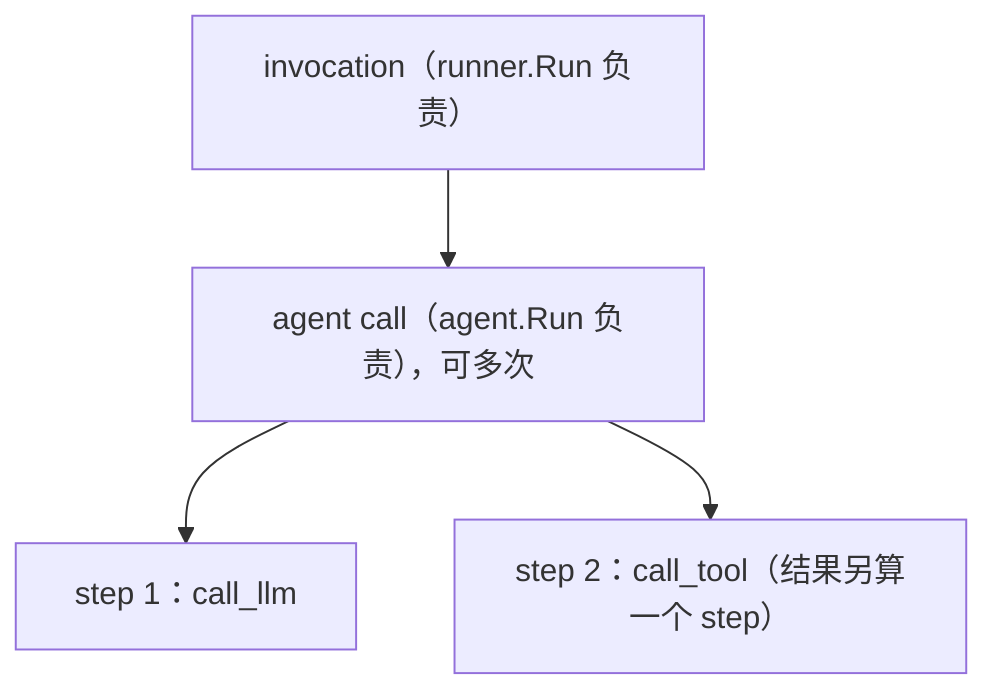
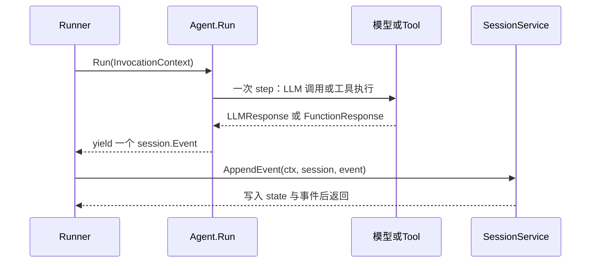

# 核心概念（Core Concepts）

> ADK Go 的全部抽象都围绕四组接口展开：`agent.Agent` 的流式运行、`agent.InvocationContext` 的执行上下文、`session` 包的事件与状态、以及 `tool` 与 `plugin` 的扩展点。

## 涉及代码

- `agent/agent.go` —— `Agent` 接口、`agent.New` 自定义 agent、`Config`、`Before/AfterAgentCallback` 类型。
- `agent/context.go`、`internal/context/` —— `InvocationContext` / `ReadonlyContext` / `Context` 三个上下文的接口与默认实现。
- `session/session.go`、`session/service.go`、`session/inmemory.go` —— `Session` / `Event` / `State` 定义、持久化接口 `Service`、内存实现与 state 分层。
- `tool/tool.go` —— `Tool`、`Toolset`、`Predicate`、`FilterToolset` 与确认相关的哨兵错误。
- `plugin/plugin.go` —— `plugin.Config`、`plugin.New` 以及各生命周期回调类型。
- `platform/time.go`、`platform/uuid.go` —— 可替换的时间/UUID provider，`session.NewEvent` 依赖它们。

## `agent.Agent` 接口与流式约定

所有 agent 都实现 `agent.Agent`（`agent/agent.go`）：

```go
type Agent interface {
	Name() string
	Description() string
	Run(InvocationContext) iter.Seq2[*session.Event, error]
	SubAgents() []Agent
	FindAgent(name string) Agent
	FindSubAgent(name string) Agent
}
```

- `Name()` / `Description()` 是身份信息。`Description` 会被 LLM 用来判断是否把控制权委托给该 agent，因此官方约定写一行即可。
- `SubAgents()` 返回直接子 agent；`FindAgent` / `FindSubAgent` 在树上按名字查找，用于 agent 转移。
- `Run` 是行为本体。它不返回结果切片，而返回 Go 1.23 的序列迭代器 `iter.Seq2[*session.Event, error]`：一次调用会陆续产出零到多个事件，最后一个 `error` 槽位只在出错时非 nil。

`Run` 返回的是迭代器而非切片，意味着**调用方必须消费它**，且事件的产出是拉取式的。标准消费方式：

```go
for event, err := range ag.Run(ctx) {
	if err != nil {
		// 处理错误；通常到此为止
		break
	}
	// 使用 event
}
```

`yield` 的布尔返回值是停止信号：消费方提前 `break`（即 yield 返回 false）时，产生方应立刻停止后续工作。因此不要把事件收集进 `[]*session.Event` 再处理，应边产边用。

自定义 agent 用 `agent.New(cfg Config)` 构造（`Config.Name` 不能是 `"user"`，该名字保留给终端用户输入），关键字段：

```go
type Config struct {
	Name, Description string
	SubAgents            []Agent
	BeforeAgentCallbacks []BeforeAgentCallback
	Run                  func(InvocationContext) iter.Seq2[*session.Event, error]
	AfterAgentCallbacks  []AfterAgentCallback
}
```

## InvocationContext：invocation / agent call / step 三层

`agent.InvocationContext`（`agent/context.go`）的文档注释直接给出了三个层级的定义，是全仓最权威的说明：

- **invocation**：以一条用户消息开始、以最终响应结束。可包含一次或多次 agent call，由 `runner.Run()` 负责。invocation 会持续运行 agent，直到该 agent 不再请求转移到另一个 agent。
- **agent call**：由 `agent.Run()` 负责，`agent.Run()` 结束即 agent call 结束。一个 agent call 可包含一个或多个 step。
- **step**：只调用 LLM 一次并产出其响应；若模型请求了工具，则再调用工具并产出结果。对函数响应做摘要算作另一个 step，因为那又是一次 LLM 调用。任一层调用 `EndInvocation()` 都会终止 step。



`InvocationContext` 本身内嵌 `context.Context`，关键方法：

| 方法 | 作用 |
| --- | --- |
| `Agent() Agent` | 当前正在运行的 agent |
| `Session() session.Session` | 当前会话 |
| `Artifacts() Artifacts` | 当前会话的 artifact 读写 |
| `Memory() Memory` | 当前 `user_id` 的跨会话记忆 |
| `InvocationID() string` | invocation 标识，事件的 `InvocationID` 来源 |
| `Branch() string` | 形如 `agent_1.agent_2.agent_3` 的分支路径，用于隔离并行子 agent 的历史 |
| `IsolationScope() string` | 非空时只有 scope 完全匹配的事件进入该 agent 的 prompt 历史 |
| `UserContent() *genai.Content` | 触发本次 invocation 的用户输入 |
| `RunConfig() *RunConfig` | 本次运行的运行时配置 |
| `EndInvocation()` / `Ended() bool` | 终止/查询是否终止本次 invocation |
| `ResumedInput(interruptID string) (any, bool)` | 取回 HITL 恢复负载 |
| `WithContext(ctx)` / `WithICDelta(d)` | 派生新上下文（分别覆盖内嵌 context / 应用增量） |

- `ReadonlyContext`：只读视图，额外提供 `UserContent`、`InvocationID`、`AgentName`、`ReadonlyState`、`UserID`、`AppName`、`SessionID`、`Branch`。传给 `Toolset.Tools` 和 `tool.Predicate` 的就是它。
- `Context`：面向回调和工具的完整可变上下文，在 `ReadonlyContext` + `InvocationContext` 之上增加 `State()`、`FunctionCallID()`、`Actions()`、`SearchMemory`，以及 HITL 的 `ToolConfirmation()` / `RequestConfirmation(hint, payload)`，还有工作流动态节点的 `Path()` / `RunID()` / `SubScheduler()` 等。

上述接口的默认实现位于 `internal/context/`：`NewInvocationContext`、`NewCallbackContext`、`NewCallbackContextWithDelta`、`NewReadonlyContext`。LLM agent 在循环中反复跑 step，直到出现最终响应、转移或 `EndInvocation()`。

## Session / Event / State

### Session

`session.Session`（`session/session.go`）是一个会话（一条聊天线程）的接口：

```go
type Session interface {
	ID() string
	AppName() string
	UserID() string
	State() State
	Events() Events
	LastUpdateTime() time.Time
}
```

`State` 提供 `Get` / `Set` / `All`（返回 `iter.Seq2[string, any]`），`ReadonlyState` 是其只读子集；`Events` 提供 `All() iter.Seq[*Event]`、`Len()`、`At(i)`。

持久化由 `session.Service` 承担：`Create` / `Get` / `List` / `Delete` / `AppendEvent`。`AppendEvent` 会**剥离 event 里的临时状态键**（见下文作用域）。默认实现是 `session.InMemoryService()`。

### Event

`Event` 内嵌 `model.LLMResponse`，再加上框架与存储写入的字段：

```go
type Event struct {
	model.LLMResponse                          // 内容、Partial、ErrorCode 等

	ID, InvocationID, Author, Branch, IsolationScope string
	Timestamp  time.Time
	Actions    EventActions
	LongRunningToolIDs, Routes []string
	RequestedInput *RequestInput   // 工作流 HITL 提示
	Output         any             // 工作流节点通用输出
	NodeInfo       *NodeInfo       // 工作流节点元数据，非工作流事件为 nil
}
```

`Author` 决定事件在对话里是谁说的；模型输出的 user 角色内容会被标成 `genai.RoleUser`，其余用当前 agent 的名字。`IsFinalResponse()` 判断该事件是否为某个 agent 的最终响应，它会把 `Actions.Compaction != nil` 的压缩记账事件排除，并在出现函数调用/响应、`Partial` 流式分片或末尾代码执行结果时返回 false。

### NewEvent 与 platform provider

构造事件用：

```go
func NewEvent(ctx context.Context, invocationID string) *Event
```

v2 起第一个参数是 `context.Context`（`README-v2.md` 记录了这次变更）。事件 ID 与时间戳不再直接取 `time.Now()` / 随机 UUID，而是走 `platform` 包：

- `platform.Now(ctx)`：ctx 上装了 `TimeProvider`（`platform.WithTimeProvider`）就用它，否则退回 `time.Now`。
- `platform.NewUUID(ctx)`：ctx 上装了 `UUIDProvider`（`platform.WithUUIDProvider`）就用它，否则退回随机 UUIDv4。

这让 workflow 引擎之类调用方可以产出确定性的、可重放的事件；`NewEvent` 还会把 `Actions.StateDelta` 与 `Actions.ArtifactDelta` 初始化成空 map，调用方写入时无需判 nil。

### EventActions

`EventActions` 描述事件携带的副作用：

```go
type EventActions struct {
	StateDelta                 map[string]any
	ArtifactDelta              map[string]int64
	RequestedToolConfirmations map[string]toolconfirmation.ToolConfirmation
	SkipSummarization          bool
	TransferToAgent            string
	Escalate                   bool
	Compaction                 *EventCompaction
}
```

- `StateDelta`：本次事件要写入的状态增量，按 key 前缀路由到不同作用域（见下）。
- `ArtifactDelta`：artifact 变更，key 是文件名、value 是版本号。
- `RequestedToolConfirmations`：HITL 工具确认请求。
- `SkipSummarization`：不再调用模型总结函数响应，仅对函数响应事件有效。
- `TransferToAgent`：请求把控制权转移给指定 agent；`Escalate` 表示向更上层 agent 升级。
- `Compaction`：由框架写入的上下文压缩记录，**不是**工具或回调能设置的字段——它在所有把调用方 actions 拷到事件上的地方都会被清掉（`agent/agent.go` 的 `eventActionsFrom` 即做此事）。

### 状态作用域

状态按 key 前缀分四级，前缀常量定义在 `session/session.go`：

| 常量 | 值 | 作用域 |
| --- | --- | --- |
| `session.KeyPrefixApp` | `"app:"` | 应用级，同一 app 下所有用户、所有会话共享 |
| `session.KeyPrefixUser` | `"user:"` | 用户级，同一 app、同一 `user_id` 下所有会话共享 |
| `session.KeyPrefixTemp` | `"temp:"` | 仅当前 invocation，invocation 结束即丢弃 |
| （无前缀） | —— | 会话级，仅属于当前 session |

路由发生在会话服务 `AppendEvent` 时。`internal/sessionutils.ExtractStateDeltas` 把 delta 拆成 app / user / session 三份：`app:` 与 `user:` 前缀被剥掉后归入对应级别的存储，`temp:` 键被忽略，其余无前缀键归 session。

`temp:` 的语义是 **event 里可见、持久化时被剥离**：`session/inmemory.go` 的 `trimTempDeltaState` 在追加前删掉所有 `temp:` 开头的 StateDelta 键，因此它不会写入 session 存储。

## Tool 与 Toolset

`tool.Tool` 是工具的最小身份（`tool/tool.go`）：

```go
type Tool interface {
	Name() string
	Description() string
	IsLongRunning() bool
}
```

`IsLongRunning` 为 true 表示该操作先返回资源 id、稍后才完成。

`tool.Toolset` 是工具的集合，可动态决定暴露哪些工具：

```go
type Toolset interface {
	Name() string
	Tools(ctx agent.ReadonlyContext) ([]Tool, error)
}
```

`Tools` 接收 `ReadonlyContext`，所以能依据 invocation 状态过滤；`tool.FilterToolset(ts, predicate)` 与 `tool.AllowedToolsPredicate(names)` 是现成的过滤组合子。

真正可执行的工具在 `Tool` 之上再实现一个（包内私有）接口，形状定义在 `internal/toolinternal/tool.go`：

```go
type FunctionTool interface {
	tool.Tool
	Declaration() *genai.FunctionDeclaration
	Run(ctx agent.Context, args any) (result map[string]any, err error)
}
type StreamingFunctionTool interface {
	tool.Tool
	Declaration() *genai.FunctionDeclaration
	RunStream(ctx agent.Context, args any) iter.Seq2[string, error]
}
```

一次调用如何变成一次执行、再回到事件流：

1. `Declaration()` 给 LLM 的函数声明被装进模型请求（`ProcessRequest` / `toolutils.PackTool`）。
2. 模型返回带 `FunctionCall` 的响应部分。flow 按名字解析出具体工具，构造 `agent.Context` 并调用其 `Run`（流式工具走 `RunStream`）。
3. 返回的 `map[string]any` 被编码成 `FunctionResponse`，放进后续事件；`RunStream` 则逐个 chunk 产出。
4. 需要 HITL 时，工具通过 `ctx.RequestConfirmation` 升起确认请求，并返回哨兵错误 `tool.ErrConfirmationRequired`；用户拒绝则返回 `tool.ErrConfirmationRejected`。

## Callback 与 Plugin

回调按介入点分三类：

- **Agent 级**（`agent/agent.go`）：`BeforeAgentCallback` / `AfterAgentCallback`，签名均为 `func(Context) (*genai.Content, error)`。
- **Model 级**（`agent/llmagent/llmagent.go`）：`BeforeModelCallback`、`AfterModelCallback`、`OnModelErrorCallback`。
- **Tool 级**（同文件）：`BeforeToolCallback`、`AfterToolCallback`、`OnToolErrorCallback`。

### Before 回调的短路规则

这是最容易混淆的一点，规则在代码里可以得到逐一验证：

- **模型 / 工具回调**：返回**非 nil 结果或非 nil error** 都短路。`internal/llminternal/base_flow.go` 中 `BeforeModelCallbacks` 的循环是 `if callbackResponse != nil || callbackErr != nil { yield(...); return }`——两种情况都跳过真正的模型调用。`invokeBeforeToolCallbacks` 遇 `err != nil` 立刻 `return nil, err`，遇非 nil `result` 立刻返回该结果，两者都停止后续回调与真实工具调用。要让工具仍然执行、只改参数，就原地改 `args` 后返回 `(nil, nil)`。
- **`BeforeAgentCallback`**：只有返回**非 nil content** 才短路。`runBeforeAgentCallbacks` 在拿到非 nil content 时创建事件并调用 `ctx.EndInvocation()`，随后 `Run` 检查 `Ended()` 为真即跳过 agent 主体。若返回 **error，则把错误产物 yield 出去，但不阻止 agent 继续运行**（`Run` 中 yield 后并不 return，`Ended()` 仍为 false）。

`Plugin` 把这些回调打包成可复用的跨切面单元（`plugin/plugin.go`）：

```go
p, err := plugin.New(plugin.Config{
	Name:                "my-plugin",
	BeforeAgentCallback: ..., // agent.BeforeAgentCallback
	BeforeModelCallback: ..., // llmagent.BeforeModelCallback
	BeforeToolCallback:  ..., // llmagent.BeforeToolCallback
	OnEventCallback:     ..., // func(agent.InvocationContext, *session.Event) (*session.Event, error)
	CloseFunc:           ...,
})
```

`Config` 覆盖了两条轴：run/agent/model/tool 各级的 `Before*` / `After*` / `On*Error`，外加 `OnUserMessageCallback`（可替换用户消息）与 `OnEventCallback`（可替换事件）。插件通过 runner 配置注册后，由 `internal/plugininternal.PluginManager` 按顺序分发。

内置插件（`plugin/` 各子目录）：

- `plugin/loggingplugin` —— `loggingplugin.New(name)`，记录各级生命周期日志。
- `plugin/functioncallmodifier` —— `functioncallmodifier.NewPlugin(cfg)`，改写模型的函数调用。
- `plugin/retryandreflect` —— `retryandreflect.New(opts...)`，工具失败时重试并让模型反思。
- `plugin/agentanalytics` —— 独立 Go module，`NewBigQueryAgentAnalyticsPlugin` 把 agent 运行写入 BigQuery。

## 一次 run 的时序



`Runner.Run` 产出 `iter.Seq2[*session.Event, error]`：每拿到一个事件就交给 `session.Service.AppendEvent` 落库，并继续 yield 给上层。

## 相关页面

- [ADK Go 是什么](./01-overview.md) —— 模块划分与 v2 多模块布局，是理解这些接口所在包的前提。
- [Agent 执行](./04-agent-execution.md) —— Runner 如何驱动 `Agent.Run`、LLM flow、流式聚合与 agent 转移。
- [Agent 类型](./05-agent-types.md) —— `llmagent`、workflow agents、remote agent 与自定义 agent 的实现差异。
- [工具系统](./06-tool-system.md) —— functiontool、schema、确认与长任务、MCP 与内置工具的细节。
- [服务层](./08-service-layer.md) —— session / artifact / memory 服务与各后端、Event 结构在存储层的处理。
- [进阶主题](./12-advanced-topics.md) —— 流式、层级与 parent map、state 作用域、事件重排与插件的深入讨论。
