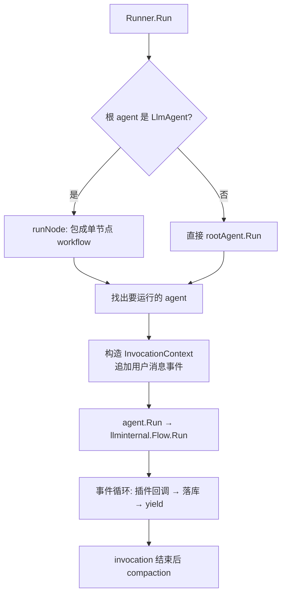
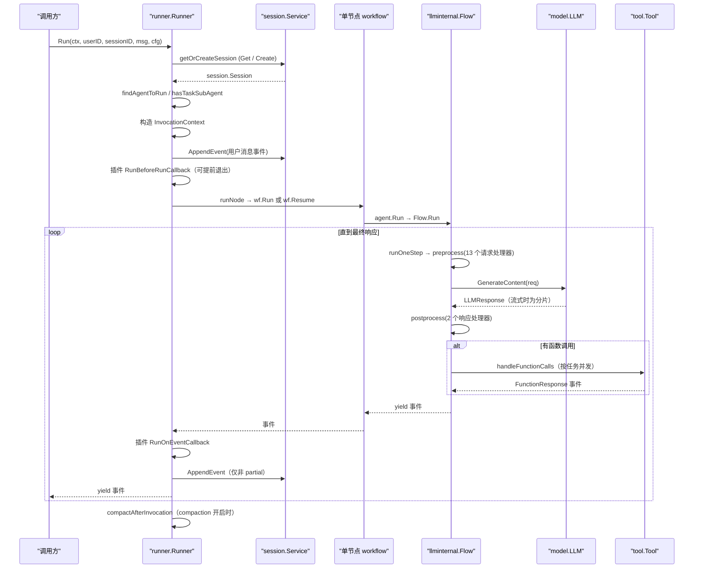

# 代理执行（Agent Execution）

> `runner.Run` 把一条用户消息变成一串有序事件：选 agent、组装请求、调模型、跑工具、产出事件、按需持久化，并在模型要求时把控制权转交给别的 agent——全程由 `internal/llminternal.Flow` 驱动、由 `runner.Runner` 编排与落库。

## 涉及代码

- `runner/runner.go` —— `Runner`、`Config`、`New`、`NewInMemory`、`Run`/`RunLive` 入口，以及 `findAgentToRun`、`isTransferableAcrossAgentTree`、`appendMessageToSession`。
- `runner/run_node.go` —— LlmAgent 根走的“节点路径”：`runNode`、`buildRunnerNode`、`rootWorkflowName`、`newNodeInvocationContext`、`buildResumeResponses`、`resolveInvocationID`。
- `runner/agent_node.go` —— 把任意 `agent.Agent` 包成 workflow 节点：`newAgentNode`、`runAgentNodeBody`、`runLlmAgentBody`、`runGenericAgentBody`。
- `internal/llminternal/base_flow.go` —— `Flow`、`DefaultRequestProcessors`、`DefaultResponseProcessors`、`Run`/`runOneStep`/`preprocess`/`callLLM`/`postprocess`/`handleFunctionCalls`。
- `internal/llminternal/agent_transfer.go` —— `AgentTransferRequestProcessor`、`NewTransferToAgentTool`、`TransferToAgentTool`、`transferTargets`、`shouldUseAutoFlow`。
- `internal/llminternal/stream_aggregator.go` —— `streamingResponseAggregator`、`NewStreamingResponseAggregator`、`ProcessResponse`、`Close`。
- `internal/llminternal/basic_processor.go`、`tools_processor.go`、`request_confirmation_processor.go`、`instruction_processor.go`、`identity_request_processor.go`、`compaction_processor.go`、`contents_processor.go`、`other_processors.go`、`outputschema_processor.go`、`file_uploads_processor.go` —— 13 个默认请求处理器与 2 个响应处理器的实现。
- `agent/llmagent/llmagent.go` —— `llmAgent.run` 装配 `llminternal.Flow`（注入 `DefaultRequestProcessors`/`DefaultResponseProcessors` 与 agent 级回调）。
- `agent/llmagent/llm_agent_wrapper.go` —— `RunLLMAgentAsNode` 按 `Mode` 分派：`runChat`（协调者）、`runTask`（任务型）、single_turn。
- `internal/agent/parentmap/map.go` —— `Map`、`New`、`RootAgent`、`ToContext`/`FromContext`，是转移与请求处理器读取层级关系的依据。
- `model/gemini/gemini.go`、`model/openaimodel/openai.go` —— 各自在 `generateStream` 里用 `NewStreamingResponseAggregator` 聚合流式分片。

## 两条执行路径

`Runner.Run` 按根 agent 的类型分为两条路径（`runner/runner.go`）：

- **节点路径（node path）**：根是 LlmAgent（`isLlmAgent` 为真，即实现了 `llminternal.Agent`）。它把 agent 包成单节点 workflow（`START -> node`），统一走 workflow 引擎，对应 adk-python 的 `_run_node_async`。根 agent 必须是 `ModeChat`，否则直接报错。
- **agent 路径**：根不是 LlmAgent 时，直接 `rootAgent.Run(ctx)`，把 `parentmap`/`runconfig`/`plugininternal`/`compactionctx` 塞进 `context.Context`。

两条路径后续的事件处理循环几乎一致：插件 `RunOnEventCallback` → 非 partial 事件 `AppendEvent` → yield，最后做一次 invocation 结束后的压缩（compaction）。



## Runner 的构造

`runner.New(cfg Config)`（`runner/runner.go`）要求的真实字段：

```go
type Config struct {
    AppName        string
    Agent          agent.Agent       // 根 agent，必需
    SessionService session.Service   // 必需
    ArtifactService artifact.Service // 可选
    MemoryService   memory.Service   // 可选
    PluginConfig    PluginConfig     // 可选
    AutoCreateSession bool
    Compaction      *compaction.Config // 可选，nil 表示关闭
}

type PluginConfig struct {
    Plugins      []*plugin.Plugin
    CloseTimeout time.Duration
}
```

`New` 做的事：校验 `Agent`/`SessionService` 非 nil；用 `parentmap.New(cfg.Agent)` 建父表（保证每个 agent 至多一个父、名字在树内唯一、根名不被重复引用，否则报错）；建 `plugininternal.PluginManager`；调用 `resolveCompactionConfig`（`Compaction` 非 nil 但没给 `Summarizer` 时，会在根 agent 的模型上装一个 `compaction.LLMSummarizer`，超时用包级变量 `defaultSummarizerTimeout`，默认 `60 * time.Second`）。

便捷构造 `NewInMemory(appName, agent.Agent)` 用内存版 session/artifact/memory 服务并打开 `AutoCreateSession`。

## Run 入口签名

```go
func (r *Runner) Run(ctx context.Context, userID, sessionID string, msg *genai.Content,
    cfg agent.RunConfig, opts ...RunOption) iter.Seq2[*session.Event, error]

func (r *Runner) RunLive(ctx context.Context, userID, sessionID string,
    cfg agent.LiveRunConfig, opts ...RunOption) (agent.LiveSession, iter.Seq2[*session.Event, error], error)
```

`Run` 返回惰性迭代器，必须被消费。`RunOption` 有 `WithStateDelta(map[string]any)` 和 `WithYieldUserMessage()`（后者只在节点路径生效）。`agent.RunConfig` 只有两个字段：`StreamingMode`（`StreamingModeNone` / `StreamingModeSSE` / `StreamingModeBidi`）与 `SaveInputBlobsAsArtifacts`。

## 一次 Run 内部按顺序发生什么

`Runner.Run` 的主体（`runner/runner.go`）与节点路径（`runner/run_node.go`）顺序如下：



逐步说明：

1. `getOrCreateSession`：先 `sessionService.Get`；失败且 `AutoCreateSession` 为真则 `Create`。
2. 选择要运行的 agent：LlmAgent 根且存在 task 模式子 agent 时直接跑根（由 wrapper 负责委派）；否则 `findAgentToRun` 从 session 历史倒序找最近的、可转移的 agent，找不到就回退根 agent。
3. 构造 `agent.InvocationContext`：绑定 session、agent、用户内容、`RunConfig`、`InvocationID`（`resolveInvocationID` 对 HITL 恢复复用被回答调用所在事件的 invocation ID，否则由 `icontext.NewInvocationContext` 用 `"e-" + platform.NewUUID` 新铸）。
4. `appendMessageToSession`：先跑插件 `RunOnUserMessageCallback`；`SaveInputBlobsAsArtifacts` 为真时把 `InlineData` 存成 artifact 并替换为文本占位；生成 author 为 `"user"` 的事件并 `AppendEvent`。节点路径在 `WithYieldUserMessage()` 下会把这条事件先 yield 出去。
5. 插件生命周期：`defer RunAfterRunCallback`；`RunBeforeRunCallback` 返回内容或错误时提前产出一条 user 事件并结束本次 invocation。
6. 节点路径额外两步：`wf.ReconstructRunState(storedSession, invocationID)` 重建暂停状态；`buildResumeResponses` 若发现本轮 function response 命中了待恢复的 interrupt，就调用 `wf.Resume`，否则 `wf.Run`。
7. 事件循环：`event.Author` 为空时补成当前 agent 名；`MessageAsOutput` 且非 partial 时清空 `Output`；跑插件 `RunOnEventCallback`（`fromPlugin` 会把框架写入的 `Actions.Compaction` 记录恢复回去，插件不能伪造它）；仅 `!event.LLMResponse.Partial` 的事件才 `AppendEvent`；随后 yield。
8. `compactOnce`：invocation 正常结束且所有事件已落库后执行一次 `compactAfterInvocation`（滑动窗口压缩）。任何一步 yield 过 error 会把 `invocationFailed` 置真并跳过压缩。`RunLive` 不参与压缩（live 每次不重发历史）。

## LLM Flow：runOneStep 与 Run 循环

`llmAgent.run`（`agent/llmagent/llmagent.go`）为每次运行新建一个 `llminternal.Flow`，注入模型、两组处理器和 agent 级回调：

```go
f := &llminternal.Flow{
    Model:                 a.model,
    RequestProcessors:     llminternal.DefaultRequestProcessors,
    ResponseProcessors:    llminternal.DefaultResponseProcessors,
    BeforeModelCallbacks:  a.beforeModelCallbacks,
    AfterModelCallbacks:   a.afterModelCallbacks,
    OnModelErrorCallbacks: a.onModelErrorCallbacks,
    BeforeToolCallbacks:   a.beforeToolCallbacks,
    AfterToolCallbacks:    a.afterToolCallbacks,
    OnToolErrorCallbacks:  a.onToolErrorCallbacks,
}
```

`Flow.Run`（`internal/llminternal/base_flow.go`）反复调用 `runOneStep`，每次拿到该步的最后一个事件 `lastEvent`，据此决定是否继续：

- `lastEvent.IsFinalResponse()` 为真且不是“纯思考轮”（`isThoughtOnlyTurn`）→ 结束。
- 纯思考轮（所有 part 都是 `Thought`）→ 计数加一，达到 `maxConsecutiveThoughtOnlyTurns` 后放弃并返回最后一个思考事件；任何非纯思考轮把计数清零。
- `lastEvent.LLMResponse.Partial` 为真 → 说明产出方没给出终止聚合事件，记日志并结束。

`runOneStep` 的顺序：

1. 建 `req := &model.LLMRequest{Model: f.Model.Name()}`；模型为 nil 直接报 `ErrModelNotConfigured`。
2. `f.preprocess(ctx, req)`：按序跑所有 `RequestProcessors`，再对 `f.Tools` 逐个 `toolPreprocess`、对 agent 的 `Toolsets` 逐个 `toolsetPreprocess`。
3. `ctx.Ended()` 为真则提前 return（处理器可能已结束本轮）。
4. `f.callLLM(ctx, req, stateDelta, artifactDelta)`：先回调、后真正调模型（详见下节）。
5. 对每个响应 `f.postprocess`（响应处理器）；`Content == nil && ErrorCode == "" && !Interrupted` 的响应被跳过。
6. `finalizeModelResponseEvent` 组装事件（补 function call ID、填 `LongRunningToolIDs`）并 yield。
7. partial 响应到此为止（`continue`）。
8. `handleFunctionCalls` 执行工具，合并出的 `FunctionResponse` 事件先 yield；若工具要求确认，再 yield `generateRequestConfirmationEvent` 生成的确认请求。
9. 结构化输出场景下 `retrieveStructuredModelResponse` 命中后额外 yield 一个最终响应事件。
10. 若 `ev.Actions.TransferToAgent != ""`，解析目标 agent 并调用其 `Run`，把其事件转发进同一迭代器（见“Agent 转移”）。

## 请求处理器的真实顺序

`DefaultRequestProcessors`（`internal/llminternal/base_flow.go`）与 `DefaultResponseProcessors` 的条目顺序就是执行顺序：

| # | 类型/函数名 | 文件 | 职责 |
|---|---|---|---|
| 1 | `basicRequestProcessor` | `basic_processor.go` | 把 agent 的 `GenerateContentConfig` 复制进 `req.Config`；无工具冲突时直接设 `ResponseSchema`/`ResponseMIMEType` |
| 2 | `toolProcessor` | `tools_processor.go` | 把 agent 的 `Tools` 与各 `Toolset` 展开结果填进 `f.Tools`（`f.Tools` 非空则跳过） |
| 3 | `authPreprocessor` | `other_processors.go` | 预留（TODO，当前空实现） |
| 4 | `RequestConfirmationRequestProcessor` | `request_confirmation_processor.go` | 从历史里找用户对 `adk_request_confirmation` 的回复，构造工具确认并挂到请求上 |
| 5 | `instructionsRequestProcessor` | `instruction_processor.go` | 追加根 agent 的全局指令 + 本 agent 指令（含 `{placeholder}` 替换） |
| 6 | `identityRequestProcessor` | `identity_request_processor.go` | 追加框架身份说明（`single_turn` 模式跳过） |
| 7 | `CompactionRequestProcessor` | `compaction_processor.go` | 调用前的尾保留压缩；必须排在 `ContentsRequestProcessor` 之前才影响本次请求 |
| 8 | `ContentsRequestProcessor` | `contents_processor.go` | 由 session 历史组装 `req.Contents`（默认全量，或按 `IncludeContents`/`single_turn` 只取当前轮） |
| 9 | `nlPlanningRequestProcessor` | `other_processors.go` | 预留（TODO，当前空实现） |
| 10 | `codeExecutionRequestProcessor` | `other_processors.go` | 预留（TODO，当前空实现） |
| 11 | `outputSchemaRequestProcessor` | `outputschema_processor.go` | 结构化输出需要时注入 `set_model_response` 工具与配套指令 |
| 12 | `AgentTransferRequestProcessor` | `agent_transfer.go` | 计算可转移目标，生成并追加 `transfer_to_agent` 工具与转交指令 |
| 13 | `removeDisplayNameIfExists` | `file_uploads_processor.go` | Gemini API（非 Vertex）后端不支持上传的 `display_name`，清掉它 |

响应处理器按序执行，当前两项都还是占位：

1. `nlPlanningResponseProcessor` —— `other_processors.go`（TODO，返回 nil）。
2. `codeExecutionResponseProcessor` —— `other_processors.go`（TODO，返回 nil）。

## 模型调用与回调顺序

`Flow.callLLM`（`base_flow.go`）的顺序：

1. 插件 `pluginManager.RunBeforeModelCallback`；返回非 nil 响应或错误则短路。
2. agent 的 `f.BeforeModelCallbacks` 逐个调用，同样短路。
3. 是否流式取决于 `ctx.RunConfig().StreamingMode == agent.StreamingModeSSE`。
4. `generateContent(ctx, f.Model, req, useStream)` → `m.GenerateContent(ctx, req, useStream)`，外面包一层 `generate_content` telemetry span。
5. 出错时依次跑插件 `RunOnModelErrorCallback` 与 `f.OnModelErrorCallbacks`，能给出替代响应就继续。
6. 每个响应先 `utils.PopulateClientFunctionCallID` 补齐 function call ID，再跑 `runAfterModelCallbacks`（插件 `RunAfterModelCallback` → `f.AfterModelCallbacks`），回调给出替代响应则用它、否则用原始响应。

## 工具调用

`handleFunctionCalls`（`base_flow.go`）把同一响应里的多个 function call 包成任务，交给 `platform.RunTasks` 并发执行；多于一个调用时额外开一个 `execute_tool (merged)` span。每个调用的结果事件按原顺序收集，最后 `mergeParallelFunctionResponseEvents` 合并成一条（合并 `SkipSummarization`、`TransferToAgent`、`Escalate`、`StateDelta`、`ArtifactDelta`、`RequestedToolConfirmations`）。

单个 function tool 的 `callTool` 回调顺序：

1. 插件 `RunBeforeToolCallback`；
2. agent `BeforeToolCallbacks`（返回非 nil 即短路）；
3. `tool.Run(ctx, args)`；
4. 出错时插件 `RunOnToolErrorCallback` → agent `OnToolErrorCallbacks`；
5. 插件 `RunAfterToolCallback` → agent `AfterToolCallbacks`。

长任务工具：`IsLongRunning()` 为真且无结果时**不产出** function response，其 call ID 由 `findLongRunningFunctionCallIDs` 收集进事件的 `LongRunningToolIDs`；节点路径据此把节点停成 `workflow.NodeWaiting`（agent 节点返回 `workflow.ErrNodeInterrupted`），待用户回复的 function response 到达后经 `wf.Resume` 继续。

## 流式响应聚合

聚合发生在**模型实现内部**，不在 Flow 里。`model/gemini/gemini.go` 的 `generateStream` 与 `model/openaimodel/openai.go` 各自新建一个 `llminternal.NewStreamingResponseAggregator()`，对每个分片调用 `ProcessResponse`，流结束后调用 `Close()` 产出终止聚合响应。

`streamingResponseAggregator`（`internal/llminternal/stream_aggregator.go`）：

- `ProcessResponse` 把 `genai.GenerateContentResponse` 转成 `model.LLMResponse`，置 `Partial = true`，同时把需要中间聚合的结果一并 yield。
- 文本分片按 `Thought` 边界缓冲拼接；function call 的 `PartialArgs` 按 JSON Path 写入参数树，`WillContinue` 未结束时继续攒，结束时 `flushFunctionCallToSequence` 落成完整调用。
- `Close` 把攒下的 sequence、用量、grounding、citation、finish reason 组装成最终响应。`FinishReason != genai.FinishReasonStop` 时才带出 `ErrorCode`/`ErrorMessage`。
- JSON Path 解析只接受 `$.name`、`$['name']`、`$[0]`，数组下标上限是常量 `maxPathIndex = 1 << 16`，超出即丢弃该分片而不是写坏参数。

Flow 与 Runner 对 partial 的处理：partial 事件照常 yield 给调用方，但 `!Partial` 的事件才落库（`runner/runner.go`、`runner/run_node.go`）。

## Agent 转移（Transfer）

### 层级与父表

层级由 `SubAgents()` 表达，父表由 `parentmap.New(root)`（`internal/agent/parentmap/map.go`）构建：树内名字唯一、每个 agent 至多一个父、根名不可被再次引用。运行时通过 `parentmap.ToContext`/`FromContext` 取用；`Runner.Run` 与节点路径都会把父表写进 context。

### 允许转移的方向

`transferTargets(curAgent, parent)`（`internal/llminternal/agent_transfer.go`）计算目标：

- 当前 agent 的子 agent，跳过 `ModeTask`、`ModeSingleTurn`（它们走工具委派而非 transfer）；
- `parent`，仅当 `!DisallowTransferToParent`；
- 兄弟 agent（peer），仅当 `!DisallowTransferToPeers` 且父 agent 也满足 `shouldUseAutoFlow(parent)`。

`shouldUseAutoFlow(agent)` 为真表示“至少有子 agent，或不禁父转移，或不禁兄弟转移”。只有 LlmAgent 参与；非 LLM agent 一律不可转移。

### transfer 工具怎么生成

`AgentTransferRequestProcessor`（第 12 个请求处理器）在每次请求组装时：

1. `shouldUseAutoFlow` 为假则什么都不做；
2. `transferTargets` 算出目标；
3. `NewTransferToAgentTool(ctx, curAgent, parent, targets)` 造出工具；
4. `utils.AppendInstructions(req, tool.instructions)` 追加转交提示词，`appendTools(req, tool)` 追加工具声明。

工具名是常量 `transferAgentName = "transfer_to_agent"`。声明的 `agent_name` 参数枚举就是目标 agent 名。对 `ModeTask`/`ModeSingleTurn` agent，`instructionsForTransferToAgent` 返回空串（只给声明、不给提示词）。`TransferToAgentTool.Run` 不产生内容，只做一件事：`ctx.Actions().TransferToAgent = agent_name`。

### 转移后 invocation 怎么变

工具执行后 `runOneStep` 检查 `ev.Actions.TransferToAgent`，用 `f.agentToRun(ctx, name)` 解析目标——注意它只在**当前 agent 的 `transferTargets`**里按名字找，而不是全树搜索。找到后把目标 agent 的 `Run` 事件直接转发进当前迭代器：

```go
nextAgent := f.agentToRun(ctx, ev.Actions.TransferToAgent)
nextStream := nextAgent.Run(ctx) // 或目标实现了 RunNode 时走 RunNode
for ev, err := range nextStream { if !yield(ev, err) { return } }
```

因此 Go 的转移是**同一次 `runner.Run` 内进程内完成**的：一次 `Run` 可以同时产出协调者的转交事件与被转交 agent 的首个响应，这与 adk-python「退出本轮、下次再选 agent」的模型不同（见 `agent/llmagent/llm_agent_wrapper.go` 的 `runChat` 注释）。被转移 agent 的 `llmAgent.run` 会通过 delta 把 `InvocationContext.Agent` 重绑到自己，其后的请求处理器按新 agent 的身份与配置组装请求；`InvocationID` 不变。

下一轮用户消息由谁来接，由 `Runner.findAgentToRun` 决定：倒序扫描 session 事件，取最近一条非 user 事件，用 `rootAgent.FindAgent(author)` 找到对应 agent，再用 `isTransferableAcrossAgentTree` 沿父链校验（任一祖先不是 LLM agent、或设了 `DisallowTransferToParent`，就不可跨树转移）；都不满足则回退根 agent。用户直接送来 function response 时，`handleUserFunctionCallResponse` 会先按 call ID 找到原调用事件，据此把消息路由回发起调用的 agent。

### 循环如何被检测/限制

Go 侧**没有为 transfer 设专门的跳数或深度上限**：转移在 Flow 的 step 内联执行，终止条件就是内层 agent 产出最终响应；如果两个 agent 互相转移，会继续嵌套调用，没有计数器拦截。

真正存在的边界来自别的机制：

- 纯思考死循环：`maxConsecutiveThoughtOnlyTurns = 10`（`internal/llminternal/base_flow.go`），连续 10 轮只有 `Thought` 没有答案就放弃。
- `ModeTask`/`ModeSingleTurn` 不进入 transfer 目标，避免与工具委派路径互相缠绕。
- `runChat` 的外层委派循环以“本轮不再出现 task 委派”为出口；`loopagent` 包另有 `MaxIterations`（`agent/workflowagents/loopagent/agent.go`，0 表示无限），但那是该 workflow agent 自身的行为，不是 transfer 的护栏。

## 关键限制与默认值

- `maxConsecutiveThoughtOnlyTurns = 10` —— `internal/llminternal/base_flow.go`。只为防退化模型，刻意不可配置。
- `transferAgentName = "transfer_to_agent"` —— `internal/llminternal/agent_transfer.go`。
- `maxPathIndex = 1 << 16` —— `internal/llminternal/stream_aggregator.go`，流式 function call 参数数组下标上限。
- `defaultSummarizerTimeout = 60 * time.Second` —— `runner/runner.go`，未指定 `Summarizer` 时的默认压缩超时。
- `rerunOnResume = true` —— `runner/agent_node.go`，仅对 LlmAgent 节点生效，HITL 恢复时整节点重跑并从历史续接。
- `agent.RunConfig` 只承载 `StreamingMode` 与 `SaveInputBlobsAsArtifacts`；只有 `StreamingModeSSE` 会走流式。
- 只有非 partial（完整）事件写入 session；partial 事件只流向调用方。
- 根 agent 若非 LlmAgent，走的是不带 graph 引擎的直接 `Run` 路径；LlmAgent 根必须是 `ModeChat`。

## 相关页面

- [核心概念（Core Concepts）](./03-core-concepts.md) —— `Agent` 接口、`InvocationContext`、Session/Event 与 Callback/Plugin 的定义，是本页所有流程的抽象基础。
- [Agent 类型（Agent Types）](./05-agent-types.md) —— `llmagent` 的 `Mode`（chat/task/single_turn）与 workflow agents 如何决定各自走哪条执行路径。
- [工具系统（Tool System）](./06-tool-system.md) —— `handleFunctionCalls` 调用的 `Tool`/`Toolset` 接口、确认流程与长任务工具。
- [服务层（Service Layer）](./08-service-layer.md) —— 事件最终落到 `session.Service.AppendEvent` 的持久化细节与 `Event` 结构。
- [启动与部署（Launcher & Deployment）](./09-launcher-deployment.md) —— 谁调用 `runner.Run` 并消费这条事件流。
