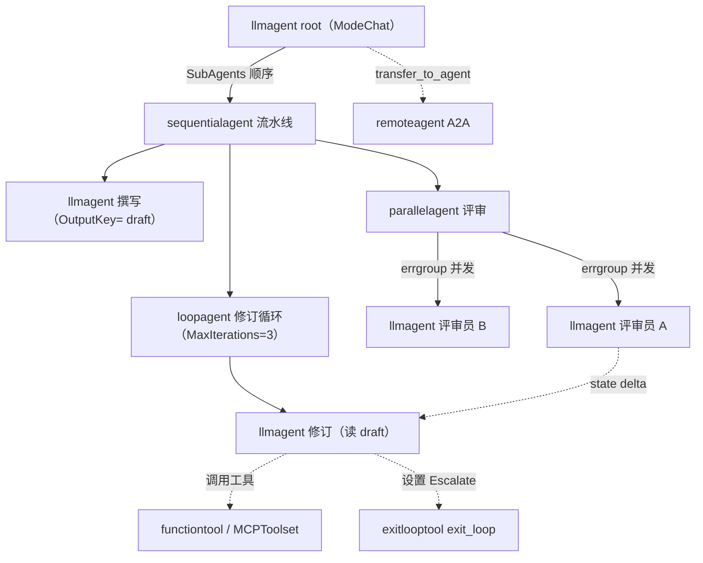

# 代理类型（Agent Types）

> ADK Go 里的 agent 全部实现同一个 `agent.Agent` 接口；`llmagent` 负责调模型，`workflowagents/*` 负责编排子 agent，`workflowagent` 把一张节点/边图包装成 agent，`remoteagent` 通过 A2A 调远端，自定义 agent 用 `agent.New` 写 `Run`。

## 涉及代码

- `agent/agent.go` —— `agent.Agent` 接口、`agent.Config` 与 `agent.New` 基类实现
- `agent/context.go`、`agent/common_context.go` —— `InvocationContext` / `Context` / `ReadonlyContext` 与 `Promote`
- `agent/llmagent/llmagent.go` —— `llmagent.New` 与 `llmagent.Config` 的全部字段、instruction、回调类型
- `agent/llmagent/llm_agent_wrapper.go` —— `RunLLMAgentAsNode`、`ProcessLLMAgentOutput`，agent 作为图节点时的执行
- `agent/workflowagents/{sequentialagent,loopagent,parallelagent}/agent.go` —— 三个固定编排 agent 的构造与执行语义
- `agent/workflowagent/workflow.go` —— `workflowagent.New`，图工作流到 agent 的适配
- `agent/remoteagent/a2a_agent.go`、`agent/remoteagent/v2/a2a_agent.go`、`v2/client.go` —— A2A 远端 agent 的构造、配置与 client
- `agent/loader.go` —— `Loader`、`NewSingleLoader`、`NewMultiLoader`
- `internal/llminternal/instruction_processor.go`、`mode.go` —— instruction 占位符解析与 Mode 的 per-invocation 绑定
- `internal/llminternal/outputschema_processor.go`、`basic_processor.go` —— `set_model_response` 结构化输出与原生 `ResponseSchema`
- `internal/workflowinternal/single_turn_tool.go`、`task_agent_tool.go`、`finish_task_tool.go` —— 按子 agent 模式自动挂载的工具
- `util/instructionutil/instruction.go` —— `InjectSessionState`
- `workflow/agent_node.go`、`workflow/run_node.go`、`workflow/edgebuilder.go` —— 图节点与边

## 代理基类与构造入口

`agent.Agent` 是唯一接口（`agent/agent.go`）：

```go
type Agent interface {
	Name() string
	Description() string
	Run(InvocationContext) iter.Seq2[*session.Event, error]
	SubAgents() []Agent
	FindAgent(name string) Agent
	FindSubAgent(name string) Agent

	internal() *agent   // 非导出方法
}
```

`internal()` 是非导出的，所以**树外类型无法直接实现这个接口**，只能从各构造器得到实例。所有构造器最终都落到 `agent.New(agent.Config)`，它创建的基类负责：

- 启动 `invoke_agent` telemetry span（`telemetry.StartNodeSpan`）；
- 依次跑 `BeforeAgentCallbacks`，任一返回非 nil content/error 就跳过 agent 本体并由此产生事件；调用 `ctx.EndInvocation()` 后直接结束；
- 给 `Author == ""` 的事件补 `Author`（模型内容是 `user` 角色时记为 `user`，否则为 agent 名）；
- 跑 `AfterAgentCallbacks`。

`agent.New` 只检查 `SubAgents` 中是否有**重复的 agent 指针**；名字在整棵树内的唯一性由 `runner.New`（经 `internal/agent/parentmap`）校验。`Config` 的文档还要求名字不能是 `"user"`（预留给终端用户输入）。

| 类型 | 构造器 | 内部 `AgentType` |
| --- | --- | --- |
| LLM | `llmagent.New` | `TypeLLMAgent` |
| 顺序 | `sequentialagent.New` | `TypeSequentialAgent` |
| 循环 | `loopagent.New` | `TypeLoopAgent` |
| 并行 | `parallelagent.New` | `TypeParallelAgent` |
| 图工作流 | `workflowagent.New` | `TypeWorkflowAgent` |
| 远端 | `remoteagent/v2.NewA2A` | `TypeRemoteAgent` |
| 自定义 | `agent.New` | `TypeCustomAgent` |

`AgentType` 与原始 `Config` 存在内部 `agentinternal.State` 里，供 telemetry 与调试接口读取。

## `llmagent`（LLM Agent）

`llmagent.New(cfg Config) (agent.Agent, error)`。`Config` 的真实字段分四组。

### 身份与子 agent

- `Name string`、`Description string` —— `Description` 会被父 LLM 用来决定是否委派，建议一行。
- `SubAgents []agent.Agent` —— 子 agent；ADK 据此建立 parent map，支持跨树的 agent 转移。

### 模型与生成配置

- `Model model.LLM` —— 必填，否则运行期无模型可调。
- `GenerateContentConfig *genai.GenerateContentConfig` —— 温度、安全设置等；**工具不能在里配**，要用 `Tools` / `Toolsets`。
- `IncludeContents IncludeContents` —— `IncludeContentsNone`（只看本轮）与 `IncludeContentsDefault`。不设置时，普通对话 agent 仍看历史，但作为 workflow `single_turn` 节点时只看当前轮；显式设为 `IncludeContentsDefault` 会在节点里也保留历史。

### instruction

- `Instruction string`：静态模板字符串，运行时做占位符替换。
- `InstructionProvider InstructionProvider`：`func(ctx agent.ReadonlyContext) (string, error)`，每次调用时求值；**设置了它就会覆盖 `Instruction`**，且**不再做占位符替换**。
- `GlobalInstruction string` / `GlobalInstructionProvider InstructionProvider`：作用于整棵树的全局指令，**只有根 agent 的 `GlobalInstruction` 生效**。
- `OutputKey string`、`OutputSchema *genai.Schema`、`InputSchema *genai.Schema`、`Mode Mode`。
- `DisallowTransferToParent bool`、`DisallowTransferToPeers bool`。

### 工具与回调

- `Tools []tool.Tool`、`Toolsets []tool.Toolset`。
- Agent 级：`BeforeAgentCallbacks`、`AfterAgentCallbacks`。
- 模型级：`BeforeModelCallbacks`、`AfterModelCallbacks`、`OnModelErrorCallbacks`。
- 工具级：`BeforeToolCallbacks`、`AfterToolCallbacks`、`OnToolErrorCallbacks`。

回调签名即 `agent/llmagent/llmagent.go` 里的真实类型，例如 `BeforeModelCallback func(ctx agent.Context, llmRequest *model.LLMRequest) (*model.LLMResponse, error)`、`BeforeToolCallback func(ctx agent.Context, tool tool.Tool, args map[string]any) (map[string]any, error)`、`AfterToolCallback func(ctx agent.Context, tool tool.Tool, args, result map[string]any, err error) (map[string]any, error)`。

短路规则：`BeforeModelCallback` 返回非 nil response/error 就跳过真实模型调用；`BeforeToolCallback` 返回非 nil 结果/错误就跳过工具执行，但**要修改参数并继续执行工具，就原地改 `args` 再返回 `(nil, nil)`**。`AfterModelCallback` / `AfterToolCallback` 用返回值替换原结果。

### instruction 里能插值什么

占位符逻辑在 `internal/llminternal/instruction_processor.go`，公开入口是 `util/instructionutil.InjectSessionState(ctx, template)`（仅用于 `InstructionProvider` 内部）。规则由代码而非文档决定：

- 正则 `{+[^{}]*}+` 匹配占位符，形如 `{key}`。
- 名称合法时从 session state 取值：`{key}`；带作用域前缀的 `{app:key}`、`{user:key}`、`{temp:key}` 也合法（`isValidStateName`）。
- `{artifact.<name>}` 取 artifact 的文本内容。
- 名称后加 `?` 表示可选，如 `{var?}`：取值/artifact 不存在时替换为空字符串而非报错。
- 名称不合法（如含空格）时**原样保留**，不当作占位符。
- 取值用 `fmt.Sprintf("%v")` 格式化。

因此 `InstructionProvider` 想要插值必须自己调用 `instructionutil.InjectSessionState`。

### `OutputSchema` 与 `OutputKey`

`OutputSchema` 的落地分两条路（`basic_processor.go` 与 `outputschema_processor.go`）：

- 无工具，或模型原生支持「schema + 工具」组合时：直接把 `req.Config.ResponseSchema = OutputSchema`、`ResponseMIMEType = "application/json"`。
- 有工具且 `googlellm.NeedsOutputSchemaProcessor` 为真时：注入内部工具 `set_model_response`（`setModelResponseTool`），它的 `Declaration` 用该 schema 定义参数，`Run` 用 `utils.ValidateMapOnSchema` 校验，并追加一段要求模型必须调用它的 instruction。
- `ModeTask` 完全跳过 `OutputSchema` 配置：任务的结构化结果走 `finish_task` 工具的声明。

`OutputKey` 决定结果落到 session state 的哪个 key：

- 直接运行（非图节点）时由 `llmAgent.maybeSaveOutputToState` 处理：只处理 `Author == 本 agent` 且 `IsFinalResponse()` 的事件，把非 thought 的文本 part 拼接后写入 `event.Actions.StateDelta[OutputKey]`。**这条路径只写字符串**，不做 schema 校验与反序列化。
- 作为 workflow 节点运行时由 `ProcessLLMAgentOutput` 处理：若设置了 `OutputSchema`，用 `utils.ValidateOutputSchema` 解析文本得到结构化值；再写入 `StateDelta[OutputKey]` 并挂到 `event.Output`。

### `InputSchema` 与 Mode

`InputSchema` 描述「agent 被当工具调用时」的入参：`workflowinternal.MakeFunctionDeclaration` 优先用该 agent 的 `InputSchema`，没有则退回一个 `request: string` 参数；若是组合 agent，取第一个子 agent 的 InputSchema、最后一个子 agent 的 OutputSchema。

Mode 是代码里的真实枚举（`llminternal.Mode`）：

| 值 | 常量 | 语义 |
| --- | --- | --- |
| `""` | `ModeUnset` | 未声明，按放置位置解析 |
| `"chat"` | `ModeChat` | 标准对话 agent，经 `transfer_to_agent` 可达 |
| `"task"` | `ModeTask` | 与用户多轮协作完成任务，自动装 `finish_task` |
| `"single_turn"` | `ModeSingleTurn` | 单轮完成，不与用户对话 |

默认值取决于放置：作为子 agent 默认 `chat`，作为 workflow 节点默认 `single_turn`。解析是**每次 invocation** 做的：`State.Mode` 是 agent 自己的声明，实际模式用 `llminternal.WithBoundMode` 绑到 context 上（key 同时含 agent 名与 `*State` 指针），读取用 `ModeFor` / `ResolveMode`。这样同一个 agent 实例可同时服务不同放置的并发 invocation。

`installTaskTools` 在构造时按解析后的模式给父 agent 装工具：

- 本 agent `Mode == ModeTask`：给自己装 `finish_task`。
- 子 agent 解析为 `single_turn`：父装 `SingleTurnTool`（`NewSingleTurnTool`）。
- 子 agent 解析为 `task`：父装 `TaskAgentTool`（`NewTaskAgentTool`）。
- 子 agent 未声明（解析为 `chat`）：不装工具，父 LLM 通过 `transfer_to_agent` 委派。

## `workflowagents`：固定编排模式

三个包各有一个 `Config`，都内嵌 `agent.Config`，且都**拒绝自定义 `Run`**（`AgentConfig.Run != nil` 直接报错）。

### `sequentialagent`

配置是 `sequentialagent.Config{AgentConfig: agent.Config{Name: "seq", SubAgents: []agent.Agent{a1, a2}}}`。

- `Config` 只有 `AgentConfig agent.Config`。
- 语义：按 `SubAgents()` 顺序，每个子 agent 完整跑一次（把它的 `iter.Seq2` 抽干），再进入下一个；子 agent 的事件原样向上 yield。
- 返回值是一个 `seqAgent` 包装（`agent.Agent` + `*agentinternal.State`），额外实现 `RunLive` 支持 live 模式；live 下会给 LLM 子 agent 注入 `task_completed` 工具并在 instruction 追加退出提示。

### `loopagent`

- `Config`：`AgentConfig agent.Config` + `MaxIterations uint`；`MaxIterations` 就是最大轮数。
- 语义：每一轮按顺序跑一遍全部子 agent；`MaxIterations == 0` 表示无限循环，直到有子 agent 升级退出。
- 终止条件：子 agent 产生的事件 `event.Actions.Escalate == true` 时立刻结束整个 loop。`tool/exitlooptool.New()` 提供的 `exit_loop` 工具就是把 `ctx.Actions().Escalate` 置真。
- `MaxIterations > 0` 时，跑满次数即返回。

### `parallelagent`

- `Config` 只有 `AgentConfig`；`Run` 是一个包级函数 `run`。
- 并发怎么起：`errgroup.WithContext` + 每个子 agent 一个 goroutine；每个子 agent 拿到独立的 `InvocationContext`，其中 `Branch = [父branch.]父名.子名`，其余（session、artifacts、memory、run config、invocation ID）共享父上下文。
- 事件回流：子 agent 的每个事件经 `resultsChan` 交给消费者，并附一个 `ackChan`，**消费者处理（含 session 追加）完并 close ack 后**该子 agent 才推进到下一轮，避免乱序写入。事件在多个分支间交错，顺序不确定。
- 错误聚合：`errgroup` 在第一个错误时取消兄弟 goroutine；该错误由 funnel goroutine 放进 `resultsChan` 并被 yield 出去（即只返回首个错误）。消费者提前停止时会 cancel 并 drain，保证各子 agent 的 teardown 在 run 返回前完成。

### 子 agent 输出如何传递

三个编排 agent 都不做显式的输出管道：子 agent 的事件写入共享 session，结构化结果靠 `OutputKey` 写进 state delta，下游 agent 再从 session state 读。顺序/循环/并行只决定「谁先跑、跑几次、是否并发」。

## `workflowagent`：把图工作流当 agent

`agent/workflowagent/workflow.go` 是适配层：`workflowagent.Config{Name, Description, SubAgents, BeforeAgentCallbacks, AfterAgentCallbacks, Edges []workflow.Edge}`。

```go
wa, err := workflowagent.New(workflowagent.Config{
	Name:  "graph",
	Edges: workflow.Chain(startNode, midNode, endNode),
})
```

`New` 内部调 `workflow.New(cfg.Name, cfg.Edges)` 建图，再用 `agent.New` 包一层，`Run` 的职责是**分发**：

- 若本轮用户内容里带 `FunctionResponse` 且名称为 `workflow.WorkflowInputFunctionCallName`（`"adk_request_input"`），视为 HITL 恢复：`detectResume` 从 session 重建 `*workflow.RunState` 后调 `workflow.Resume`；否则调 `workflow.Run`。

它与 `workflowagents/*` 的区别：后者是三种**固定形状**的编排（顺序/循环/并行），子 agent 由 `SubAgents()` 决定；而 `workflowagent` 执行的是任意节点/边图，支持路由（`Route`）、fan-out/fan-in、join、重试、超时、状态 schema、嵌套工作流与并发上限 `WithMaxConcurrency`，节点不一定是 agent（也有 `ToolNode`、`FunctionNode`、`JoinNode` 等）。`SubAgents` 在这里只参与 agent 树/转移，图的走向由 `Edges` 决定；把 agent 接进图通常经 `workflow.NewAgentNode(agent, workflow.NodeConfig{})`。节点运行时会实现 `NodeRunner` 接口（`RunNode(ctx, nodeInput)`）的 agent 走 `RunNode`，否则走普通 `Run`（`llmagent` 实现了 `RunNode`）。图引擎细节见 [图工作流引擎](./11-graph-workflow-engine.md)。

## `remoteagent`：A2A 远端 agent

当前实现是 `agent/remoteagent/v2`；旧的 `agent/remoteagent` 包已标记 Deprecated，是 v1 A2A 与兼容转换的包装。

```go
ra, err := remoteagent.NewA2A(remoteagent.A2AConfig{
	Name:              "remote",
	Description:       "远端专家",
	AgentCardProvider: remoteagent.NewAgentCardProvider("https://host/.well-known/agent.json"),
})
```

关键配置（`remoteagent/v2.A2AConfig`）：

- `AgentCard *a2a.AgentCard` 或 `AgentCardProvider AgentCardProvider`，二者至少给一个；`NewAgentCardProvider(source)` 支持 http(s) URL 或本地文件路径，并对网络获取的 card 做 origin 校验。
- `BeforeAgentCallbacks` / `AfterAgentCallbacks`、`BeforeRequestCallbacks` / `AfterRequestCallbacks`（`BeforeA2ARequestCallback` 返回非 nil 事件可跳过真实请求）。
- `Converter A2AEventConverter` —— 自定义 A2A event → `session.Event` 的转换；`A2APartConverter` / `GenAIPartConverter` 转换 part；`ClientProvider A2AClientProvider`、`MessageSendConfig`、`RemoteTaskCleanupCallback` 分别定制发送实现、请求配置与中断清理。
- `AllowTransferToAgent bool` —— 是否信任远端在 metadata 里放的 `transfer_to_agent`，**v2 默认 false**（旧的 `remoteagent` 包装为兼容历史行为设为 true）。

运行语义：解析 agent card → 取 client → 构造 message → 按 `ctx.RunConfig().StreamingMode` 决定 `SendMessage` 还是 `SendStreamingMessage`；`StreamingModeNone` 走单发，否则流式。失败被转换成带 `ErrorMessage` 的 event 而不是 panic。协议与服务端侧见 [A2A 与分布式](./07-a2a-distributed.md)。

## 自定义 agent

实现自定义逻辑的正规方式是 `agent.New`：

```go
custom, err := agent.New(agent.Config{
	Name:        "greeter",
	Description: "返回一句问候",
	Run: func(ctx agent.InvocationContext) iter.Seq2[*session.Event, error] {
		return func(yield func(*session.Event, error) bool) {
			ev := session.NewEvent(ctx, ctx.InvocationID())
			ev.Content = &genai.Content{Parts: []*genai.Part{{Text: "hello"}}}
			yield(ev, nil)
		}
	},
})
```

注意点：

- 只能经 `agent.New`，因为 `agent.Agent` 的 `internal()` 非导出。
- `Run` 返回 `iter.Seq2`，不要额外实现 span / 回调 / author 逻辑，基类已经做了。
- `SubAgents` 中不允许重复指针；名字在同一 runner 树内必须唯一。
- 若该 agent 要作为图节点且需要「节点输出」，应实现 `RunNode(ctx agent.Context, nodeInput any) iter.Seq2[*session.Event, error]`（`llmagent` 即如此）；否则图引擎退回调 `Run`，入参只体现为 `ctx.UserContent()`。

写 agent 的现成范例就是 `agent/workflowagents/*`：三者都是「定义 `Run` 闭包 → 填进 `agent.Config.Run` → 调 `agent.New` → 打上 `AgentType`」这一套。`loopagent` 的 `loopAgent.Run`、`parallelagent` 的 `run` 都直接展示了如何遍历 `ctx.Agent().SubAgents()` 并 yield 事件。

## 按名字解析并构造 agent：Loader 与 agentregistry

两套机制用途不同，容易混淆。

**`agent/loader.go` —— 本地 agent 树的命名入口。** `Loader` 接口：

```go
type Loader interface {
	ListAgents() []string
	LoadAgent(name string) (Agent, error)
	RootAgent() Agent
}
```

- `NewSingleLoader(a)`：只有一个 agent，它既是 root，也是 `LoadAgent("")` / `LoadAgent(name)` 的唯一结果。
- `NewMultiLoader(root, agents...)`：名字 → agent 映射，重复名字报错。
- 消费方是 launcher / server：`launcher.Config.AgentLoader` 决定暴露哪些 agent，Web UI 的 agent 选择、`RootAgent()` 都走它。

**`agentregistry/` —— 从注册中心按名字解析远端资源。** 它是 Google Cloud Agent Registry（`agentregistry.googleapis.com`）的客户端：`agentregistry.New(ctx, Config{ProjectID, Location})` 建 client，`factory.go` 提供两个「按名字造对象」的 helper：

- `Client.RemoteAgent(ctx, name, opts...) (agent.Agent, error)` —— 按注册名取回 A2A agent 信息，构造 card（优先用注册中心内嵌 card，否则由离散字段合成），再调 `remoteagent.NewA2A` 得到可直接挂为子 agent 的实例。
- `Client.MCPToolset(ctx, name, opts...) (tool.Toolset, error)` —— 按注册名解析 MCP server。二者都可用 `WithA2AHTTPClient` / `WithA2AHeaders`、`WithMCPHTTPClient` / `WithMCPHeaders` 控制出口认证。

`resolve.go` 负责把注册中心的协议绑定（`JSONRPC` / `HTTP_JSON` / `GRPC`）映射成 `a2a.TransportProtocol`，并从 `Protocols`/`Interfaces` 里挑出连接 URI，同时把展示名清洗成合法标识符。这里没有本地 agent 树的 name→agent factory，`Client.GetAgent`/`ListAgents` 等只是 REST 读取。

## 组合关系



外部 agent 通过 `SubAgents` 挂进树，`llmagent` 以 `transfer_to_agent`（chat 子 agent）或自动挂载的 `single_turn`/`task` 工具（声明模式的子 agent）调用它们；工作流类 agent 只按自己的规则驱动子 agent，不参与 LLM 的委派决策。

## 相关页面

- [核心概念](./03-core-concepts.md) —— `agent.Agent`、`InvocationContext`、Event/State 的定义都在这里
- [Agent 执行](./04-agent-execution.md) —— Runner 如何驱动这些 agent、LLM flow 与事件流转
- [工具系统](./06-tool-system.md) —— `Tools`/`Toolsets` 的接口、`functiontool` 与 MCP
- [A2A 与分布式](./07-a2a-distributed.md) —— agent card、A2A 服务端/客户端与 `agentregistry`
- [图工作流引擎](./11-graph-workflow-engine.md) —— `workflowagent` 背后的节点、边、HITL 与重试
- [进阶主题](./12-advanced-topics.md) —— 层级与 parent map、state 作用域、live 模式
