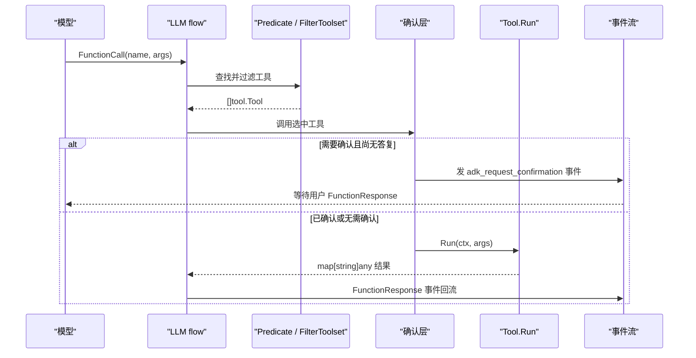

# 工具系统（Tool System）

> 工具是 LLM 能调用的能力单元；ADK Go 用极简的 `tool.Tool` / `tool.Toolset` 契约、泛型 `functiontool` 自动生成 JSON Schema，并用 `agent.Context` 把 state、artifact、memory、HITL 确认能力交给工具。

## 涉及代码

- `tool/tool.go` —— `Tool`、`Toolset` 接口，`Predicate`/`FilterToolset` 过滤，`ConfirmationProvider`/`WithConfirmation` 确认包装。
- `tool/functiontool/function.go` —— 把 Go 函数包装成工具，从泛型参数推断 JSON Schema。
- `tool/functiontool/streaming_function.go` —— `NewStreaming` 包装流式函数。
- `tool/toolutils/toolutils.go` —— `PackTool`，把工具声明合并进 `model.LLMRequest`。
- `agent/context.go` —— `Context`/`ReadonlyContext`/`InvocationContext`，工具执行时拿到的上下文与 HITL 方法。
- `agent/common_context.go` —— `ToolConfirmation`/`RequestConfirmation` 的真实实现。
- `internal/toolinternal/tool.go` —— `FunctionTool`、`StreamingFunctionTool`、`RequestProcessor` 等内部契约。
- `internal/llminternal/request_confirmation_processor.go` —— 把用户的确认答复回灌为可执行调用。
- `tool/toolconfirmation/tool_confirmation.go` —— `ToolConfirmation` 结构与 `FunctionCallName` 常量。
- `tool/mcptoolset/{set.go,client.go,tool.go}` —— MCP 工具集、传输配置、连接刷新、MCP 工具到 ADK 工具的转换。
- `tool/agenttool`、`tool/exampletool`、`tool/exitlooptool`、`tool/geminitool`、`tool/loadartifactstool`、`tool/loadmemorytool`、`tool/preloadmemorytool`、`tool/skilltoolset` —— 内置工具与工具集。

## 核心接口

`tool/tool.go` 里的两个接口是全部工具系统的根：

```go
type Tool interface {
	Name() string
	Description() string
	IsLongRunning() bool
}

type Toolset interface {
	Name() string
	Tools(ctx agent.ReadonlyContext) ([]Tool, error)
}
```

- `Tool` 只描述“这是什么工具”，不包含执行方法。真正能被 flow 执行的是内部接口 `toolinternal.FunctionTool`（`Declaration() *genai.FunctionDeclaration` + `Run(ctx agent.Context, args any) (map[string]any, error)`）和 `toolinternal.StreamingFunctionTool`（`Declaration()` + `RunStream(ctx, args) iter.Seq2[string, error]`），定义在 `internal/toolinternal/tool.go`。
- `Toolset.Tools` 在每次请求时被调用，可以依据 `agent.ReadonlyContext` 动态决定返回哪些工具。
- 工具通过实现 `toolinternal.RequestProcessor`（`ProcessRequest(ctx agent.Context, req *model.LLMRequest) error`）把自己的声明写进 `model.LLMRequest`。公开的 `toolutils.PackTool(req, t)` 负责把多个工具的 `FunctionDeclaration` 合并进同一个 `genai.Tool.FunctionDeclarations`，同名工具会报 `duplicate tool` 错误。

因此“一个工具”通常是：实现 `Tool` 三方法 + 实现 `Declaration()`/`Run`（或 `RunStream`）+ 在 `ProcessRequest` 里调用 `toolutils.PackTool`。

## functiontool：把 Go 函数变成工具

`tool/functiontool/function.go` 是写业务工具最常用的入口。

```go
type Func[TArgs, TResults any] func(agent.Context, TArgs) (TResults, error)

func New[TArgs, TResults any](cfg Config, handler Func[TArgs, TResults]) (tool.Tool, error)
```

约束与行为：

- `TArgs` 去指针后必须是 **struct 或 map**，否则 `New` 返回 `ErrInvalidArgument`（`tool/functiontool/function.go:89`）。`TResults` 没有这个限制。
- `Config` 字段：`Name`、`Description`、`InputSchema`、`OutputSchema`（`*jsonschema.Schema`，为 nil 时自动推断）、`IsLongRunning`、`RequireConfirmation`、`RequireConfirmationProvider`。
- Schema 由 `github.com/google/jsonschema-go/jsonschema`（`go.mod` 中为 `v0.4.3`）的 `jsonschema.For[T]` 推断，再 `Resolve`。**tag 约定**：属性名来自 `json` tag，属性描述来自 `jsonschema` tag。例如 `City string `json:"city" jsonschema:"要查询天气的城市名"`` 会生成 `{"city": {"type":"string","description":"要查询天气的城市名"}}`。
- `IsLongRunning` 为 true 时，`Declaration()` 会自动在描述后追加一行提示模型“不要在已返回中间/挂起状态后重复调用”。
- `RequireConfirmationProvider` 必须是 `func(TArgs) bool`，否则 `New` 返回配置错误。

`Run` 的执行顺序：把 `map[string]any` 参数经 `typeutil.ConvertToWithJSONSchema` 转成 `TArgs` → 检查/发起确认 → 调用 handler → 把结果转回 `map[string]any`。`TResults` 不能直接编成 map 时，会包成 `{"result": output}`（若无法被 `json.Marshal` 则报错）。`Run` 内部 `recover` panic 并转成错误返回。

短示例（对应 `examples/quickstart-localtool/main.go`）：

```go
type getWeatherInput struct {
	City string `json:"city" jsonschema:"要查询天气的城市名"`
}

type getWeatherOutput struct {
	City      string `json:"city"`
	Condition string `json:"condition"`
	TempC     int    `json:"temperature_c"`
}

func getWeather(_ agent.Context, in getWeatherInput) (getWeatherOutput, error) {
	return getWeatherOutput{City: in.City, Condition: "晴", TempC: 24}, nil
}

weatherTool, err := functiontool.New(functiontool.Config{
	Name:        "get_weather",
	Description: "查询指定城市当前的天气。",
}, getWeather)
```

流式版本用 `NewStreaming[TArgs](cfg Config, handler StreamingFunc[TArgs])`，其中 `StreamingFunc[TArgs] func(agent.Context, TArgs) iter.Seq2[string, error]`。

## 工具上下文与能力

工具执行时拿到的是 `agent.Context`（`agent/context.go`），它在 `ReadonlyContext` + `InvocationContext` 之上补齐了工具与回调需要的能力：

| 方法 | 能做什么 |
| --- | --- |
| `FunctionCallID() string` | 触发本次工具执行的 function call ID。 |
| `State() session.State` / `ReadonlyState() session.ReadonlyState` | 读写会话状态（`Set` 写入的是本次事件的 `StateDelta`）。 |
| `Artifacts() agent.Artifacts` | `Save`/`List`/`Load`/`LoadVersion` 当前会话的 artifact（定义在 `agent/agent.go`）。 |
| `SearchMemory(ctx, query) (*memory.SearchResponse, error)` | 语义检索长期记忆；未配置 memory service 时返回错误。 |
| `Actions() *session.EventActions` | 修改 `StateDelta`、`TransferToAgent`、`Escalate`、`SkipSummarization` 等。 |
| `UserContent()`, `AgentName()`, `SessionID()`, `Branch()`, `InvocationID()` | 读取调用现场的只读信息。 |
| `ToolConfirmation() *toolconfirmation.ToolConfirmation` | 查询本次调用是否已带用户确认；无确认时为 `nil`。 |
| `RequestConfirmation(hint string, payload any) error` | 发起 HITL 确认请求。 |

示例：`exitlooptool` 只做两件事——`ctx.Actions().Escalate = true` 和 `SkipSummarization = true`；`loadmemorytool` 调 `toolCtx.SearchMemory(toolCtx, query)`。注意 `RequestConfirmation`/`ToolConfirmation` 在 callback context 上不受支持（`agent/callback_context_wrapper.go` 会记日志并返回错误）。

## 长任务与确认（HITL）

### 标记长任务

`Tool.IsLongRunning()` / `functiontool.Config.IsLongRunning` 为 true 表示工具先返回资源 id、稍后完成。事件带 `LongRunningToolIDs` 时，`session.Event.IsFinalResponse()` 为 false，agent 循环不会把它当最终回复（`session/session.go:226`）。

### sentinel error

```go
var ErrConfirmationRequired = errors.New("requires confirmation, please approve or reject")
var ErrConfirmationRejected = errors.New("call is rejected")
```

`Run` 在需要用户批准时返回包装了 `ErrConfirmationRequired` 的错误；若用户已拒绝（`ToolConfirmation.Confirmed == false`），返回包装 `ErrConfirmationRejected` 的错误。

### 确认请求怎么发起

`agent.Context.RequestConfirmation(hint, payload)`（实现见 `agent/common_context.go:708`）把一条挂起确认写进当前事件的 `EventActions.RequestedToolConfirmations`（map 的 key 是 function call ID），并置 `SkipSummarization = true`，让 agent 循环停在这次函数响应后等用户。`functiontool`、`mcptoolset`、`tool.WithConfirmation` 都会在需要时调用它。

### `ToolConfirmation` 的真实字段

`tool/toolconfirmation/tool_confirmation.go`：

```go
type ToolConfirmation struct {
	Hint      string `json:"hint"`
	Confirmed bool   `json:"confirmed"`
	Payload   any    `json:"payload"`
}
```

- `Hint`：展示给用户的说明。
- `Confirmed`：用户决定，true 批准、false 拒绝。
- `Payload`：应用自定义的附加上下文。

同文件还有常量 `FunctionCallName = "adk_request_confirmation"`，以及 `OriginalCallFrom(functionCall *genai.FunctionCall) (*genai.FunctionCall, error)`，用于从包装调用里取出 `originalFunctionCall` 参数（支持已是 `*genai.FunctionCall` 或原始 `map[string]any` 两种形态）。

### HITL 闭环

1. 工具返回 `ErrConfirmationRequired`，事件里带 `adk_request_confirmation` 的 `FunctionCall`，其 `args` 包含 `toolConfirmation` 与 `originalFunctionCall`。
2. 前端监听该事件，展示提示，拿到用户决定。
3. 用户答复以 `FunctionResponse` 回灌：`id` 与收到的 `adk_request_confirmation` 调用一致，`name` 为 `adk_request_confirmation`，payload 形如 `{"confirmed": bool}`。控制台实现见 `cmd/launcher/console/hitl.go`。
4. 下一轮 `internal/llminternal/request_confirmation_processor.go` 扫描最近一条 user 事件，解析出 `ToolConfirmation`，并校验确认事件与原调用的一致性（防止同一确认 ID 被替换成不同调用），再把原调用重新入队执行。
5. 重新执行时 `ctx.ToolConfirmation()` 返回已填好的结构，`Confirmed == true` 就放行，否则返回拒绝错误。

`tool.WithConfirmation(ts, requireConfirmation, requireConfirmationProvider)` 可以把确认逻辑套在整个 toolset 上：能提供 `Declaration` + `Run` 的工具和 `Declaration` + `RunStream` 的流式工具会被包一层，模型侧内置工具（如 `tool/geminitool`）不会被包装。`ConfirmationProvider` 签名是 `func(toolName string, toolInput any) bool`，返回 true 表示需要确认。workflow 引擎也有一套以 `adk_request_input` 为名的 HITL（见 `workflow/request_input.go`），两套机制都依赖事件里的挂起调用与用户回灌，细节见 [图工作流引擎](./11-graph-workflow-engine.md)。

## MCP 集成

`tool/mcptoolset` 基于 `github.com/modelcontextprotocol/go-sdk`（`go.mod` 中为 `v1.8.0`）把 MCP server 的工具桥接成 ADK 工具。

```go
func New(cfg Config) (tool.Toolset, error)
```

`Config` 的真实字段（`tool/mcptoolset/set.go:98`）：

- `Client *mcp.Client` —— 可选自定义 MCP 客户端，nil 时创建 `adk-mcp-client`。
- `Transport mcp.Transport` —— 显式指定传输。
- `Endpoint string` —— `Transport` 为 nil 且 `Endpoint` 非空时，构建 `mcp.StreamableClientTransport{Endpoint: ...}`。
- `Auth auth.CredentialProvider` —— 给每个 HTTP 请求套一个 `auth.Transport` RoundTripper；**要求 streamable HTTP 传输**，与 `*mcp.StreamableClientTransport` 或 `Endpoint` 搭配，配 stdio 会直接报配置错误。
- `ToolFilter tool.Predicate` —— 已废弃，改用 `tool.FilterToolset`。
- `RequireConfirmation bool` / `RequireConfirmationProvider tool.ConfirmationProvider` —— 确认策略。

三种传输方式对应 go-sdk 的真实类型：

| 传输 | 类型 | 关键字段 |
| --- | --- | --- |
| stdio（子进程） | `mcp.CommandTransport` | `Command *exec.Cmd`、`TerminateDuration time.Duration` |
| Streamable HTTP | `mcp.StreamableClientTransport` | `Endpoint`、`HTTPClient`、`MaxRetries`、`DisableStandaloneSSE`、`OAuthHandler`、`MaxEventSize` |
| SSE（旧式） | `mcp.SSEClientTransport` | `Endpoint`、`HTTPClient`、`MaxEventSize` |

stdio 示例：`mcptoolset.New(mcptoolset.Config{Transport: &mcp.CommandTransport{Command: exec.Command("myserver")}})`。

工具发现与连接生命周期：

- `set.Tools(ctx)` 调 `connectionRefresher.ListTools(ctx)`，把每个 `*mcp.Tool` 经 `convertTool` 转成 `mcpTool`（同时映射 `InputSchema`/`OutputSchema` 到 `FunctionDeclaration`），再按 `ToolFilter` 过滤。
- `mcpTool.Run` 走和 `functiontool` 一样的确认检查，然后 `CallTool`，把 `StructuredContent` 或格式化后的文本内容作为 `{"output": ...}` 返回；`IsError` 时转为 Go error。
- `connectionRefresher`（`client.go`）懒建立会话：首次用到时才 `client.Connect(ctx, transport, nil)`。遇到 `mcp.ErrConnectionClosed`、`mcp.ErrSessionMissing`、`io.ErrClosedPipe`、`io.EOF` 时重连一次并重试；`ListTools` 重连后从第一页重新分页（MCP 规范规定 cursor 不跨会话）。并发用一把 mutex 保护，`refreshConnection` 会先 `Ping` 验证旧会话确实已死。

## 内置工具一览

逐个对应 `tool/` 下的真实包：

| 包 | 作用 | 构造入口 | 一句话用法 |
| --- | --- | --- | --- |
| `agenttool` | 让一个 agent 作为工具调用另一个 agent。 | `agenttool.New(agent agent.Agent, cfg *Config) tool.Tool` | 把子 agent 塞进父 agent 的 `Tools`，实现组合。 |
| `exampletool` | 把 few-shot 示例注入 system instruction。 | `exampletool.New(config ExampleToolConfig) (*exampleTool, error)` | 用 `Example{Input, Output}` 教会模型工具调用格式。 |
| `exitlooptool` | 让模型主动退出循环。 | `exitlooptool.New() (tool.Tool, error)` | 置 `Escalate` 与 `SkipSummarization`，结束当前循环。 |
| `geminitool` | 包装任意 Gemini 原生 `genai.Tool`。 | `geminitool.New(name, description string, t *genai.Tool) tool.Tool`；`geminitool.GoogleSearch{}` | 挂接 Google Search、retrieval 等模型侧内置工具。 |
| `loadartifactstool` | 列出并加载会话 artifact 供模型读取。 | `loadartifactstool.New() tool.Tool` | 需要先配置 artifact service，否则 `ProcessRequest` 报错。 |
| `loadmemorytool` | 模型显式调用以检索当前用户记忆。 | `loadmemorytool.New() toolinternal.FunctionTool` | `load_memory(query)` → `SearchMemory`。 |
| `preloadmemorytool` | 每次请求自动预载相关记忆到 system instruction。 | `preloadmemorytool.New() *preloadMemoryTool` | 模型不直接调用，效果是 `<PAST_CONVERSATIONS>` 注入。 |
| `skilltoolset` | 发现并使用本地技能目录。 | `skilltoolset.New(ctx, Config) (*SkillToolset, error)` | 给 agent 装上 `list_skills`/`load_skill`/`load_skill_resource`。 |
| `toolutils` | 把工具声明合并进 `LLMRequest`。 | `toolutils.PackTool(req, t) error` | 自定义工具在 `ProcessRequest` 里调用。 |
| `toolconfirmation` | HITL 确认的数据结构与辅助函数。 | `FunctionCallName`、`OriginalCallFrom`、`ToolConfirmation` | 前端据此渲染确认并回灌答复。 |
| `functiontool` | 通用 Go 函数包装。 | `functiontool.New[TArgs,TResults](cfg, handler)` | 见上文。 |
| `mcptoolset` | MCP server 工具桥接。 | `mcptoolset.New(Config) (tool.Toolset, error)` | 见上文。 |

### skilltoolset 与 agent 技能

`SkillToolset` 把技能目录暴露成三个工具，名字来自 `tool/skilltoolset/internal/skilltool/*.go`：`list_skills`、`load_skill`、`load_skill_resource`。工具集在 `ProcessRequest` 时把可用技能列表（`SkillsToXML`）连同系统指令注入请求，告诉模型“相关技能必须先用 load_skill 读全再执行”。

技能来源是 `skill.Source` 接口（`tool/skilltoolset/skill/source.go`）：`ListFrontmatters`、`LoadFrontmatter`、`LoadInstructions`、`LoadResource`、`ListResources`。常用实现：

- `skill.NewFileSystemSource(fs.FS)` —— 基于 `fs.FS`，通常配 `os.DirFS("./skills")`。
- `skill.NewMergedSource(sources ...Source)` —— 合并多个来源。
- `skill.WithCompletePreloadSource(ctx, source)` / `skill.WithFrontmatterPreloadSource(ctx, source)` —— 预载缓存，返回 `(Source, reloadFunc, error)`。

每个技能是一个目录，核心是 `SKILL.md`；`skill.Parse` 解析其 YAML frontmatter，字段为 `name`、`description`、`license`、`compatibility`、`metadata`、`allowed-tools`（`skill.Frontmatter`，见 `frontmatter.go`）。目录里可放 `references/`、`assets/`、`scripts/`。这与“agent 技能”是同一套 `SKILL.md` 约定：本仓库的 `.agents/skills/`、`skill/<name>/` 就是这种目录结构，只要用 `os.DirFS` 指过去即可被 `skilltoolset` 加载。完整例子见 `examples/skills/main.go`。

## 工具过滤与谓词

代码里**有**真实的过滤机制，全部在 `tool/tool.go`：

- `type Predicate func(ctx agent.ReadonlyContext, tool Tool) bool` —— 判定某工具是否暴露给 LLM。
- `AllowedToolsPredicate(allowedTools []string) Predicate` —— 点名单内放行。
- `StringPredicate(allowedTools []string) Predicate` —— 已废弃，内部转调 `AllowedToolsPredicate`。
- `FilterToolset(toolset Toolset, predicate Predicate) Toolset` —— 包装一个 toolset，按 predicate 过滤其结果；nil 参数会 panic。
- `WithConfirmation(ts Toolset, requireConfirmation bool, requireConfirmationProvider ConfirmationProvider) Toolset` —— 按需注入确认逻辑。
- `ConfirmationProvider func(toolName string, toolInput any) bool` —— 动态决定是否要求确认。

`mcptoolset.Config.ToolFilter` 是旧接口，标注 `Deprecated: use tool.FilterToolset instead`。

## 执行时序



## 相关页面

- [核心概念](./03-core-concepts.md) —— `agent.InvocationContext`、`Session`/`Event`/`State`、Callback 与 Plugin，工具上下文的底座。
- [Agent 执行](./04-agent-execution.md) —— Runner 与 LLM flow 如何解析 function call、调用工具并回流事件。
- [图工作流引擎](./11-graph-workflow-engine.md) —— workflow 的 HITL（`adk_request_input`）与工具确认如何互补。
- [服务层](./08-service-layer.md) —— artifact 与 memory 服务的后端，决定工具能否访问它们。
- [进阶主题](./12-advanced-topics.md) —— 类型转换与流式聚合等工具侧细节。
