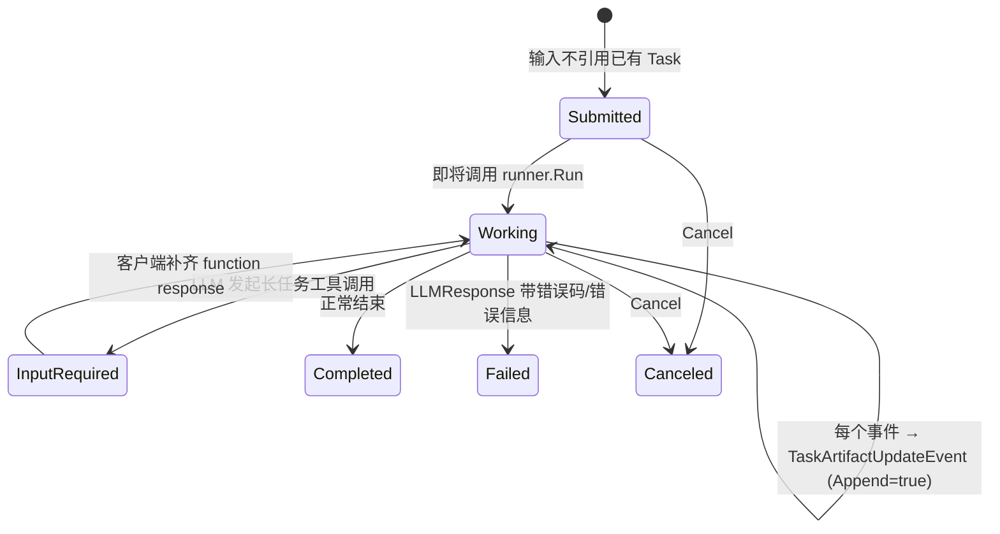
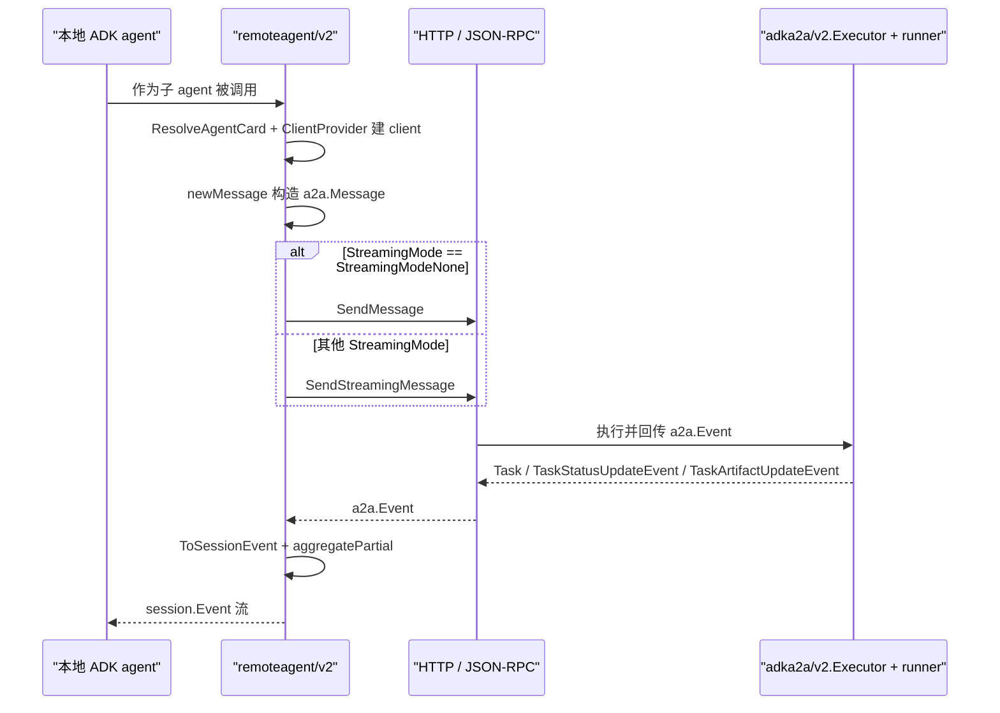

# A2A 协议与分布式代理（A2A Protocol and Distributed Agents）

> A2A（Agent-to-Agent）让 ADK agent 跨进程/跨主机互相调用：`agent/remoteagent/v2` 是客户端（把远端 agent 当成子 agent 来跑），`server/adka2a/v2` 是服务端（用 `Executor` 把本地 agent 暴露成 A2A 服务），`agentregistry` 负责从 Google Cloud Agent Registry 解析远端 A2A agent、MCP server 与 model endpoint。

## 涉及代码

- `agent/remoteagent/v2/a2a_agent.go` —— 客户端主体：`A2AConfig`、`NewA2A`、agent card 解析、消息构造、流式/单发分支与事件回流
- `agent/remoteagent/v2/a2a_agent_run_processor.go` —— partial 事件的聚合、请求/响应回调的调度、custom metadata 注入
- `agent/remoteagent/v2/client.go` —— `A2AClient`、`A2AClientProvider`、`NewA2AClientProvider`
- `agent/remoteagent/v2/utils.go` —— function call/response 匹配（`getUserFunctionCallAt`、`collectRemoteFunctionCallIDs`）与构造待发送 parts（`toMissingRemoteSessionParts`、`convertParts`）
- `agent/remoteagent/a2a_agent.go` —— 旧版 A2A（a2a-go v1）的兼容包装，已标记 Deprecated
- `server/adka2a/v2/executor.go` —— 服务端主体：`Executor`、`ExecutorConfig`、task 状态机
- `server/adka2a/v2/events.go` —— `EventToMessage` / `ToSessionEvent` 等 ADK↔A2A 事件翻译
- `server/adka2a/v2/metadata.go` —— 双方 metadata 的前缀约定与读写
- `server/adka2a/v2/parts.go` —— `genai.Part` ↔ `a2a.Part` 的转换
- `server/adka2a/v2/processor.go` —— 每个 `session.Event` 到 `a2a.TaskArtifactUpdateEvent` 的处理与终态判定
- `server/adka2a/v2/input_required.go` —— 长任务工具调用与 `TaskStateInputRequired` 的 HITL 处理
- `server/adka2a/v2/agent_card.go` —— `BuildAgentSkills`：从 agent 生成 `a2a.AgentSkill`
- `server/adka2a/v2/extension.go` —— `ADKExtensionURI`：标识 ADK 响应布局的 metadata key
- `agentregistry/client.go`、`agentregistry/resolve.go`、`agentregistry/factory.go`、`agentregistry/types.go` —— Agent Registry 的发现与构造
- `cmd/launcher/web/a2a/a2a.go` —— 通过 web launcher 暴露 A2A 服务（路由与 card 生成）
- `examples/a2a/main.go`、`examples/agentregistry/a2a/main.go` —— 可运行示例

## 协议与依赖

A2A 把一次调用建模为一个 **Task**：客户端发 **Message**，服务端产出 **Task**、**TaskStatusUpdateEvent**、**TaskArtifactUpdateEvent**；Task 有状态机、累积 **Artifact**、并保留消息历史。

本地依赖两个版本（`go.mod`）：

- `github.com/a2aproject/a2a-go/v2 v2.5.0` —— 当前实现所用的 SDK。
- `github.com/a2aproject/a2a-go v0.3.15` —— 旧版 SDK，只被兼容包装用到。

仓库里的 A2A 落点：

| 落点 | 角色 |
|------|------|
| `server/adka2a/v2` | 服务端：把 ADK agent 暴露成 A2A `AgentExecutor` |
| `agent/remoteagent/v2` | 客户端：把远端 agent 包装成本地 `agent.Agent` |
| `agentregistry` | 发现：从 Google Cloud Agent Registry 取回远端 A2A agent / MCP server / endpoint |
| `cmd/launcher/web/a2a` | 部署：把上述能力接进 web launcher，暴露 HTTP JSON-RPC 路由 |
| `examples/a2a`、`examples/agentregistry/a2a` | 示例 |

`server/adka2a`（无 `/v2`）与 `agent/remoteagent`（无 `/v2`）是 **Deprecated 包装**，其包注释明确要求改用 `/v2` 子包；它们保留是为了兼容 a2a-go v1 的类型（如 `a2avam.MessageSendParams`），并在内部转调 v2。新代码一律用 `/v2`。

## Agent Card 与发现

远端 agent 的身份由 **agent card**（`a2a.AgentCard`）描述。`A2AConfig` 要求二者择一：

```go
type A2AConfig struct {
    Name        string
    Description string
    // AgentCard 是静态 card；AgentCardProvider 每次调用时解析。
    AgentCard         *a2a.AgentCard
    AgentCardProvider AgentCardProvider // func(ctx) (*a2a.AgentCard, error)
    // ...
}

func NewA2A(cfg A2AConfig) (agent.Agent, error) // 未提供任一 card 时报错
```

`NewAgentCardProvider(source string, opts ...agentcard.ResolveOption) AgentCardProvider` 从 URL 或文件路径构造 provider：

- `http(s)://` 源：走 `agentcard.DefaultResolver.Resolve` 拉取，然后 `validateCardInterfaceOrigins` 校验——每个 `SupportedInterfaces[].URL` 必须是 https（或 loopback 上的 http），且与配置源的 origin 一致，否则返回 `ErrUntrustedCardInterface`。
- 其他源：按本地文件 `os.ReadFile` + `json.Unmarshal` 解析。
- 带非 http(s) scheme 的源（如 `file://`）被拒绝，返回 `ErrUnsupportedCardSource`。

provider 在**每次** agent 调用时被调用，需要缓存的话由调用方在函数内部自行实现。

`agentregistry` 在合成远端 card 时会用到这些字段：`Name`、`Description`、`Version`、`SupportedInterfaces`（`URL` / `ProtocolBinding` / `ProtocolVersion`）、`Skills`、`DefaultInputModes`、`DefaultOutputModes`、`Capabilities`。

服务端方向由 `BuildAgentSkills(agent agent.Agent) []a2a.AgentSkill` 生成 skills：LLM agent 的 `model` 与每个 tool 一条；`sequentialagent` / `parallelagent` / `loopagent` 生成编排描述与 `sub_agents:<name>` 标签。`cmd/launcher/web/a2a` 就用它填 card 的 `Skills`，并注册 `WellKnownAgentCardPath`。

## A2A 服务端：`adka2a/v2.Executor`

`NewExecutor(config ExecutorConfig) *Executor` 返回一个 `a2asrv.AgentExecutor`（实现 `Execute`、`Cancel`、`Cleanup`）。它把 ADK agent 包装成 A2A 服务；通过 HTTP 暴露还要再套 a2a-go 的 `a2asrv.NewHandler` / `a2asrv.NewJSONRPCHandler`。

`ExecutorConfig` 关键字段：

- `RunnerConfig runner.Config` —— 内部 `runner.Runner` 的配置（包含 `Agent`、`SessionService`、`AppName` 等）。
- `RunnerProvider func(ctx, *a2asrv.ExecutorContext, *plugin.Plugin) (RunnerConfig, Runner, error)` —— 自定义 runner 创建；不设则用默认 provider 调 `runner.New`。
- `RunConfig agent.RunConfig` —— 传给每次 `Runner.Run` 的配置。
- `BeforeExecuteCallback` / `AfterEventCallback` / `AfterExecuteCallback` —— 执行前、每个 ADK 事件转成 A2A 事件后、终态后的钩子。
- `A2APartConverter` / `GenAIPartConverter` —— 自定义 part 转换（nil 返回视为故意丢弃）。
- `OutputMode` —— artifact 的聚拢方式：`OutputArtifactPerRun`（默认，整个 run 一个 artifact）或 `OutputArtifactPerEvent`（每个非 partial 事件一个 artifact，artifact 内增量追加）。
- `A2AExecutionCleanupCallback` —— 执行/取消结束后的清理钩子（不设则只记录日志）。

### Task 状态如何映射

`Executor.Execute` 的注释给出完整映射：



- 每个 `session.Event` 产出一个 `TaskArtifactUpdateEvent{Append: true}`；最后一个事件后补一个 `LastChunk=true` 的空 artifact update（前提是本次 run 至少产出过一个 artifact）。
- 长任务工具调用由 `inputRequiredProcessor` 收集，最终以 `TaskStateInputRequired` 的 `TaskStatusUpdateEvent` 发出，并把待补的 function call 放进 status message；下次请求由 `HandleInputRequired` 校验输入是否补全，缺哪条就回一条带 `validation_error` 的错误。
- 终态选择顺序：`Failed`（LLM 错误）→ `InputRequired`（长任务）→ `Completed`。

### 事件翻译

`server/adka2a/v2/events.go` 的导出函数是双向翻译的核心：

| 方向 | 函数 |
|------|------|
| ADK → A2A | `EventToMessage(event *session.Event) (*a2a.Message, error)` |
| A2A → ADK | `ToSessionEvent(ctx, a2a.Event) (*session.Event, error)`、`ToSessionEventWithParts(...)` |
| part 级 | `ToA2APart` / `ToA2AParts`（`genai.Part` → `a2a.Part`）、`ToGenAIPart` / `ToGenAIParts`（反向） |
| 辅助 | `IsPartial`、`IsPartialFlagSet`、`ToCustomMetadata`、`GetA2ATaskInfo`、`TransferToAgentFromMeta` |

part 映射：`Text` → `a2a.TextPart`（`Thought` 写到 `adk_thought` metadata）；`FunctionCall` / `FunctionResponse` / 代码执行结果 → `a2a.DataPart`，用 `adk_type` 标注 `function_call` / `function_response` / `code_execution_result` / `executable_code`；`InlineData` / `FileData` → file / raw part。

metadata 用前缀区分归属：

- A2A 事件上的 ADK 值：`ToA2AMetaKey(key) = "adk_" + key`（app_name、user_id、session_id、invocation_id、author、branch、citation_metadata、grounding_metadata、usage_metadata、custom_metadata、error_code、partial、escalate、transfer_to_agent、is_error_message 等）。
- ADK 事件 `CustomMetadata` 上的 A2A 值：`ToADKMetaKey(key) = "a2a:" + key`（`a2a:task_id`、`a2a:context_id`）。

### 持久化与调用身份

`Executor` 本身不存 task：它只是一个 `a2asrv.AgentExecutor`，task 的存储由 a2a-go 的请求处理器负责。ADK 侧的持久化仍走 `RunnerConfig.SessionService`——`Execute` 先 `prepareSession`（`Get` 不到就 `Create`），再由 runner 执行并把事件写入会话。

调用身份在 `toInvocationMeta` 里确定：`sessionID` 取 `ExecutorContext.ContextID`，`userID` 默认是 `"A2A_USER_"+ContextID`，若 a2a-go 在调用上下文里带了认证用户则改用该用户名。会话键与事件 metadata 里的 `app_name` / `user_id` / `session_id` 都来自这里。

`Executor` 还会给每个 Task 与 status update 打上 `ADKExtensionURI`（`extension.go`）metadata key，告诉客户端“内容分散在 artifact 与 status message 里，长任务调用在后者”，避免客户端只读 artifact 而漏掉长任务调用。

## A2A 客户端：`remoteagent/v2`

`NewA2A(cfg A2AConfig) (agent.Agent, error)` 返回一个普通 `agent.Agent`，可以直接挂为子 agent（内部状态标记为 `TypeRemoteAgent`）。一次调用的流程：



要点：

- **card 与 client**：每次 run 先 `ResolveAgentCard`，再用 `ClientProvider`（默认 `NewA2AClientProvider(a2aclient.NewFactory())`）按 card 建客户端；`A2AClientProvider` 是 `func(context.Context, *a2a.AgentCard) (A2AClient, error)`，可注入认证等。
- **消息构造**：`newMessage` 优先处理“恢复”路径——若最后一个事件是用户发起的 function call，则把它的 function response 回填为消息；否则把会话历史里远端尚未收到的部分转成 parts。消息 role 固定为 user。
- **单发 vs 流式**：按 `ctx.RunConfig().StreamingMode` 分支——`agent.StreamingModeNone` 走 `SendMessage`，其余走 `SendStreamingMessage` 并逐事件处理。
- **错误如何变成 event**：`convertToSessionEvent` 里任何转换错误、或 A2A 事件本身带错，都调用 `toErrorEvent` 生成一个带 `ErrorMessage` 与 `a2a:error` custom metadata、且 `TurnComplete=true` 的 `session.Event`——调用方看到的是事件流里的一条事件，而不是 panic。
- **partial 聚合**：`aggregatePartial` 缓冲 partial 的 artifact 分片，在终态事件前合成一个非 partial 事件；收到 `a2a.Task` 快照时重置缓冲。
- **中断清理**：`Run` 在收到终态事件前退出（含取消）时，`cleanupRemoteTask` 默认发一个 5 秒超时的 cancel RPC；可用 `RemoteTaskCleanupCallback` 覆盖。
- **`AllowTransferToAgent`**：控制是否采纳远端在 metadata 里放的 `transfer_to_agent`。**v2 默认 `false`**——远端值被丢弃（`ToSessionEvent` 本来就不还原它），只有在转换后且该字段为 true 时才用 `TransferToAgentFromMeta` 把它写回 `event.Actions.TransferToAgent`。对不完全信任的 peer，默认就是安全的。注意 Deprecated 的 `agent/remoteagent` 包装为了兼容旧行为把它强制设为 `true`。

回调顺序（`A2AConfig`）：`BeforeRequestCallbacks`（可短路并返回缓存事件）→ 真实调用 → `AfterRequestCallbacks` → 聚合。另有 `Converter A2AEventConverter` 可整体替换 A2A→`session.Event` 的转换。

## `agentregistry`：Google Cloud Agent Registry 客户端

`agentregistry` 连到 `agentregistry.googleapis.com`，把注册中心里的 A2A agent、MCP server、model endpoint 解析成本地可用的对象。

```go
c, err := agentregistry.New(ctx, agentregistry.Config{
    ProjectID: "my-project",
    Location:  "us-central1",
})
```

默认用 Application Default Credentials（scope `cloud-platform`）并可通过 `GOOGLE_API_USE_MTLS_ENDPOINT` / `GOOGLE_API_USE_CLIENT_CERTIFICATE` 选 mTLS 端点；也可传 `Config.HTTPClient` 用自带客户端。非 2xx 响应返回 `*APIError`。

发现方法分三组资源，每组 `List`（一页）/ `Get`（单个，按完整资源名如 `projects/<p>/locations/<l>/agents/<id>`）/ `All`（自动翻页的 `iter.Seq2`）：

- Agent：`ListAgents` / `GetAgent` / `AllAgents`
- MCP server：`ListMCPServers` / `GetMCPServer` / `AllMCPServers`
- Endpoint：`ListEndpoints` / `GetEndpoint` / `AllEndpoints`

列表可用 `ListOption`：`WithFilter`、`WithPageSize`、`WithPageToken`。返回的 wire 类型在 `types.go`：`Agent`、`MCPServer`、`Endpoint`、`Protocol`、`Interface`、`Skill`、`Card`、`Tool`。

两个工厂把资源变成本地对象：

- `Client.RemoteAgent(ctx, name string, opts ...RemoteAgentOption) (agent.Agent, error)` —— 取回 agent 后构造 card：若 `Card.Type == "A2A_AGENT_CARD"` 直接反序列化内嵌 card，否则由 `Protocols` / `Skills` 合成（缺 protocol version 时默认 `"0.3.0"`，binding 未知时默认 HTTP+JSON）。再调 `remoteagent.NewA2A` 得到可直接挂载的 agent。Registry 常上报比 SDK 更旧的 A2A 协议版本，`a2aClientFactory` 会为 card 声明的每个 `(binding, protocolVersion)` 注册兼容 transport，避免 “no compatible transports found”。**A2A 出口不做自动认证**：认证由 `WithA2AHTTPClient` / `WithA2AHeaders` 提供。
- `Client.MCPToolset(ctx, name string, opts ...MCPToolsetOption) (tool.Toolset, error)` —— 解析 MCP server 的 streamable-HTTP 端点（优先 JSONRPC，其次 HTTP_JSON），用 `mcptoolset.New` 建 toolset。对 `*.googleapis.com` 端点默认用注册中心的 ADC 客户端认证，可用 `WithMCPHTTPClient` / `WithMCPHeaders` 覆盖。注册中心上报的 `Tool` 只是声明元数据，真正的工具集在连接 MCP 时才被发现。

## 相关页面

- [代理类型](./05-agent-types.md) —— `remoteagent` 作为 agent 类型的构造与配置（本文侧重协议、服务端与注册中心）
- [工具系统](./06-tool-system.md) —— `tool.Toolset` 与 `mcptoolset`，对应 `Client.MCPToolset` 的产物
- [服务层](./08-service-layer.md) —— A2A 服务端背后用到 `session.Service` 与 `runner` 的持久化
- [启动器与部署](./09-launcher-deployment.md) —— `cmd/launcher/web/a2a` 如何把 `adka2a.Executor` 接到 HTTP 路由
- [术语表](./99-glossary.md) —— A2A、agent card、task、executor 等词条
