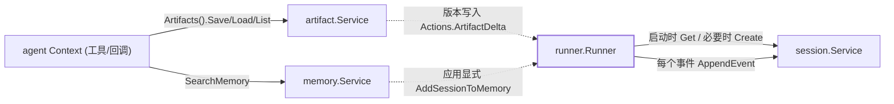

# 服务层（Service Layer）

> ADK 把持久化拆成三个互相独立的接口——`session.Service`（会话与事件）、`artifact.Service`（带版本的文件）、`memory.Service`（跨会话的长期记忆）；`runner` 通过 `runner.Config` 拿到它们，每个接口都有内存、数据库/对象存储、Vertex AI 等实现。

## 涉及代码

- `session/service.go` —— `session.Service` 接口、`ErrNotFound`、各请求/响应类型与 `session.InMemoryService`
- `session/session.go` —— `Session` / `State` / `Events` / `Event` / `EventActions` 与状态作用域前缀
- `session/inmemory.go` —— 内存实现：`omap` 存储、状态合并、`AppendEvent` 的 temp 剥离
- `session/vertexai/vertexai.go` —— 基于 Vertex AI Agent Engine 的会话服务
- `session/database/service.go`、`session/database/storage_session.go`、`session/database/gorm_datatypes.go` —— GORM 关系库实现与表结构
- `session/sessiontestsuite/service_suite.go` —— 所有 `session.Service` 实现共享的一致性测试
- `artifact/service.go` —— `artifact.Service` 接口与请求校验、`artifact.ArtifactVersion`
- `artifact/inmemory.go` —— 内存实现与 artifact key 编码
- `artifact/gcsartifact/service.go` —— GCS 实现与乐观版本控制
- `internal/artifact/tests/service_suite.go` —— `artifact.Service` 一致性测试
- `memory/service.go` —— `memory.Service` 接口与 `SearchRequest` / `SearchResponse` / `Entry`
- `memory/inmemory.go` —— 关键词匹配的内存实现
- `memory/vertexai/vertexai.go` —— 基于 Vertex AI MemoryBank 的实现
- `runner/runner.go` —— `runner.Config` 组装三个服务；`NewInMemory` 一键用内存实现

## 三个服务接口

三个包各自定义 `Service` 接口，签名都是真实代码：

```go
// session/service.go
type Service interface {
    Create(context.Context, *CreateRequest) (*CreateResponse, error)
    Get(context.Context, *GetRequest) (*GetResponse, error)
    List(context.Context, *ListRequest) (*ListResponse, error)
    Delete(context.Context, *DeleteRequest) error
    AppendEvent(context.Context, Session, *Event) error
}

// artifact/service.go
type Service interface {
    Save(ctx context.Context, req *SaveRequest) (*SaveResponse, error)
    Load(ctx context.Context, req *LoadRequest) (*LoadResponse, error)
    Delete(ctx context.Context, req *DeleteRequest) error
    List(ctx context.Context, req *ListRequest) (*ListResponse, error)
    Versions(ctx context.Context, req *VersionsRequest) (*VersionsResponse, error)
    GetArtifactVersion(ctx context.Context, req *GetArtifactVersionRequest) (*GetArtifactVersionResponse, error)
}

// memory/service.go
type Service interface {
    AddSessionToMemory(ctx context.Context, s session.Session) error
    SearchMemory(ctx context.Context, req *SearchRequest) (*SearchResponse, error)
}
```

**为什么各自定义而不是一个统一接口**：三者存储的是不同东西、生命周期也不同——`session` 是每次对话的私有记录，`artifact` 是可按版本寻址的文件，`memory` 是用户级、跨会话的检索索引。它们分属 `session`、`artifact`、`memory` 三个包，`memory.Service` 的方法直接收 `session.Session`，如果合并到一个公共接口反而制造包依赖与实现负担。分开之后，调用方按需依赖最小接口：`runner.Config` 里 `SessionService` 必填，`ArtifactService`、`MemoryService` 可选，各实现只需满足自己那个接口（每个文件末尾都有 `var _ Service = (*impl)(nil)` 的断言）。

## Session 服务实现

`session.Service` 管理 `Session` 的生命周期、`State`（键值）与 `Events`（按序日志）。`AppendEvent` 是唯一写事件的方法，契约见下一节。

### 内存：`session.InMemoryService()`

线程安全（`sync.RWMutex`），用 `rsc.io/omap` 有序 map 存储。会话键是 `id{appName, userID, sessionID}`，经 `rsc.io/ordered` 编码；app/user 级状态分别单独存，读取时 `sessionutils.MergeStates` 合并回带前缀的视图。`Get` 支持 `NumRecentEvents` 与 `After` 两个过滤。适合测试与本地开发。

### Vertex AI：`session/vertexai.NewSessionService(ctx, VertexAIServiceConfig{ProjectID, Location, ReasoningEngine}, opts ...option.ClientOption)`

会话存放在 Google Cloud Agent Engine 的 reasoning engine 里。`Get` 并发拉取会话元信息与事件列表（`errgroup`），`AppendEvent` 委托给客户端。**事件 ID 由服务端分配**：写入时不改调用方的事件，读回时才带上服务端资源名——这是与内存/数据库实现的一个差异，一致性测试对“原地赋 ID”这一半做了豁免。

### 关系数据库：`session/database`

```go
func NewSessionService(dialector gorm.Dialector, opts ...gorm.Option) (session.Service, error)
func NewSessionServiceFromDB(db *gorm.DB) (session.Service, error)
func AutoMigrate(service session.Service) error
```

用 GORM 实现。本模块只依赖 `gorm.io/gorm` 本体，**driver 由调用方传入**——包注释举例 PostgreSQL、Spanner、SQLite，dialect 相关的列类型在 `gorm_datatypes.go` 里按方言分派：`postgres` → `JSONB`，`mysql` → `LONGTEXT`，`spanner` → `STRING(MAX)`。`AutoMigrate` 会建四张表：

| 表 | 模型 | 主键 | 说明 |
|----|------|------|------|
| `sessions` | `storageSession` | `(AppName, UserID, ID)` | 会话状态 + CreateTime/UpdateTime（`precision:6`） |
| `events` | `storageEvent` | `(ID, AppName, UserID, SessionID)` | 事件；`Actions` 存 JSON 字节，`Content` 及各 metadata 存 `dynamicJSON` |
| `app_states` | `storageAppState` | `AppName` | app 级状态 |
| `user_states` | `storageUserState` | `(AppName, UserID)` | user 级状态 |

`events` 通过 `gorm:"foreignKey:AppName,UserID,SessionID;references:AppName,UserID,ID;constraint:OnDelete:CASCADE"` 关联 `sessions`（删除会话级联删事件）。读写要点：

- 状态按前缀拆分：`extractStateDeltas` 把 `app:` / `user:` 前缀键分别写进对应表，其余进会话状态，`temp:` 忽略；返回时 `mergeStates` 再补回前缀。
- 写入时间戳统一 `Truncate(time.Microsecond)`，与数据库精度对齐。
- 并发用乐观校验：`applyEvent` 在事务里比较会话的 `UpdateTime`，若数据库里的更新更新则报 stale session 错。
- `Get` 按 `timestamp DESC, id DESC` 排序并在 limit 后反转为时间升序；`id` 作为并列时间戳的稳定 tiebreak（compaction 依赖这一顺序）。

所有实现共享 `session/sessiontestsuite` 的一致性测试。

## Artifact 服务

`artifact.Service` 存“文件”（`genai.Part`），用 `AppName + UserID + SessionID + FileName` 定位，文件名不允许含 `/` 或 `\`（`validateFileName`）。`Save` 返回递增的 `Version`；`Load` / `Delete` 不带版本时作用于最新版本。

### key 的结构与版本

内存实现的 key（`artifact/inmemory.go`）是：

```go
type artifactKey struct {
    AppName, UserID, SessionID, FileName string
    Version int64
}
// Encode: ordered.Encode(appName, userID, sessionID, fileName, ordered.Rev(Version))
```

版本用 `ordered.Rev` **反转**编码，于是扫描时最新版本排在最前——`find` 取第一个匹配即为最新。`Save` 先 `find` 出当前最大版本再 `+1`。

**用户级 artifact** 是个特例：文件名以 `user:` 开头时，存储时把 `sessionID` 换成常量 `"user"`（`userScopedArtifactKey`），从而对同一 `app + user` 的所有会话共享；`List` 会同时合并会话内与用户级两类文件名。

### GCS：`gcsartifact.NewService(ctx, bucketName, opts ...option.ClientOption) (artifact.Service, error)`

blob 名形如 `app/user/session/file/version`（用户级为 `app/user/user/file/version`）。版本是**乐观分配**的：先列出已有版本取 `max+1`，用 `ifNotExist` 前置条件写入；若被并发写入者抢占则退避重试，最多 `maxSaveAttempts = 16` 次（抖动退避，基准 10ms、上限 1s），仍失败返回 `ErrVersionConflict`（可安全重试）。`GetArtifactVersion` 返回 `ArtifactVersion{Version, CanonicalURI, CustomMetadata, CreateTime, MimeType}`，其中 `CanonicalURI` 是 `gs://<bucket>/<blob>` 形式的身份标识（不是需要认证的下载 URL）。

## Memory 服务

`memory.Service` 提供 **用户级、跨会话**的长期知识：`AddSessionToMemory` 摄取一个会话，`SearchMemory` 按 `Query` + `UserID` + `AppName` 检索。

```go
type SearchRequest struct{ Query, UserID, AppName string }
type SearchResponse struct{ Memories []Entry }
type Entry struct {
    ID             string
    Content        *genai.Content
    Author         string
    Timestamp      time.Time
    CustomMetadata map[string]any
}
```

- 内存实现 `memory.InMemoryService()`：把每个事件的文本分词（`extractWords`）做关键词匹配，最多返回 `maxSearchResults = 10` 条，按命中不同查询词的个数排序；检索严格按 `appName + userID` 隔离。非 ASCII 查询词额外允许子串匹配。
- Vertex AI 实现 `memory/vertexai.NewService(ctx, *ServiceConfig)`：`ServiceConfig` 内嵌 `vertexaiutil.AgentEngineData`（指定 MemoryBank 所在的 Agent Engine），另有 `StateKeySessionLastUpdateTime`（非空时只摄取该状态键时间之后的事件，否则摄取整个会话）与 `WaitForCompletion`。

注意：`AddSessionToMemory` **不由 runner 自动调用**，需要应用显式触发（`examples/agentengine/main.go`、`examples/tools/loadmemory/main.go` 即如此）；检索则通过 `agent.Context.SearchMemory` 在工具/回调里发起。

## Event 结构与 Actions（持久化视角）

`session.Event` 内嵌 `model.LLMResponse`，字段与含义（概念页已详述，此处只列持久化相关的）：

- `ID` / `Timestamp` 注释写明 “Set by storage”——存储实现得保证它们有值。
- `InvocationID` / `Branch` / `IsolationScope` / `Author` 由 `agent.Context` 填写。
- `Actions EventActions`、`LongRunningToolIDs`、`Routes`、`RequestedInput`、`Output`、`NodeInfo`。

`EventActions` 各字段及消费者：

| 字段 | 含义 | 谁消费 |
|------|------|--------|
| `StateDelta map[string]any` | 状态增量，键前缀决定作用域 | `AppendEvent` 拆分并落库（见下） |
| `ArtifactDelta map[string]int64` | 文件名 → 版本 | 工具保存 artifact 时由 `Context.Artifacts()` 的包装写入（`agent/common_context.go` 的 tracked artifacts）；REST/A2A 序列化时透传 |
| `RequestedToolConfirmations map[string]toolconfirmation.ToolConfirmation` | 待人工确认的工具调用 | LLM flow 与 compaction 窗口（保留 call/response 配对）、`server/adkrest` 序列化 |
| `TransferToAgent string` | 转交给哪个 agent | LLM flow 的 `agent_transfer.go` / `base_flow.go` 决定下一个 agent |
| `Escalate bool` | 向父 agent 升级 | workflow 编排 |
| `SkipSummarization bool` | 不调用模型总结 function response | LLM flow |
| `Compaction *EventCompaction` | 上下文压缩记录，标注被摘要覆盖的事件区间 | prompt 组装；`AppendEvent` 必须原样保留 |

状态作用域前缀定义在 `session/session.go`：`KeyPrefixApp = "app:"`、`KeyPrefixUser = "user:"`、`KeyPrefixTemp = "temp:"`，无前缀即会话级。

### `AppendEvent` 的契约

`session.Service.AppendEvent` 的文档注释与两个实现共同约定：

1. **忽略 partial 事件**——`event.Partial` 为真时直接返回，不入历史。
2. **补齐 ID**——事件没有 `ID` 时补一个（内存与数据库都在原地用 `platform.NewUUID` 赋值；Vertex AI 由服务端在读回时赋值）。事件可能由 agent/tool 用结构字面量构造，不经过 `NewEvent`，所以不能假设 ID 已存在。
3. **剥离 temp 键**——持久化前删除 `temp:` 前缀的 `StateDelta`（`trimTempDeltaState`），让临时状态只活在当前 invocation。列表里其余键按前缀拆分到 app/user/session 三处状态。
4. **保留 Compaction**——压缩摘要的内容只在 `EventActions.Compaction` 里（`LLMResponse.Content` 为 nil、没有 state/artifact delta），实现不能按“有 content/delta 才写”来挑拣，否则会话读回来会丢掉摘要并重复计费。
5. **缺失会话报 `session.ErrNotFound`**——`Get` 与 `AppendEvent` 都要 `errors.Is(err, session.ErrNotFound)` 可判；`Delete` 对不存在的会话是 no-op，`List` 返回空，不报此错。

`sessiontestsuite` 覆盖第 2、4 条，实现若不满足会在一致性测试里变红。

## Runner 与三个服务的关系

`runner.Config` 必填 `SessionService`，`ArtifactService` / `MemoryService` 可选；`runner.NewInMemory(appName, agent)` 用三个内存实现一键装配并开启 `AutoCreateSession`。



- **会话**：runner 直接读（`Get`/必要时 `Create`）写（`AppendEvent`），时机贯穿一次 run 的始终。
- **artifact**：runner 不直接调用，工具/回调通过 `agent.Context.Artifacts()` 访问；保存成功后版本会记进当前事件的 `ArtifactDelta`。
- **memory**：检索由 `Context.SearchMemory` 发起；摄取（`AddSessionToMemory`）由应用显式调用，不是 runner 的自动步骤。

## 相关页面

- [核心概念](./03-core-concepts.md) —— `Session` / `Event` / `State` 与 `EventActions` 的概念性介绍（本文侧重服务接口与持久化契约）
- [Agent 执行](./04-agent-execution.md) —— runner 在一次 run 中如何读写这些服务、事件如何被追加
- [A2A 与分布式](./07-a2a-distributed.md) —— A2A 服务端复用 `session.Service` 与 runner 做持久化
- [启动器与部署](./09-launcher-deployment.md) —— `runner.Config` 与各服务实例在 launcher 里如何组装
- [高级主题](./12-advanced-topics.md) —— 状态作用域、事件重排与 compaction 等横切话题
