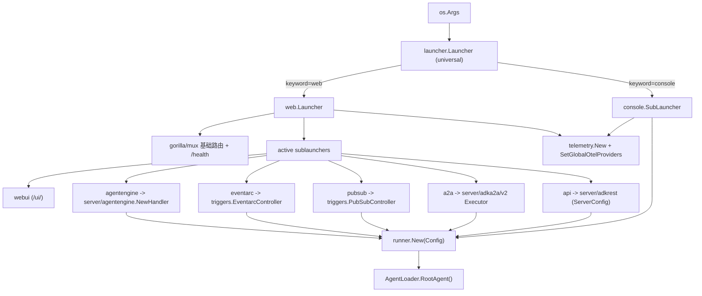

# 启动器与部署（Launcher and Deployment）

> ADK Go 用一层 `Launcher`/`SubLauncher` 抽象把「同一个 agent 以 console、web、A2A 或触发式服务运行」统一成命令行关键字，并用 `adkgo` CLI 把入口打包部署到 Cloud Run 或 Agent Engine。

## 涉及代码

- `cmd/launcher/launcher.go` —— `Launcher`/`SubLauncher` 接口与 `Config`，以及 `Config.Validate`
- `cmd/launcher/universal/universal.go` —— 按第一个参数（keyword）路由到某个子启动器
- `cmd/launcher/full/full.go` —— `full.NewLauncher`，聚合 console 与 web 的全部子启动器
- `cmd/launcher/prod/prod.go` —— `prod.NewLauncher`，只保留 REST API 与 A2A（无 console / Web UI）
- `cmd/launcher/console/console.go`、`cmd/launcher/console/hitl.go` —— 终端交互与 HITL 提示
- `cmd/launcher/web/web.go` —— web 启动器、`web.Sublauncher` 接口、基础路由与默认服务
- `cmd/launcher/web/webui/webui.go` —— 内嵌 ADK Web UI（Angular）静态资源
- `cmd/launcher/web/api/api.go` —— 挂载 `server/adkrest` 的 ADK REST API
- `cmd/launcher/web/a2a/a2a.go` —— 挂载 `server/adka2a/v2` 的 A2A JSON-RPC 端点
- `cmd/launcher/web/triggers/pubsub/pubsub.go`、`cmd/launcher/web/triggers/eventarc/eventarc.go` —— 触发式端点
- `cmd/launcher/web/agentengine/agentengine.go` —— Agent Engine 的 reasoning engine 端点
- `cmd/launcher/agentengine/agentengine.go` —— 面向 Agent Engine 部署的启动器聚合
- `cmd/adkgo/adkgo.go`、`cmd/adkgo/internal/root/root.go`、`cmd/adkgo/internal/deploy/**` —— `adkgo` CLI
- `cmd/internal/adkcli/main.go` —— 扫描 `root_agent.yaml` 并运行 `full.NewLauncher` 的另一个入口
- `agent/loader.go` —— `agent.Loader`、`NewSingleLoader`、`NewMultiLoader`
- `server/adkrest/handler.go`、`server/agentengine/handler.go` —— 被 sublauncher 复用的 HTTP 服务
- `scripts/adk-web/update-adk-web.sh`、`scripts/adk-web/Dockerfile` —— 重新构建内嵌的 Web UI bundle

## cmd/ 结构

`cmd/` 下有两类入口：

- `cmd/adkgo/` —— 发布/部署用 CLI，二进制名 `adkgo`（`cmd/adkgo/internal/root/root.go` 里的 `RootCmd`）。实际子命令由 `deploy` 包挂载：`root.RootCmd.AddCommand(DeployCmd)`（`cmd/adkgo/internal/deploy/deploy.go`）。因此 `adkgo` 目前只有 `deploy` 一个顶层命令，下面两个子命令：
  - `adkgo deploy cloudrun`（`cmd/adkgo/internal/deploy/cloudrun/cloudrun.go`）
  - `adkgo deploy agentengine`（`cmd/adkgo/internal/deploy/agentengine/agentengine.go`）

  没有其它 cobra 命令被注册（全仓库 `AddCommand` 只出现在上述三处）。
- `cmd/internal/adkcli/main.go` —— 另一套可执行入口：递归查找 `root_agent.yaml`，用 `configurable.FromConfig` 加载 agent，装配 `replayplugin`/`recordplugin`，最后调用 `full.NewLauncher()`。它是 `cmd/launcher` 的使用示例，不是 `adkgo` 的一部分。

启动器本体全部在 `cmd/launcher/`：顶层 `console`、`web`、`universal`、`full`、`prod`、`agentengine`，web 下再挂 `webui`/`api`/`a2a`/`triggers/pubsub`/`triggers/eventarc`/`agentengine`。

## Launcher 抽象

两个接口（`cmd/launcher/launcher.go`）：

- `Launcher` —— 顶层入口。`Execute(ctx, config, args) error` 解析命令行并运行；`CommandLineSyntax() string` 返回帮助文本。
- `SubLauncher` —— 可组合的子启动器。`Keyword()` 返回激活用的关键字，`Parse(args) ([]string, error)` 消费自己的 flag 并返回剩余参数，`Run(ctx, config) error` 执行，另有 `CommandLineSyntax()` 与 `SimpleDescription()`。

`launcher.Config` 汇总依赖：`SessionService`、`ArtifactService`、`MemoryService`、`AgentLoader`、`A2AOptions []a2asrv.RequestHandlerOption`、`PluginConfig runner.PluginConfig`、`TelemetryOptions []telemetry.Option`，以及 `Authenticator`、`Authorizer`、`BindHost`、`Compaction *compaction.Config`、`MaxPayloadSize int64`。`Config.Validate` 在启动前检查 `Compaction`——否则进程会「启动成功、每个请求都失败」。

`agent.Loader`（`agent/loader.go`）把 agent 交给 launcher：`NewSingleLoader(a)` 只暴露一个 root agent；`NewMultiLoader(root, agents...)` 建立按名字索引的多 agent 表（重名报错）。launcher 通过 `AgentLoader.RootAgent()` 拿根 agent，REST/A2A 等服务端还会用 `ListAgents()`/`LoadAgent(name)` 支持多应用。

`universal.NewLauncher(...)`（`cmd/launcher/universal/universal.go`）是路由器：第一个子启动器是默认项；`args[0]` 命中某个 `Keyword()` 就用它，并把它从参数里摘掉；未命中则整串参数交给默认子启动器。`ErrorOnUnparsedArgs` 在参数消费不完时报错。

工厂（`full`/`prod`/`agentengine`）就是不同的组合：

| 工厂 | 组合 |
| --- | --- |
| `full.NewLauncher()` | `universal(console, web(webui, a2a, pubsub, eventarc, api))` |
| `prod.NewLauncher()` | `universal(web(api, a2a))` |
| `agentengine.NewLauncher(id)` | `universal(web(web/agentengine))` |

### 关键字清单

`console` 与 `web` 是 universal 层的子启动器；其余是 `web` 层的子启动器（实现 `web.Sublauncher`：`SetupSubrouters(router, config)` 与 `UserMessage(webURL, printer)`）。

| 关键字 | 包 | 作用 |
| --- | --- | --- |
| `console` | `cmd/launcher/console` | 终端里跑 agent |
| `web` | `cmd/launcher/web` | 起 HTTP 服务器，挂载下面各子启动器 |
| `webui` | `cmd/launcher/web/webui` | 内嵌 ADK Web UI（`/ui/`） |
| `api` | `cmd/launcher/web/api` | ADK REST API（默认 `/api`） |
| `a2a` | `cmd/launcher/web/a2a` | A2A JSON-RPC 服务与 agent card |
| `pubsub` | `cmd/launcher/web/triggers/pubsub` | Pub/Sub 触发端点 |
| `eventarc` | `cmd/launcher/web/triggers/eventarc` | Eventarc 触发端点 |
| `agentengine` | `cmd/launcher/web/agentengine` | Agent Engine reasoning engine 端点 |

### 关系图

## console 启动器

`NewLauncher` 建 `flag.FlagSet("console")`，flag 与默认值：

- `-streaming_mode`（默认空，只接受 `none`/`sse`；空值运行时按 stdout 是否为字符设备决定：TTY 用 `sse`，否则 `none`）
- `-shutdown-timeout`（默认 `2s`）
- `-otel_to_cloud`（默认 `false`）

`Run` 会：初始化 telemetry（`telemetry.InitAndSetGlobalOtelProviders`）并在退出时 `Shutdown`；session service 为空时用 `session.InMemoryService()`；用固定 `userID="console_user"`、`appName="console_app"` 建 session；构造 `runner.New`；然后进入读 stdin 的循环，把每行当一个 `genai.Content` 交给 `r.Run`，按 streaming 模式打印事件文本；`compaction.ErrCompaction` 只记日志、不算这一轮失败。终端节点若只返回 `Event.Output` 而没有模型文本，用 `renderOutput`（字符串原样，其它转 JSON）打印。

### 终端里的 HITL

HITL（human-in-the-loop）在 `cmd/launcher/console/hitl.go` 处理。上一轮事件里 `Event.LongRunningToolIDs` 指向的 `FunctionCall` 被收集为 `pendingInterrupt`（`collectPendingInterrupts` 会按 call ID 去重并跳过 `Partial` 分片）。渲染与应答按函数名分派：

- `workflow.WorkflowInputFunctionCallName` —— 打印 `message`、`payload`、`responseSchema`；用户回复先尝试 JSON 解析，对象原样返回，标量/数组包在 `payload` 下。
- `toolconfirmation.FunctionCallName` —— 打印 `toolConfirmation.hint`（缺失时用 `toolconfirmation.OriginalCallFrom` 还原工具名，拼成 `Confirm <name>?`），提示 `Type 'yes' to confirm, anything else to reject.`；回复 `y`/`yes`/`true`/`confirm`（大小写不敏感）得到 `{"confirmed": true}`，其余（含空行）得到 `{"confirmed": false}`。
- 其它类型 —— `renderGenericInterruptPrompt` 打印类型名与原始 args，回复按 JSON 对象原样或包在 `result` 下。

每个答复被包成按 `id`/`name` 键控的 `genai.Part`（`buildInterruptResponse`），多个中断的答复合并成一条 user `Content` 发回，由 workflow 运行时按 `FunctionResponse.ID` 路由到等待的节点。

## web 启动器与各子启动器

`web.NewLauncher(sublaunchers...)` 建 `flag.FlagSet("web")`：

- `-host`（默认 `127.0.0.1`，空值按默认处理；`0.0.0.0` 才对外）
- `-port`（默认 `8080`）
- `-write-timeout`（`15s`）、`-read-timeout`（`15s`）、`-idle-timeout`（`60s`）、`-shutdown-timeout`（`15s`）
- `-otel_to_cloud`（`false`）
- `-h2c`（`false`，开明文 HTTP/2）
- `-max_request_body_size`（`0`→用 adkrest 默认 10 MiB）

`Parse` 先解 web 自己的 flag，再按剩余参数里的关键字逐个调用对应子启动器的 `Parse`；同一关键字出现两次会报错；一个子启动器都没激活时 `buildRouter` 报错并列出可选关键字。`Run` 先用 `applyServiceDefaults` 给缺失的 session/artifact/memory service 填内存实现并打日志，再建路由、初始化 telemetry、启动 `http.Server`（`buildHTTPServer` 支持 `-h2c`），收到信号后 `Shutdown`。基础路由由 `BuildBaseRouter()` 返回（只挂 logger 中间件），`registerHealthRoute` 额外注册 `GET/HEAD /health`。`webURL()` 把 `127.0.0.1`/`::1`/`0.0.0.0`/`::` 归一成 `localhost` 显示，避免和 Web UI 的 origin 不一致。

### webui

`webui.NewLauncher()` 的 flag 只有 `-api_server_address`（默认 `http://localhost:8080/api`）。pathPrefix 固定 `/ui/`。前端资源用 `//go:embed distr/*` 打进二进制，`spaHandler` 服务 SPA：命中不到文件且无扩展名时回退 `index.html`，`noListingFS` 禁止目录列表，`rewriteBaseHref` 把 `<base href>` 指到 `/ui/`；`/assets/config/runtime-config.json` 在运行时生成（`{"backendUrl": ...}`）；`/` 重定向到 `/ui/`。刷新 bundle 用 `scripts/adk-web/update-adk-web.sh`（在容器里按 `scripts/adk-web/Dockerfile` 固定的 `ADK_WEB_REF` 构建后 `docker cp` 进 `cmd/launcher/web/webui/distr/`）。

### api（ADK REST API）

`api.NewLauncher()` 的 flag：

- `-webui_address`（默认 `localhost:8080`；作为 CORS allowed origin，同时进入 REST 的 origin 检查；`*` 关闭检查）
- `-path_prefix`（默认 `/api`）
- `-sse-write-timeout`（`120s`）
- `-trace_capacity`（`10000`，内存中保留的 trace 数）
- `-include_debug_api`（`false`）—— 开启 trace 与 agent graph 调试端点，会暴露工具调用参数/响应/名称，生产环境不要开

`SetupSubrouters` 用 `adkrest.NewServer(adkrest.ServerConfig{...})` 建服务（传入 session/memory/artifact/agent loader、`MaxPayloadSize`、`SSEWriteTimeout`、`PluginConfig`、`Authenticator`、`Authorizer`、`Compaction`、`BindHost`、`AllowedOrigins`、`DebugConfig.TraceCapacity`、`DebugAPIConfig.IncludeDebugAPI`），并把 `restServer.SpanProcessor()` / `LogProcessor()` 追加进 `config.TelemetryOptions`；外面套 `corsWithArgs`，再经 `registerAPIRoutes` 挂载（处理挂载前缀下的重定向、尾斜杠、`Hijack` 以支持 `/run_live` 的 WebSocket）。

`adkrest` 注册的路由（`server/adkrest/internal/routers/*.go`）：`/health`、`/version`、`/list-apps`、`/apps/{app_name}/users/{user_id}/sessions...`（CRUD）、artifact 系列、`/run`、`/run_sse`、`/run_live`；开发者端点在 `DevPrefix = "/dev/apps/{app_name}"` 下（eval、agent builder、tests，以及开启 `IncludeDebugAPI` 后的 debug trace 与 agent graph）。

### a2a（A2A 服务端）

`a2a.NewLauncher()` 的 flag 是 `-a2a_agent_url`（默认 `http://localhost:8080`，写进公开 agent card）。`SetupSubrouters` 先做 compaction 校验，再用 root agent 的名字/描述与 `adka2a.BuildAgentSkills` 构造 `a2acore.AgentCard`（`Version: "2.0.0"`，声明 streaming 与 `adka2a.ADKExtensionURI` 扩展），暴露 `a2asrv.WellKnownAgentCardPath`；用 `adka2a.NewExecutor` 包一个 runner，再挂 JSON-RPC：`/a2a/v1/invoke`（1.0）与 `/a2a/invoke`（0.3 兼容）。

### agentengine 子启动器

`web/agentengine.NewLauncher(agentEngineId)` 关键字 `agentengine`，flag：`-path_prefix`（`/api`）、`-max_payload_size`（10 MiB）、`-sse-write-timeout`（`120s`）。`SetupSubrouters` 调 `agentengine.NewHandler(config, sseWriteTimeout, maxPayloadSize, agentEngineID)`（`server/agentengine/handler.go`），把 `POST {prefix}/reasoning_engine` 和 `POST {prefix}/stream_reasoning_engine` 挂上；支持的 RPC 方法由 `agentengine.ListClassMethods()` 列出（如 `async_create_session`、`async_get_session`、`async_list_sessions`、`async_delete_session`、`async_stream_query`、`streaming_agent_run_with_events`）。

## 触发式部署：PubSub 与 Eventarc

两者都真实存在，是 web 层的子启动器（不是独立进程）：

- `cmd/launcher/web/triggers/pubsub` → 关键字 `pubsub` → `POST {prefix}/apps/{app_name}/trigger/pubsub`
- `cmd/launcher/web/triggers/eventarc` → 关键字 `eventarc` → `POST {prefix}/apps/{app_name}/trigger/eventarc`

共同的 flag（默认值相同）：`-path_prefix`（`/api`）、`-trigger_max_retries`（`3`）、`-trigger_base_delay`（`1s`）、`-trigger_max_delay`（`10s`）、`-trigger_max_concurrent_runs`（`100`）；`Parse` 会校验都为合法值。处理逻辑在 `server/adkrest/controllers/triggers`：`NewPubSubControllerWithConfig` / `NewEventarcControllerWithConfig` 接收 `triggers.ControllerConfig`（session/memory/artifact/agent loader/plugin/compaction + `TriggerConfig{MaxRetries, BaseDelay, MaxDelay, MaxConcurrentRuns}`）。

## 部署

### `adkgo deploy cloudrun`

`cloudrunCmd` 的 flag（均为 persistent，默认值来自源码）：`-region/-r`、`-project_name/-p`、`-service_name/-s`（三者默认空）、`-temp_dir/-t`（空→`os.TempDir()`）、`-proxy_port`（`8081`）、`-server_port`（`8080`）、`-entry_point_path/-e`（空）、`-a2a`（`true`）、`-a2a_agent_url/-a`（`http://127.0.0.1:8081`）、`-api`（`true`）、`-debug_api`（`false`，需 `--api`）、`-webui`（`true`）、`-pubsub`（`false`）及其 `-pubsub_max_retries`(`3`)/`-pubsub_base_delay`(`1s`)/`-pubsub_max_delay`(`10s`)/`-pubsub_max_concurrent_runs`(`100`)、`-eventarc`（`false`）及其 `-eventarc_*` 同组默认值。

流程（`deployOnCloudRun`）：`computeFlags`（校验 `--a2a_agent_url`/可执行名并建临时目录）→ `compileEntryPoint`（`go build -ldflags "-s -w"`，`CGO_ENABLED=0 GOOS=linux GOARCH=amd64`）→ `prepareDockerfile`（生成 `FROM gcr.io/distroless/static-debian11`，`CMD` 是 `<exec> web -host 0.0.0.0 -port <server_port> ...各子启动器...`）→ `gcloudDeployToCloudRun`（`gcloud run deploy <service> --source . --set-secrets=GOOGLE_API_KEY=GOOGLE_API_KEY:latest --region ... --project ... --ingress all --no-allow-unauthenticated`）→ 清理临时目录 → `runGcloudProxy`（`gcloud run services proxy` 加认证头，本地 `:8081` 映射 Web UI `/ui/` 与 API `/api/`）。

### `adkgo deploy agentengine`

`agentEngineCmd` 的 flag：`-region/-r`、`-project_name/-p`、`-name/-s`（默认空）、`-temp_dir/-t`（空→`os.TempDir()`）、`-server_port`（`8080`）、`-entry_point_path/-e`（空）、`-source_dir/-d`（空→当前目录）、`-agent_engine_id`（空→新建实例，非空→更新）、`-mem_deploy`（`false`）、`-mem_model`（`publishers/google/models/gemini-2.5-flash`）、`-mem_ttl`（`time.Hour*24*365`）。

流程：`computeFlags` → `prepareDockerfile`（多阶段：`FROM golang:<go.mod 的 go 版本> AS builder`，`ENV GOTOOLCHAIN=auto`，`RUN CGO_ENABLED=0 ... go build`，再 `FROM gcr.io/distroless/static-debian11`，`CMD` 为 `<exec> web -host 0.0.0.0 -port <server_port> agentengine`）→ `createArchive`（`tar -czf archive.tgz -C <source_dir> --exclude=.git --exclude=adkgo .` 另加 Dockerfile）→ 调 `cloud.google.com/go/aiplatform/apiv1beta1` 的 `ReasoningEngineClient` 发 `CreateReasoningEngine` 或 `UpdateReasoningEngine`（超时 `agentEngineOperationTimeout = 45 * time.Minute`）→ 清理临时目录。`AgentFramework: "google-adk"`，写入环境变量 `GOOGLE_CLOUD_REGION`、`NUM_WORKERS=1`、`GOOGLE_CLOUD_AGENT_ENGINE_ENABLE_TELEMETRY=true`、`OTEL_INSTRUMENTATION_GENAI_CAPTURE_MESSAGE_CONTENT=true`；若 `-mem_deploy` 还附带 memory bank 的 `MemoryBankConfig`（模型与 TTL）。

容器化文件：仓库里唯一的 `Dockerfile` 是 `scripts/adk-web/Dockerfile`（构建 Web UI bundle）。Cloud Run 与 Agent Engine 的部署 Dockerfile 由上面两条命令在临时目录里现场生成，不提交进仓库。`scripts/` 下另有 `backport.sh`。

## 相关页面

- [核心概念](./03-core-concepts.md) —— `Agent`/`InvocationContext`/Session 等 launcher 装配的对象
- [Agent 执行](./04-agent-execution.md) —— launcher 最终构造的 `runner` 如何驱动一轮对话
- [A2A 与分布式](./07-a2a-distributed.md) —— `a2a` sublauncher 背后的协议、agent card 与 executor
- [服务层](./08-service-layer.md) —— `Config` 里的 session/artifact/memory service 实现
- [可观测性](./10-telemetry-observability.md) —— launcher 里的 telemetry 初始化与 `-otel_to_cloud`
- [示例导览](./13-examples.md) —— 各 example 如何用 `full`/`prod`/`agentengine` 启动
