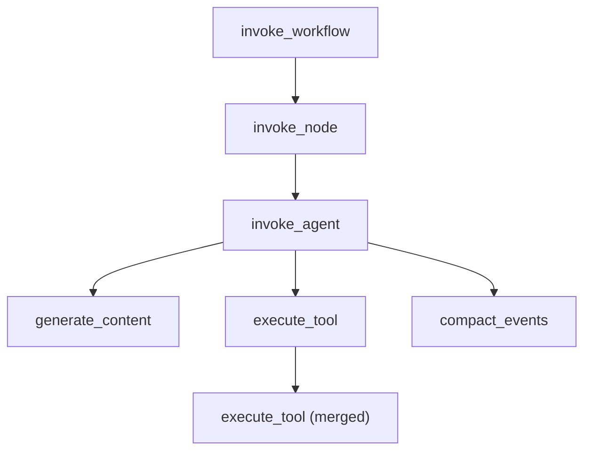

# 可观测性（Telemetry and Observability）

> `telemetry.New` 用 OTel options 装配 Tracer/Logger provider 并把它们设为全局 provider；ADK 内部按 GenAI 语义约定发出 `invoke_agent`/`generate_content`/`execute_tool` 等 span 与 `gen_ai.*` 日志，可导出到任意 OTLP HTTP 端点或 Google Cloud 的 `telemetry.googleapis.com`。

## 涉及代码

- `telemetry/telemetry.go` —— 公共 API：`New`、`Providers`、`Shutdown`、`SetGlobalOtelProviders`
- `telemetry/config.go` —— `Option` 与全部 `With*` 配置项
- `telemetry/setup_otel.go` —— resource 解析、exporter 装配、GCP 相关逻辑
- `internal/telemetry/telemetry.go` —— span 生成与属性（`StartGenerateContentSpan`、`StartExecuteToolSpan`、`StartTrace` 等）
- `internal/telemetry/node_tracing.go` —— `StartNodeSpan`：`invoke_agent`/`invoke_workflow`/`invoke_node`
- `internal/telemetry/logger.go` —— 日志记录、`gen_ai.system.*`/`gen_ai.choice`、内容捕获开关
- `internal/telemetry/genaimessages.go` —— span 上的 `gen_ai.input.messages`/`gen_ai.output.messages`/`gen_ai.system_instructions`
- `internal/telemetry/compaction.go` —— `compact_events <trigger>` span
- `agent/agent.go`、`workflow/node_span.go` —— 调用 `StartNodeSpan` 的位置
- `internal/llminternal/base_flow.go` —— 调用 `StartGenerateContentSpan`/`StartExecuteToolSpan` 的位置
- `cmd/launcher/internal/telemetry/telemetry.go` —— launcher 侧的初始化封装 `InitAndSetGlobalOtelProviders`
- `plugin/loggingplugin/logging_plugin.go` —— 控制台日志插件
- `examples/telemetry/main.go` —— 可运行示例

## 公共 API

`telemetry.New(ctx, opts ...Option) (*Providers, error)`（`telemetry/telemetry.go`）返回 `Providers`，其中只有两个 provider 字段：

- `TracerProvider *sdktrace.TracerProvider`（未配置时为 `nil`）
- `LoggerProvider *sdklog.LoggerProvider`（未配置时为 `nil`）

`Providers.Shutdown(ctx)` 逐个关闭非 nil 的 provider 并把错误 `errors.Join` 起来；`Providers.SetGlobalOtelProviders()` 用 `otel.SetTracerProvider` / `logglobal.SetLoggerProvider` 安装全局 provider。当前**没有** MeterProvider（`telemetry/setup_otel.go` 里 `newInternal` 标注 `TODO(#479) init meter provider`），因此 ADK 目前只提供 trace 与 log 两个信号。

`Option` 由 `telemetry/config.go` 定义，全部构造器（真实符号）：

| Option | 作用 |
| --- | --- |
| `WithOtelToCloud(bool)` | 开启/关闭导出到 GCP（`telemetry.googleapis.com`） |
| `WithGcpResourceProject(string)` | 设置 `gcp.project_id` resource 属性 |
| `WithGcpQuotaProject(string)` | 设置导出用的 quota project |
| `WithResource(*resource.Resource)` | 自定义 OTel resource，与默认 detectors 合并 |
| `WithGoogleCredentials(*google.Credentials)` | 覆盖 ADC |
| `WithSpanProcessors(...sdktrace.SpanProcessor)` | 追加 span processor（自定义 exporter、内存调试等） |
| `WithLogRecordProcessors(...sdklog.Processor)` | 追加 log processor |
| `WithTracerProvider(*sdktrace.TracerProvider)` | 用预配置的 TracerProvider 覆盖 |
| `WithLoggerProvider(*sdklog.LoggerProvider)` | 用预配置的 LoggerProvider 覆盖 |

内部 `config` 字段与这些 Option 一一对应。`newInternal`：`initTracerProvider` 在 `spanProcessors` 为空时返回 nil，否则建一个带 resource 和这些 processor 的 `sdktrace.NewTracerProvider`；`initLoggerProvider` 同理。

最短用法（与 `examples/telemetry/main.go` 一致）：

```go
config := &launcher.Config{
	AgentLoader: agent.NewSingleLoader(a),
	TelemetryOptions: []telemetry.Option{
		telemetry.WithResource(r),
	},
}
// launcher 自动初始化 telemetry
l := full.NewLauncher()
l.Execute(ctx, config, os.Args[1:])
```

launcher 侧的封装是 `cmd/launcher/internal/telemetry.InitAndSetGlobalOtelProviders(ctx, config, otelToCloud)`：把 `config.TelemetryOptions` 与 `telemetry.WithOtelToCloud(otelToCloud)` 合并后调用 `telemetry.New`，再 `SetGlobalOtelProviders`，返回 `*telemetry.Providers` 供退出时 `Shutdown`。console 与 web 启动器都走这条路径，`-otel_to_cloud` flag 就是那个 `otelToCloud`。

## 导出目标与 provider 装配

`configureExporters`（`telemetry/setup_otel.go`）按环境变量与 `oTelToCloud` 决定 exporter：

- trace：若设置了 `OTEL_EXPORTER_OTLP_ENDPOINT` 或 `OTEL_EXPORTER_OTLP_TRACES_ENDPOINT`，用 `otlptracehttp.New(ctx)` 建 OTLP HTTP exporter，包进 `sdktrace.NewBatchSpanProcessor`。
- log：若设置了 `OTEL_EXPORTER_OTLP_ENDPOINT` 或 `OTEL_EXPORTER_OTLP_LOGS_ENDPOINT`，用 `otlploghttp.New(ctx)` 建 OTLP HTTP log exporter，包进 `sdklog.NewBatchProcessor`。
- GCP：`oTelToCloud` 为真时再加一个 `newGcpSpanExporter`——用 ADC 的 token source 包 HTTP client，`otlptracehttp.New(WithEndpointURL("https://telemetry.googleapis.com/v1/traces"), WithHeaders{"x-goog-user-project": gcpQuotaProject})`，同样批处理。

注意两点：cloud 导出目前**只覆盖 trace**，源码注释写明 `Golang OTel exporter to CloudLogging is not yet available`，所以 `-otel_to_cloud` 不会把 log 送去 Cloud Logging；log 只有走 OTLP 环境变量才会导出。

## resource 与 GCP 元数据

`resolveResource` 的合并顺序（后者覆盖前者）：

1. `resource.Default()`——读取 `OTEL_SERVICE_NAME`、`OTEL_RESOURCE_ATTRIBUTES` 等环境变量。
2. 一个带 `gcp.project_id` 属性的 resource（值来自 `gcpResourceProject`）。
3. `oTelToCloud` 时追加 `go.opentelemetry.io/contrib/detectors/gcp` 的 `gcp.NewDetector()`，在 GCE/GKE/Cloud Run 上补运行时属性。
4. `WithResource(...)` 传入的自定义 resource。

`oTelToCloud` 打开时，`configure` 还会用 `google.FindDefaultCredentials(ctx, "https://www.googleapis.com/auth/cloud-platform")` 取 ADC；project 的解析顺序（`resolveProject`）是：显式配置 → credentials 的 `ProjectID` → `GOOGLE_CLOUD_PROJECT` 环境变量；project + quota 都找不到会直接报错。

## 追踪模型

包级 tracer 名为 `gcp.vertex.agent`（`internal/telemetry/telemetry.go` 的 `systemName`），带 `version.Version` 与 `semconv.SchemaURL`。span 名称与产生位置：



| Span 名称 | 生成函数 | 触发位置 |
| --- | --- | --- |
| `invoke_agent <agent_name>` | `StartNodeSpan`（`OperationAgent`，非 workflow agent） | `agent/agent.go` 的 `agent.Run` |
| `invoke_workflow <name>` | `StartNodeSpan`（workflow agent） | 同上，按内部 `AgentType == TypeWorkflowAgent` 判定 |
| `invoke_node <node_name>` | `StartNodeSpan`（`OperationNode`） | `workflow/node_span.go` 的 `startNodeSpan` |
| `generate_content <model>` | `StartGenerateContentSpan` | `internal/llminternal/base_flow.go` |
| `execute_tool <tool>` | `StartExecuteToolSpan` | `internal/llminternal/base_flow.go` |
| `execute_tool (merged)` | `StartTrace(..., "execute_tool (merged)")` | 合并并行工具调用时 |
| `compact_events <trigger>` | `internal/telemetry/compaction.go` 里 `tracer.Start` | 上下文压缩 |

每层的属性：

- `invoke_agent`：`gen_ai.operation.name=invoke_agent`、`gen_ai.agent.name`、`gen_ai.agent.description`、`gen_ai.conversation.id`（session ID），以及 `gcp.vertex.agent.invocation_id`（供 adk-web 使用）。
- `invoke_workflow`：`gen_ai.operation.name=invoke_workflow`、`gen_ai.workflow.name`、`gen_ai.conversation.id`。
- `invoke_node`：`gen_ai.operation.name=invoke_node`、`gen_ai.node.name`、`gen_ai.conversation.id`。
- `generate_content`：`gen_ai.operation.name=generate_content`、`gen_ai.request.model`、`gcp.vertex.agent.invocation_id`；结果侧写 `gen_ai.response.finish_reasons`、`gcp.vertex.agent.event_id`，以及 token 用量 `gen_ai.usage.input_tokens`（`PromptTokenCount + ToolUsePromptTokenCount`）、`gen_ai.usage.output_tokens`（`CandidatesTokenCount + ThoughtsTokenCount`）、`gen_ai.usage.cache_read.input_tokens`、`gen_ai.usage.reasoning.output_tokens`。
- `execute_tool`：`gen_ai.operation.name=execute_tool`、`gen_ai.tool.name`、`gen_ai.tool.description`、`gen_ai.tool.call.id`、`gcp.vertex.agent.tool_call_args`、`gcp.vertex.agent.tool_response`、`gcp.vertex.agent.event_id`。
- 合并工具调用：`gen_ai.tool.name="(merged tools)"` 等。

`TraceAgentResult`/`TraceGenerateContentResult`/`TraceToolResult`/`TraceCompactionResult` 负责收尾：把错误 `RecordError` 并 `SetStatus(codes.Error, ...)`，写入结果属性。事件的产出通过 `WrapYield` 包住迭代器的 `yield`，在 defer 里 finalize 并 `End` span。workflow 节点的 span 对 `context.Canceled` 与 `ErrNodeInterrupted`（HITL 暂停）不算失败。

## 日志与内容捕获

`internal/telemetry/logger.go` 用同一个 `gcp.vertex.agent` 作用域名建 OTel log logger，发出语义约定事件：

- `gen_ai.system.message`（`LogRequest` → `logSystemMessage`）与 `gen_ai.user.message`（`logUserMessage`），body 里是 `content`。
- `gen_ai.choice`（`LogResponse`），body 含 `index`、`content`、`finish_reason`。

`GenAISystemAttr` 把 genai backend 映射成 `gen_ai.system`：`BackendVertexAI → gcp.vertex_ai`、`BackendGeminiAPI → gcp.gemini`；未知 backend 不写该属性。

消息内容默认被省略（`<elided>`），由环境变量 `OTEL_INSTRUMENTATION_GENAI_CAPTURE_MESSAGE_CONTENT` 控制，取值（`parseContentCaptureMode`）：

- `EVENT_ONLY` —— 只在 log 记录里带内容；`1`/`true` 兼容为 `EVENT_ONLY`。
- `SPAN_ONLY` —— 只在 span 属性里带内容（`gen_ai.input.messages`、`gen_ai.output.messages`、`gen_ai.system_instructions`，见 `internal/telemetry/genaimessages.go`；partial 响应会被跳过，避免被分片覆盖）。
- `SPAN_AND_EVENT` —— 两者都带。
- 其它值 —— 都不带。

`ApplyEnv` 在首次读取时用 `sync.Once` 从环境变量解析一次。span 内容属性只在 `span.IsRecording()` 为真时写入，且在采样决定之后。

## GCP 集成

代码里对 GCP 的直接支持只有以下几条：

- `go.opentelemetry.io/contrib/detectors/gcp` 的 `gcp.NewDetector()`，用于探测 GCE/GKE/Cloud Run 的运行时属性。
- `golang.org/x/oauth2/google` 的 `FindDefaultCredentials`，以及 `golang.org/x/oauth2` 的 token source，用于向 `telemetry.googleapis.com` 导 trace。
- resource 上的 `gcp.project_id` 属性与 quota project（通过 `x-goog-user-project` 请求头传给 Google 的 OTLP 端点）。

没有 `cloud.google.com/go/trace` 或 Monitoring 客户端的直接集成，也没有独立的 Cloud Trace/Monitoring exporter：Cloud 侧一律走 OTLP HTTP 打到 `telemetry.googleapis.com`。部署到 Agent Engine 时（`cmd/adkgo/internal/deploy/agentengine/agentengine.go`）由部署器注入 `GOOGLE_CLOUD_REGION`、`NUM_WORKERS=1`、`GOOGLE_CLOUD_AGENT_ENGINE_ENABLE_TELEMETRY=true`、`OTEL_INSTRUMENTATION_GENAI_CAPTURE_MESSAGE_CONTENT=true`。

## 环境变量与配置项

代码中真实读取的环境变量：

- `OTEL_EXPORTER_OTLP_ENDPOINT` —— 同时启用 trace 与 log 的 OTLP HTTP 导出。
- `OTEL_EXPORTER_OTLP_TRACES_ENDPOINT` —— 只启用 trace 的 OTLP 导出。
- `OTEL_EXPORTER_OTLP_LOGS_ENDPOINT` —— 只启用 log 的 OTLP 导出。
- `GOOGLE_CLOUD_PROJECT` —— GCP project 的兜底来源。
- `OTEL_SERVICE_NAME`、`OTEL_RESOURCE_ATTRIBUTES` —— 由 `resource.Default()` 读取。
- `OTEL_INSTRUMENTATION_GENAI_CAPTURE_MESSAGE_CONTENT` —— 内容捕获模式。

代码级配置项只有 `telemetry.Option` 那一组（见上表）；launcher 命令行侧的开关是 `-otel_to_cloud`（console 与 web 都有）。

## Debug API 与日志插件

ADK REST API 自带一个内存 trace store：`server/adkrest/internal/services` 的 `DebugTelemetry`（默认容量 `defaultTraceCapacity = 10_000`）。`adkrest.NewServer` 创建它，并通过 `Server.SpanProcessor()`/`Server.LogProcessor()` 暴露 processor；`api` sublauncher 把这两个 processor 追加进 `config.TelemetryOptions`，于是本地调试时 span/log 会被收进内存。web 层再开 `-include_debug_api` 才注册 debug trace 与 agent graph 端点，`-trace_capacity` 决定内存里保留多少条 trace。

`plugin/loggingplugin` 是另一个可观测性入口，但它**不走 OTel**：`loggingplugin.New(name)`（默认名 `logging_plugin`）注册 `plugin.Config` 的各类回调（`BeforeRun`/`AfterRun`/`BeforeAgent`/`AfterAgent`/`BeforeModel`/`AfterModel`/`OnModelError`/`BeforeTool`/`AfterTool`/`OnToolError`/`OnEvent`/`OnUserMessage`），用带 ANSI 灰码的 `fmt.Printf` 把用户消息、agent 流程、模型请求/响应、工具调用与错误打到控制台，便于终端调试。它通过 `runner.PluginConfig.Plugins` 传入 `launcher.Config`。

## 示例

`examples/telemetry/main.go` 是可直接运行的示范：建 `llmagent`，用 `resource.New(ctx, resource.WithAttributes(semconv.ServiceNameKey.String("weather-time-agent"), semconv.ServiceVersionKey.String("1.0.0")))` 造 resource，把它放进 `launcher.Config.TelemetryOptions`（`telemetry.WithResource(r)`），再用 `full.NewLauncher()` 启动——telemetry 由 launcher 自动初始化。要真正看到导出，另需按前端情况设置 `OTEL_EXPORTER_OTLP_ENDPOINT`，或传 `-otel_to_cloud` 并配好 ADC。

## 相关页面

- [核心概念](./03-core-concepts.md) —— span 覆盖的 agent、session、plugin 等对象
- [Agent 执行](./04-agent-execution.md) —— `generate_content`/`execute_tool` span 所在的 LLM flow
- [启动器与部署](./09-launcher-deployment.md) —— launcher 如何初始化 telemetry，以及 `-otel_to_cloud`
- [图工作流引擎](./11-graph-workflow-engine.md) —— `invoke_node`/`invoke_workflow` span 对应的节点与 workflow 执行
- [进阶主题](./12-advanced-topics.md) —— 流式聚合、插件等与 telemetry 交互的机制
