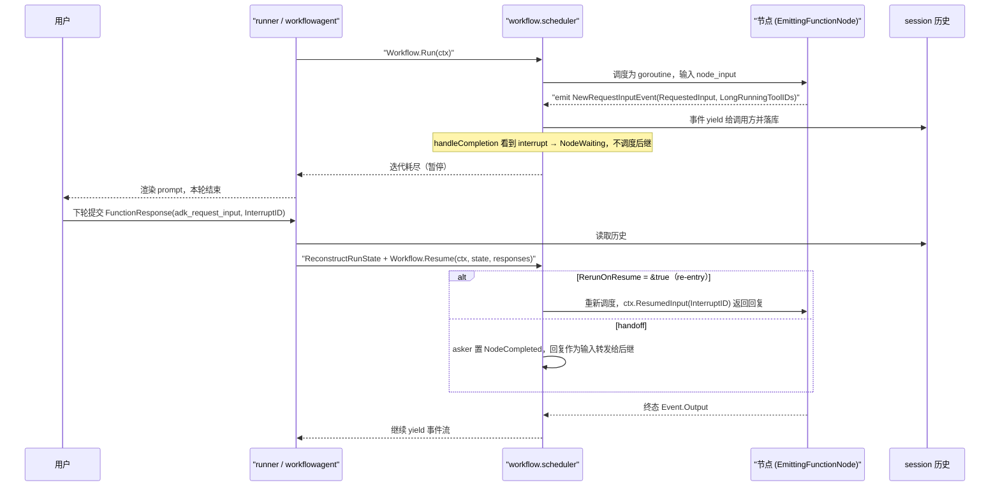
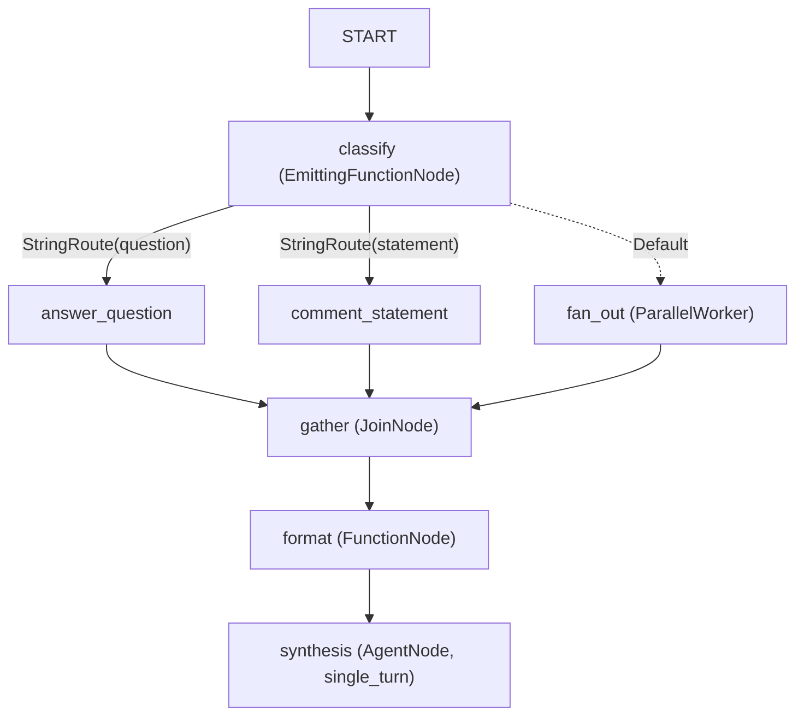

# 图工作流引擎（Graph Workflow Engine）

> `workflow` 包把多 agent 编排表达成一张有向图：`Node` 是执行单元，`Edge` 是显式对象，单个 consumer 调度器驱动节点 goroutine，并原生支持路由分支、fan-out/fan-in、并发 worker、节点级重试，以及会挂起并跨轮恢复的人机协同（HITL）。

## 涉及代码

- `workflow/workflow.go` —— `Node`/`Route`/`Edge` 接口与类型、`Workflow`、`New`、`Run`/`RunNode`、`Start` 哨兵
- `workflow/config.go` —— `NodeConfig`、`RetryConfig`、`DefaultRetryConfig` 与默认重试值
- `workflow/graph.go` —— `graph`：构建期把 `[]Edge` 索引成 successors/predecessors
- `workflow/base_node.go` —— `BaseNode`：自定义节点嵌入它即获得身份与默认 schema 校验
- `workflow/scheduler.go` —— 静态图调度器：eventQueue、生命周期、路由匹配、并发上限、finalize
- `workflow/dynamic_scheduler.go` —— `dynamicSubScheduler`：动态节点的子调度与结果缓存
- `workflow/run_node.go` —— `RunNode[OUT]` 与 `RunNodeOption`（`WithRunID`、`WithUseSubBranch`、`WithUseAsOutput` 等）
- `workflow/parallel_worker.go` —— `ParallelWorker`：按列表元素并发执行被包裹节点
- `workflow/agent_node.go` / `function_node.go` / `tool_node.go` / `join_node.go` / `workflow_node.go` / `dynamic_node.go` —— 六类节点实现
- `workflow/edgebuilder.go` —— `EdgeBuilder`、`Chain`、`Concat`
- `workflow/branch.go` —— branch 组合与 `commonBranchPrefix`（JoinNode 用它回到公共祖先）
- `workflow/state.go` —— `NodeStatus`、`NodeState`、`RunState`
- `workflow/retry.go` —— `CalculateDelay`、`ShouldRetry`
- `workflow/persistence.go` —— `ReconstructRunState`：从 session 历史重建被挂起的 `RunState`
- `workflow/resume.go` —— `Workflow.Resume`、handoff/re-entry 两条恢复路径
- `workflow/request_input.go` —— `NewRequestInputEvent`、`ResumeOrRequestInput`、`WorkflowInputFunctionCallName`
- `workflow/errors.go` / `validation.go` —— 哨兵错误与建图期校验
- `workflow/node_span.go` —— `invoke_node` telemetry span
- `agent/workflowagent/workflow.go` —— 把 `Workflow` 适配成 `agent.Agent`
- `runner/run_node.go` —— runner 直接驱动任意顶层 agent 的单节点工作流包装

## 核心模型

一次 run 由三个层次构成：

- **Node**：`workflow.Node` 接口（`workflow/workflow.go`）。需要 `Name()`、`Description()`、`Config()`、`InputSchema()`、`OutputSchema()`、`ValidateInput`、`ValidateOutput`，以及
  ```go
  Run(ctx agent.Context, input any) iter.Seq2[*session.Event, error]
  ```
  自定义节点嵌入 `BaseNode`（`NewBaseNode`/`NewBaseNodeWithSchemas`），只实现 `Run`。
- **Edge**：**显式结构体**，不是函数指针：
  ```go
  type Edge struct {
      From  Node  // 源节点
      To    Node  // 目标节点
      Route Route // 路由条件，nil 表示无条件
  }
  ```
  构图时 `newGraph(edges)` 把它索引成 `successors` / `predecessors` 两张 `map[Node][]Edge`，`Workflow.New` 在构造期完成校验。
- **Workflow**：`New(name string, edges []Edge, opts ...Option) (*Workflow, error)`。它先 `validateNodes` 与 `validateSubWorkflowNames`，再 `newGraph`、`validateWorkflow`。`name` 会成为节点路径的命名空间前缀（`Run` 里拼成 `<parent>/<name>@1`），并参与子工作流重名校验；空 name 表示匿名。注意构造入口是 variadic `Option`（`WithMaxConcurrency`、`WithStateSchema`、`WithRootWrapper`），**不是** `runner.New` 那种 `runconfig` 风格。

`Start` 是一个哨兵节点（`var Start Node`，内部 `startNode`），它的 `Run` 不产出任何事件；`Run` 只把种子输入交给 `START`，由调度器转发给后继。

### 驱动方式

`Workflow.Run` 把输入（`userInput` 从 `InvocationContext.UserContent` 拼接文本）包进 `RunNode`，后者创建 `scheduler` 并 `scheduleNode(Start, input, "", ctx.Branch())`。调度器是 producer-consumer 模型：

- **producer**：每个被调度节点一个 goroutine（`runNode` 包装器），只向 `eventQueue`（容量 `defaultEventQueueCapacity = 16`）发送 `eventItem` 与唯一一个 `completionItem`，不读队列、不碰调度器字段。
- **consumer**：调用 `Workflow.Run` 的那个 goroutine（`scheduler.run`），是 `eventQueue` 唯一读者，也是 `RunState`、`runsByName`、`runCancels`、`retryTimers` 的唯一修改者。

consumer 收到事件后 `handleEvent` 记累加器（输出、路由事件、`LongRunningToolIDs`），把事件 `yield` 给调用方；收到 completion 后 `handleCompletion` 决定重试、挂起还是调度后继（`findSuccessors`）。调用方中途 `break`、或任一节点报错，`run` 会 `cancelAll` 并继续排空队列后返回。所有节点结束且无挂起时 `finalize` 检查终止节点输出不超过一个。

> 与 deepwiki 的差异：`Concat` 不是"合并多个 workflow"，而是 `Concat(items ...any)`，只接受 `Edge` 与 `[]Edge`；`EdgeBuilder.AddFanIn` 的签名是 `AddFanIn(to Node, from ...Node)`（目标是第一个参数），不是"froms..., to"。以本地代码为准。

## 节点类型对照表

| 类型 | 构造入口 | 输入 | 输出 | 典型用途 |
| --- | --- | --- | --- | --- |
| `FunctionNode`（普通） | `NewFunctionNode[IN,OUT]`、`NewFunctionNodeWithSchema` | 前驱 `Event.Output`，按 `IN` 断言或 JSON 回退转换 | 泛型 `OUT` 放进 `Event.Output`；若返回 `*session.Event` 则原样透传（可自行设 `Routes`） | 纯计算、格式转换、条件判断 |
| `FunctionNode`（流式） | `NewEmittingFunctionNode[IN,OUT]`、`NewEmittingFunctionNodeWithSchema`（体是 `EmittingFunctionFn`） | 同上 | 可先 `emit` 中间事件，再返回终态 `OUT` | 进度上报、HITL 提示、状态增量 |
| `FunctionNode`（绑定 state） | `NewFunctionNodeFromState[Params,OUT]` | 从 `ctx.Session().State()` 按字段名/`state:"key"` 标签装配 `Params`；`state:"node_input"` 取前驱输出 | `OUT` | 消费 workflow 声明的 state 字段 |
| `AgentNode` | `NewAgentNode`、`NewAgentNodeTyped[I,O]`、`NewAgentNodeWithSchemas` | `nodeInputToContent` 转成 `*genai.Content`（字符串、JSON、`Marshaler` 均可） | 模型最终文本合成 `Event.Output`（`MessageAsOutput`）；task 模式走 `runTask` | 把 `agent.Agent` 当图节点；自动带 `EmitsOwnSpan` |
| `ToolNode` | `NewToolNode`、`NewToolNodeTyped[I,O]`、`NewToolNodeWithSchemas`、`NewNamedToolNode` | `map[string]any`（字符串会先尝试 JSON 反序列化） | 工具的 map 输出；`ValidateOutput` 额外解包 `{"result": X}` 约定 | 调用单个 `tool.Tool`（须实现内部 `runnableTool`） |
| `JoinNode` | `NewJoinNode`、`NewJoinNodeWithSchema` | 所有前驱输出的 `map[string]any`，键是前驱节点名 | 原样输出该 map | fan-in 屏障：所有声明前驱 `NodeCompleted` 后才触发一次 |
| `WorkflowNode` | `NewWorkflowNode(name, edges)` | 任意 | 子工作流**按图拓扑**选出的唯一终止节点输出 | 嵌套子工作流 |
| `dynamicNode` | `NewDynamicNode[IN,OUT]`、`NewDynamicNodeWithSchema`（返回 `Node`） | `IN` | 编排体返回的 `OUT` | 用 Go 代码命令式编排子节点（`RunNode`） |
| `ParallelWorker` | `NewParallelWorker(name, wrapped, maxConcurrency, cfg)` | 必须可反射为 slice | 每个元素结果的 `[]any` | 列表元素级并发 |
| `Start`（sentinel） | `var Start Node` | 种子输入 | 无 | 图入口 |

**组合子**：`Chain(nodes ...Node) []Edge` 连成线性边；`Concat(items ...any) []Edge` 合并 `Edge`/`[]Edge`；`EdgeBuilder` 提供 `Add`/`AddRoute`/`AddFanOut`/`AddFanIn`/`AddRoutes`/`Build` 的流式写法。

`ParallelWorker` 的一个约束：被包裹节点不允许自带 `RetryConfig`（构造时报错），重试只由 `ParallelWorker` 自身的 `cfg.RetryConfig` 控制，且按每个元素独立退避。

## 路由

路由决定"节点完成后跑谁"，由节点的产出来表达：

- 节点在某个事件的 `session.Event.Routes []string` 上写入标签，调度器 `findSuccessors` 拿这次激活累加到的**唯一**路由事件去匹配出边。一次激活最多一个路由事件，否则 `ErrMultipleRoutingEvents`。
- `Route` 接口只有 `Matches(event *session.Event) bool`。真实实现：
  - `StringRoute string` —— 与 `event.Routes` 中任一项字符串全等。
  - `IntRoute int` / `BoolRoute bool` —— 先 `fmt.Sprint` 成十进制/`true|false` 再比对。
  - `MultiRoute[T comparable]` —— 命中列表里任意值。
  - `Default`（`var Default Route`）—— 仅当**没有**任何具体 `Route` 命中时才触发。
- 匹配规则：`Route == nil` 的无条件边总是触发且不算"命中"；重复的 `To` 会去重；若所有出边都是具体路由且都没命中、又没有 `Default`，则在此静默终止（视为"故意不继续"，不是错误）。
- fan-out（一个节点多条出边）会给每个非 Join 后继派生 sub-branch `<parentBranch>.<succ>@1`；单后继继承父 branch。

```go
// class 节点产出路由标签；返回 nil 抑制默认终态事件
ev := session.NewEvent(ctx, ctx.InvocationID())
ev.Routes = []string{"question"}
ev.Output = msg
emit(ev)

edges := workflow.Concat(
    workflow.Chain(workflow.Start, classify),
    []workflow.Edge{
        {From: classify, To: answer, Route: workflow.StringRoute("question")},
        {From: classify, To: other,  Route: workflow.Default},
    },
)
```

## 人机协同（HITL）

**真实常量**：`workflow.WorkflowInputFunctionCallName = "adk_request_input"`。它是与其他 ADK runtime 共享的线格式标识，改动须跨 runtime 协调。

发起挂起用 `NewRequestInputEvent(ctx, session.RequestInput{...})`：它设置 `Event.RequestedInput`，并合成一个 `FunctionCall{Name: "adk_request_input", ID: req.InterruptID}`、把 `InterruptID` 放进 `Event.LongRunningToolIDs`，使 `IsFinalResponse()` 为 true。`InterruptID` 为空时自动生成 UUID（建议每次请求唯一，否则 Dev UI 会把复用的 ID 当作已回答）。

节点的暂停契约是"先 emit 再返回哨兵"：

- 流式节点（`NewEmittingFunctionNode`/`NewDynamicNode`）emit 完 `RequestInput` 后返回 `ErrNodeInterrupted`，引擎吞掉哨兵，只把暂停事件交给上层；
- `ResumeOrRequestInput(ctx, emit, req)` 把两步收敛为一处：`ctx.ResumedInput(req.InterruptID)` 命中就直接返回回复，否则 emit 请求并返回 `ErrNodeInterrupted`。

调度器侧：`nodeRun.trackInterrupts` 累积事件里的 `LongRunningToolIDs`；当节点干净完成且 interrupt 集合非空时，`handleCompletion` 把节点置为 `NodeWaiting` 并把 ID 写入 `NodeState.Interrupts`，不调度后继。整个 run 在"没有可运行的节点"时迭代自然耗尽，调用方据此观察到暂停。

**恢复**分两条路，由 `NodeConfig.RerunOnResume *bool` 决定：`&true` 是 re-entry（重跑原节点，回复经 `ctx.ResumedInput` 取用），`&false`（nil 时引擎当前按此处理）是 handoff（回复作为 asker 的输出交给后继，asker 自身不重跑；pass 2 以 `event=nil` 调用 `findSuccessors`，因此只经具体 `Route` 才可达的后继不会触发，只有无条件边或 `Default` 后继会跑）。`Workflow.Resume(ctx, state, responses)` 遍历 `state.Nodes`，对每个本轮被回答的 interrupt 校验 `ResponseSchema`（不匹配返回 `ErrInvalidResumeResponse` 且保持 `NodeWaiting`），然后 re-entry 走 `scheduleResumedNode`、handoff 走 pass 2 的 `findSuccessors`；没有任何节点被回答则返回 `ErrNothingToResume`。重复 Resume 是幂等的（`ResumedInputs` + `completed` 门控）。



## 并发与重试

**并发上限**：`WithMaxConcurrency(n)`（`n <= 0` 不限）。调度器在 `atConcurrencyLimit` 时把激活放进 consumer 独占的 `pendingQueue`（状态 `NodePending`），每次 completion 后 `tryDispatchPending` 按 FIFO 补位。该上限**不适用于** `DynamicNode` 体内 `RunNode` 调出的子节点（它们由父节点内联等待，卡住会死锁）。

**图内并发**：fan-out 使多个后继同时被 `scheduleNode`，各自 goroutine 并发执行，事件按到达顺序交给 consumer。

**节点重试**：由 `NodeConfig.RetryConfig *RetryConfig` 打开（nil 表示不重试）。字段与默认值（`DefaultRetryConfig()` / `defaultRetryConfig`）：

| 字段 | 含义 | 默认 |
| --- | --- | --- |
| `MaxAttempts` | 总尝试次数（含首次）；<=1 不重试 | 5 |
| `InitialDelay` | 首次重试前延迟 | 1s |
| `MaxDelay` | 单次延迟上限 | 60s |
| `BackoffFactor` | 每次失败后的乘数（1.0 恒定，2.0 指数） | 2.0 |
| `Jitter` | `[0,1]` 随机因子，实际延迟采样自 `delay*(1±Jitter)` | 1.0 |
| `ShouldRetry` | 谓词，返回 true 才重试 | `defaultShouldRetry`：除 `ErrInputValidation` 外都重试 |

失败时 `handleCompletion` 递增 `NodeState.Attempt`，`ShouldRetry(cfg, err, attempt)` 为真则 `scheduleRetry` 用 `time.AfterFunc(delay)` 计时，到点经 `retryItem` 重新 `scheduleNode`；`CalculateDelay` 计算 `InitialDelay * BackoffFactor^(failedAttempts-1)`，先按 `MaxDelay` 截断再叠加 jitter。重试用尽后节点置 `NodeFailed`，错误上抛并使整个 run 取消其余节点。

> `RetryConfig` 的字段名与 deepwiki 不一致：代码里是 `InitialDelay` / `ShouldRetry`（不是 `InitialInterval` / `RetryableErrorPredicate`），`MaxAttempts` 默认 5（不是 1）。零值 `RetryConfig{}` 是合法的"不重试、无退避、无 jitter"策略。

**ParallelWorker 的错误聚合**：每个元素在 `runWorker` 里独立重试；任一元素得到不可重试错误即通过 `reportFailure`（`sync.Once`）取消所有在飞 worker，并把**第一个**错误作为整体输出上抛（fail-fast）。中间非 output 事件被抑制，只有每个元素的 output 被收集进最终 `[]any`。

## 状态与持久化

workflow 的状态与 session state 是两套东西：

- **RunState / NodeState**（`workflow/state.go`）是引擎的 per-invocation 生命周期视图。`NodeStatus` 取值 `NodeInactive`/`NodePending`/`NodeRunning`/`NodeCompleted`/`NodeWaiting`/`NodeFailed`/`NodeCancelled`。`NodeState` 字段 `Status`、`Input`、`Output`、`TriggeredBy`、`Branch`、`Interrupts`、`Attempt`、`ResumedInputs` 都带 JSON 标签且 `any` 类型必须可 JSON 编码（二进制请走 `agent.Artifacts`）。
- **session state** 是节点在 `Run` 里通过 `ctx.Session().State()` 读写的用户态数据，二者互不替代。

持久化的真实机制是**历史重建**而非 blob：`Workflow.ReconstructRunState(sess session.Session, invocationID string)` 扫描 session 事件，按 `NodeInfo.Path`（动态子节点归属最近的静态祖先）收集各节点抛出的 interrupt、用户 `FunctionResponse` 的回复及其 `ResponseSchema`，再 `inferNodeState` 映射成 `NodeWaiting` / `NodePending`(+`ResumedInputs`) / `NodeCompleted`(+`Output`)。`invocationID` 把扫描限定在本次逻辑运行（resume 轮复用暂停轮的 ID），避免历史里的旧运行串入。

> 与 deepwiki 的差异：本地代码**没有**把 `RunState` 写进 `session.State`，也没有 `RunStateSessionKey`（`workflow.go` 的注释提到它，但符号不存在、未实现）。跨轮一致性靠"事件落库 + `ReconstructRunState` 重放"。`Branch` 被持久化是为了让 JoinNode 的公共前缀推导在暂停/恢复之间保持稳定。

## 与 agent 的两种接法

**接法一：`agent/workflowagent`**——把整张图当成一个 `agent.Agent` 用。

```go
wa, _ := workflowagent.New(workflowagent.Config{
    Name: "research", Description: "...",
    Edges:      edges,
    SubAgents:  []agent.Agent{a, b, c}, // 供 runner 解析事件 author
})
```

`workflowagent.New` 内部 `workflow.New(cfg.Name, cfg.Edges)`，再用 `agent.New(agent.Config{Run: wa.run})` 包装，并把 agent 类型标成 `TypeWorkflowAgent`（telemetry 发 `invoke_workflow`）。`run` 通过 `detectResume` 检查本轮 `UserContent` 是否含 `Name == WorkflowInputFunctionCallName` 的 `FunctionResponse`：是则 `ReconstructRunState` + `Workflow.Resume`，否则 `Workflow.Run`。适合把图交给 launcher/runner，与普通 agent 同构。

**接法二：`runner` 直接驱动**——`runner.Runner.runNode` 把任意顶层 agent（不止工作流）包成一个单节点工作流 `START -> AgentNode`，并用 `workflow.WithRootWrapper()` 防止根上下文被多打一层命名空间前缀。它同样在每轮 `ReconstructRunState` 后按需 `Resume`（`buildResumeResponses` 把尚未回答的 interrupt 映射为 responses）。这意味着在 Go 里**所有** agent 执行都经过图引擎；这与 Python ADK 直接 `agent.run_async` 不同，是为统一引擎而做的架构选择。

区别要点：`workflowagent.New` 是"图被显式注册为 agent、有自己的 Name/Description/SubAgents"；runner 的包装是"任意 agent 隐式变成单节点图"，工作流名是 `rootWorkflowName(appName, agent) = appName + "/" + agent.Name()`。此外 `internal/configurable` 还支持从 YAML 构建工作流 agent（`workflow.New(..., WithMaxConcurrency(cfg.MaxConcurrency))` + `agent.New(Run: wf.Run)`）。

## 图拓扑示例



三个分支 (`Q`、`T`、`P`) 由 `classify` 的路由决定并并发执行；`P` 再对输入列表做元素级并行；`J` 是 fan-in 屏障，等全部前驱 `NodeCompleted` 后把 `map[前驱名]输出` 交给 `F`，`F` 拼成提示词再喂给 `A`。

## 相关页面

- [核心概念](./03-core-concepts.md) —— `agent.Context`、`InvocationContext`、`Session`/`Event`/`State`，是理解 `Run` 签名与状态作用域的前提
- [Agent 执行](./04-agent-execution.md) —— runner 的执行循环与事件持久化，工作流事件正是经它落库
- [Agent 类型](./05-agent-types.md) —— `workflowagents`（sequential/loop/parallel 模板）与本文的图引擎、`workflowagent` 的定位区别
- [工具系统](./06-tool-system.md) —— `ToolNode` 包裹的 `tool.Tool` 接口与长任务/确认机制
- [服务层](./08-service-layer.md) —— session 服务如何保存事件历史，HITL 的 resume 依赖它
- [示例](./13-examples.md) —— `examples/workflow/` 下的 basic、complex、dynamic、routing、hitl 示例
