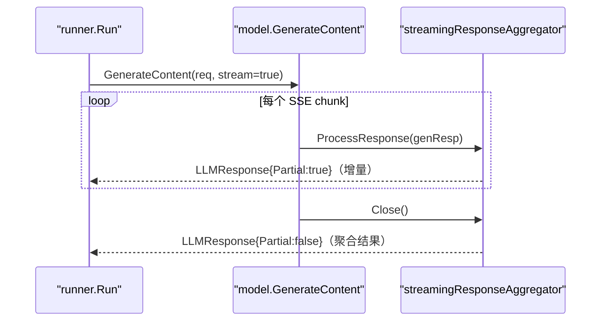
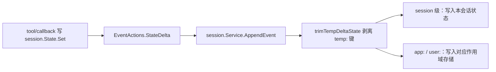

# 进阶主题（Advanced Topics）

> 覆盖流式与 live、agent 层级与 parent map、state 作用域、测试录制、事件重排、请求/响应处理器、schema 校验、内置插件与认证凭据——每个结论都以本地 v2 代码为准。

## 涉及代码

- `agent/run_config.go` —— 公开的 `StreamingMode` 常量与 `RunConfig`。
- `agent/live.go` —— 双向流式的公开接口：`LiveSession`、`LiveRequest`、`LiveRunConfig`。
- `runner/runner.go` —— `Runner.Run` / `Runner.RunLive`、事件持久化与 yield 逻辑。
- `runner/live_runner_test.go` —— live 会话的测试桩（`mockLiveAgent`、`dummyLiveSession`）。
- `internal/agent/runconfig/run_config.go` —— 内部的 `StreamingModeBidi` 与 `RunConfig.Live`。
- `internal/agent/parentmap/map.go` —— agent 树的父子映射与唯一性校验。
- `internal/llminternal/stream_aggregator.go` —— `streamingResponseAggregator` 部分响应聚合。
- `internal/llminternal/contents_processor.go` —— 事件过滤、孤儿 function response 剔除与重排。
- `internal/llminternal/base_flow.go` —— `Flow`、默认处理器列表、`RunLive`。
- `internal/testutil/test_agent_runner.go`、`internal/testutil/genai.go` —— 测试 runner、`MockModel`、httprr transport。
- `internal/httprr/rr.go` —— 录制/回放的 `RecordReplay`。
- `session/inmemory.go`、`session/session.go` —— state 前缀常量、`trimTempDeltaState`、`AppendEvent`。
- `session/sessiontestsuite/service_suite.go` —— 后端一致性测试套件。
- `internal/utils/schema_utils.go`、`internal/typeutil/convert.go`、`internal/converters/map_structure.go` —— schema 校验与类型转换。
- `plugin/plugin.go`、`plugin/loggingplugin/`、`plugin/retryandreflect/`、`plugin/functioncallmodifier/` —— 插件接口与内置插件。
- `auth/credential.go`、`auth/providers.go`、`auth/store.go`、`auth/transport.go`、`auth/gcp/` —— 凭据与出站注入。

## 流式响应

消费方只关心一件事：`Runner.Run` / `Agent.Run` 返回的是 `iter.Seq2[*session.Event, error]`，用 `for ev, err := range ...` 拉取，边到边用，不要收进切片。

流式的开关是每次运行传入的 `agent.RunConfig`（`agent/run_config.go`）：

| 常量 | 值 | 行为 |
| --- | --- | --- |
| `agent.StreamingModeNone` | `"none"` | 只产出最终响应 |
| `agent.StreamingModeSSE` | `"sse"` | 先逐块产出 `Partial` 事件，最后产出完整响应 |

`internal/llminternal/base_flow.go` 的 `Flow.callLLM` 用 `ctx.RunConfig().StreamingMode == agent.StreamingModeSSE` 决定是否向 `model.LLM.GenerateContent` 传 `stream=true`。聚合发生在**模型实现内部**（如 `model/gemini/gemini.go` 的 `generateStream`），它建一个 `llminternal.NewStreamingResponseAggregator()`：



关键点：

- `ProcessResponse` 把每个 genai chunk 经 `converters.Genai2LLMResponse` 转成 `model.LLMResponse`，用 `FinishReason != ""` 设置 `TurnComplete`，交给 `aggregateResponse` 累积，然后 yield 这条 per-chunk 响应；`aggregateResponse` 内部把 `llmResponse.Partial` 置为 `true`（当前实现对每条 chunk 返回 nil，即不额外 yield 中间事件）。文本进入 `currentTextBuffer`，`Thought` 边界变化时 `flushTextBufferToSequence()`；function call 的 `PartialArgs` 由 `processStreamingFunctionCallPart` 按 JSON path 拼回完整 `Args`。
- `Close()` 返回的最终响应 `Partial` 为 `false`，携带聚合后的 `Content.Parts`、`FinishReason`、`UsageMetadata` 等。
- Runner 的持久化门槛是 `!event.LLMResponse.Partial`（`runner/runner.go`）：**只有非 partial 事件会 `AppendEvent`**。因此历史里没有增量碎片，重放会话也看不到 partial。
- `session.Event.IsFinalResponse()` 会把带 `Partial` 的事件判为 false；判断"轮次结束"用它，而不是自己猜。

消费 side 要注意：`TurnComplete` 与 `Partial` 是两回事；`Close()` 的最终响应可能出现在所有 partial 之后，但流式工具调用等场景下顺序由模型驱动。聚合细节与执行循环见 [04-agent-execution.md](./04-agent-execution.md)。

## 双向流式 / live

Live 走一套与 `Run` 平行的 API。公开类型在 `agent/live.go`：

```go
type LiveSession interface {
    Send(req LiveRequest) error
    Close() error
}
```

- `agent.LiveRequest`：`RealtimeInput any`（`*genai.Blob` / `*genai.ActivityStart` / `*genai.ActivityEnd`）与 `Content *genai.Content`。
- `agent.LiveRunConfig`：`ResponseModalities`、`SpeechConfig`、`InputAudioTranscription`、`OutputAudioTranscription`、`RealtimeInputConfig`、`EnableAffectiveDialog`、`Proactivity`、`SessionResumption`、`SaveLiveBlob`、`MaxLLMCalls`。

入口是 `runner.Runner.RunLive`（`runner/runner.go`）：

```go
func (r *Runner) RunLive(ctx context.Context, userID, sessionID string,
    cfg agent.LiveRunConfig, opts ...RunOption,
) (agent.LiveSession, iter.Seq2[*session.Event, error], error)
```

与普通 `Run` 的差别：

1. `Run` 每次传入一条用户 `*genai.Content`，`RunLive` 的 `msg` 为 nil，输入通过返回的 `LiveSession.Send` 持续送入。
2. `RunLive` 在 context 里写入内部 `runconfig.RunConfig{StreamingMode: runconfig.StreamingModeBidi, Live: &cfg}`（`internal/agent/runconfig/run_config.go`），强制双向流式；并且**不安装 compaction**（live 不复用组装好的历史，压缩没有意义）。
3. 被运行的 agent 必须实现 runner 内部的 `liveAgent` 接口：`RunLive(ctx) (agent.LiveSession, iter.Seq2[*session.Event, error], error)`。`llmagent` 实现了它（`agent/llmagent/llmagent.go` 的 `RunLive`）；否则返回 `agent %s does not support Live Run`。
4. 返回的 `LiveSession` 是 `runnerLiveSession` 包装：`Send` 转发给底层会话，并把非 function response 的用户文本追加成 `Author: "user"` 的 session 事件；`Close` 透传。
5. 返回的事件迭代器里还有一段**时序缓冲**：转写（`InputTranscription`/`OutputTranscription`）进行中到达的 tool call/response 事件会先攒起来，等转写结束再按顺序落库并 yield。普通事件中，非 partial 且不含 inline data 的才 `AppendEvent`；转写结束事件与缓冲的 tool 事件走它们各自的分支。

`runner/live_runner_test.go` 用 `mockLiveAgent`（嵌入 `agent.Agent` 并实现 `RunLive`）与 `dummyLiveSession` 覆盖了 nil 事件即终止等边界。底层连接、断线重连在 `internal/llminternal/base_flow.go` 的 `Flow.RunLive` 与 `internal/llminternal/live_reconnect.go`。会话的**保持**靠同一 `runnerLiveSession` 上的底层 `LiveSession` 长连接，用户轮次不重新组装历史；`LiveRunConfig.SessionResumption` 交给模型侧做断线恢复。

## 层级与 parent map

`internal/agent/parentmap/map.go` 定义 `type Map map[string]agent.Agent`，键是子 agent 名，值是它的父 agent。`parentmap.New(root)` 遍历 `SubAgents()` 并强制两条不变量：

- 一个 agent 最多一个父（同一指针出现两次即报 `cannot have >1 parents`）。
- 树内 agent 名唯一，且不得与根同名（报 `agent names must be unique in the agent tree`）。

`runner.New` 会调用 `parentmap.New(cfg.Agent)`，所以重名或共享子 agent 在构造 runner 时就失败，而不是运行期。查找语义在 `agent/agent.go`：

- `FindAgent(name)`：自身命中则返回自身，否则委托 `FindSubAgent`。
- `FindSubAgent(name)`：只遍历 `SubAgents()`，对每个子 agent 再调 `FindAgent`，是深度优先的整棵子树查找。
- `Map.RootAgent(cur)`：沿父链上溯到根；`parentmap.ToContext` / `FromContext` 把 map 放进 context 供 flow 使用。

转移合法性由 `runner.isTransferableAcrossAgentTree` 从目标 agent 沿 `parents` 上溯，只要链上任一 agent 的 `DisallowTransferToParent` 为真就禁止向上转移。

## 状态作用域与生命周期

三类前缀常量定义在 `session/session.go`：

```go
const (
    KeyPrefixApp  string = "app:"   // 全 app 共享，跨用户跨会话
    KeyPrefixTemp string = "temp:"  // 仅当前 invocation，结束后丢弃
    KeyPrefixUser string = "user:"  // 同一 user_id 跨会话共享
)
```

无前缀的键归 session 级。写入流程：



- 工具或回调通过 `ctx.State().Set(...)` 写入，落到当前事件 `session.EventActions.StateDelta`（`agent/context.go` 的 `Context.State()`）。
- `AppendEvent` 是落库入口。内存后端在 `session/inmemory.go` 里先 `trimTempDeltaState(event)`：把 `temp:` 键从 `StateDelta` 里过滤掉，只保留其余键进 canonical record——所以 `temp:` 值在输入事件上可能仍在，但**不会**进存储、`Get()` 也读不回。数据库后端（`session/database/service.go`）用 `strings.CutPrefix` 按 `app:` / `user:` 拆分到独立存储，并同样忽略 `temp:`。
- 读取时按前缀路由：`{app:x}`、`{user:x}`、`{temp:x}` 由指令模板或 `session.State` 解析；`State` / `ReadonlyState` 接口在 `session/session.go`。
- `temp:` 的语义是"当前 invocation"——一次从收到用户输入到产出最终输出的过程；跨调用不保留。

细节见 [03-core-concepts.md](./03-core-concepts.md) 与 [08-service-layer.md](./08-service-layer.md)。

## 测试 agent 与 tool

测试工具在 `internal/testutil`：

- `NewTestAgentRunner(t, agent)`：用 `session.InMemoryService()` 建一个 `runner.Runner`，`Run` / `RunContentWithConfig` 跑一轮；`SessionService()` 暴露后端以便检查未 yield 的存储事件（如压缩摘要）；`SetInitSessionState` 预置状态。
- 变体 `NewTestAgentRunnerWithPluginManager`、`NewTestAgentRunnerWithCompaction`。
- `MockModel`：实现 `model.LLM`，`Responses []*genai.Content` 依次出队，`Requests` 记录收到的请求，`StreamResponsesCount` 控制流式块数（`GenerateStream` 内部同样用 `NewStreamingResponseAggregator`）。
- `CollectEvents` / `CollectParts` / `CollectTextParts` 从事件流收集；`AwaitN` / `AwaitValue` 带超时地等 channel。
- `NewGeminiTransport(rrfile)` / `NewGeminiTestClientConfig(t, rrfile)` 把 `internal/httprr` 的录制回放接到 `genai.ClientConfig` 上，并在 replay 时塞入假 key。

`session/sessiontestsuite/service_suite.go` 提供 `RunServiceTests(t, opts, setup)` 与 `Snapshot`、`ExpectedSession`、`SuiteOptions`，让每个 `session.Service` 后端跑同一套一致性用例。

`internal/httprr/rr.go` 是 vendored 的录制器：`Open(file, rt)` 返回 `*RecordReplay`（实现 `http.RoundTripper`），`Recording(file)` 判断当前是录还是放，`Body` 是内存化请求体，`ScrubReq` 在录制前清洗 header。

`/workspace/github/adk-go/AGENTS.md` 的 Testing 一节对贡献者是硬要求，复述要点：

- **LLM 流量是回放，不是实打**。有 `testdata/*.httprr` 的包通过 `internal/httprr` 回放，无需 flag 与凭据；`session/vertexai` 用的是另一套 `rpcreplay` + `testdata/*.replay`。**任何测试都不得加入真实模型或网络调用。**
- `-httprecord` 是按**录制文件路径**匹配的正则，不是 `-run` 测试名；要为单条交换重新录制，先 `ls <pkg>/testdata/*.httprr`，再用精确文件名，并只提交那一个文件。
- 整包重录用 `go generate ./<pkg>/...`；`TestHTTPRecordDirectivesPartitionCassettes` 保证每条录制只被一个 directive 覆盖。
- 绿色套件**不证明** live 路径可用：改动涉及请求/响应转换、模型后端或出站集成时，必须对真实服务跑一次并在 PR 里说明。

## 事件重排与过滤

重排发生在**组装 prompt 时**，不改动存储的事件。`internal/llminternal/contents_processor.go` 的 `buildContentsDefaultWithCallSource` 依次做：

1. 过滤：丢掉无 content/role 的事件；按 `Branch`（`utils.EventBelongsToBranch`）与 `IsolationScope`（精确相等）筛；`shouldExcludeEvent` 丢掉内部调用 `adk_request_credential` 与 `toolconfirmation.FunctionCallName`（`adk_request_confirmation`）的 call/response。
2. `dropOrphanedFunctionResponses`：凡 `FunctionResponse.ID` 在全部历史里找不到对应 call 的，从事件中剔除；若事件还有其他 part，就保留剩余内容并记入 `orphanRemnants`。这正是最近提交 `fix: preserve orphan response content during rearrangement (#1564)` 的逻辑，修复 #1540。
3. `rearrangeEventsForLatestFunctionResponse`：让"最后一个事件"里的 response 与它更早的 call 相邻。位于二者之间的**不相关 tool 事件**保留；不相关的普通文本默认丢弃，但 `orphanRemnants` 中标记的内容例外保留。
4. `rearrangeEventsForFunctionResponsesInHistory`：全量整理，使每个 call 事件紧跟一个合并后的 response 事件。若最后一个事件本身是 response，则被它回答的那对 call/response **移到最后**（tailEvents），否则模型会答一个过时的中间交换。
5. `mergeFunctionResponseEvents`：把同一 call 的多个 response 事件按 call ID 合并，非 function response 的 part（文本等）追加到尾部。

重排结果只用于本次 `req.Contents`；`AppendEvent` 存储的仍是原始顺序。并行/异步 function call 与 thought-only 轮次的处理见 [04-agent-execution.md](./04-agent-execution.md)。

## 自定义请求/响应处理器

`internal/llminternal/base_flow.go` 的 `Flow` 持有两条流水线：

```go
type Flow struct {
    Model model.LLM
    RequestProcessors  []func(ctx agent.InvocationContext, req *model.LLMRequest, f *Flow) iter.Seq2[*session.Event, error]
    ResponseProcessors []func(ctx agent.InvocationContext, req *model.LLMRequest, resp *model.LLMResponse) error
    // ...callbacks
}
```

- `Flow.preprocess` 按顺序跑 `RequestProcessors`，再跑 `toolPreprocess`（每个 tool 若能实现内部 `toolinternal.RequestProcessor`）与 `toolsetPreprocess`。
- 默认顺序由 `llminternal.DefaultRequestProcessors`（`basicRequestProcessor`、`toolProcessor`、`authPreprocessor`、`RequestConfirmationRequestProcessor`、`instructionsRequestProcessor`、`identityRequestProcessor`、`CompactionRequestProcessor`、`ContentsRequestProcessor`、`nlPlanningRequestProcessor`、`codeExecutionRequestProcessor`、`outputSchemaRequestProcessor`、`AgentTransferRequestProcessor`、`removeDisplayNameIfExists`）与 `DefaultResponseProcessors`（`nlPlanningResponseProcessor`、`codeExecutionResponseProcessor`）给出。
- **注册点在构造处**：`agent/llmagent/llmagent.go` 的 `run` / `RunLive` 把 `RequestProcessors: llminternal.DefaultRequestProcessors`、`ResponseProcessors: llminternal.DefaultResponseProcessors` 直接填进 `Flow`。`internal/llminternal` 是 internal 包，`llmagent.Config` 没有可传处理器的字段——因此在 v2 里自定义处理器的公开替代是**回调与插件**：`BeforeModelCallbacks` / `AfterModelCallbacks` / `OnModelErrorCallbacks` / `BeforeToolCallbacks` 等，或 `plugin.Plugin`。注意 `authPreprocessor`、`nlPlanning*`、`codeExecution*` 目前是空实现（带 TODO）。

## 类型转换与 schema 校验

两套并存，别混用：

- `internal/utils/schema_utils.go` 面向 `*genai.Schema`：`ValidateMapOnSchema(args, schema, isInput)` 校验 map 的每个键存在、类型匹配（`matchType`）、必填齐全；`ValidateOutputSchema(output string, schema)` 先 `json.Unmarshal` 再调它。
- `internal/typeutil/convert.go` 面向 `github.com/google/jsonschema-go/jsonschema` 的 `*jsonschema.Resolved`：`ConvertToWithJSONSchema[From, To](v, resolvedSchema)` 先 marshal 再 validate 再 unmarshal 到目标类型；`ValidateWithJSONSchema(v, resolvedSchema)` 只校验。二者都先转成 JSON 解码形态再校验，以规避 struct 的 `omitempty` 与自定义 marshalling 问题（`schemaExpectsObject` 把 `null` 当作合法空对象）。workflow 节点的输入/输出 schema 就走这套（`workflow.Node.InputSchema()` 返回 `*jsonschema.Resolved`）。
- `internal/converters/map_structure.go`：`ToMapStructure(any)` 把结构体转 `map[string]any`，`FromMapStructure[T](map)` 反向，供工具参数/结果的通用表示。

## 内置插件

`plugin/plugin.go` 定义插件模型：`plugin.Config` 收集各阶段回调，`plugin.New(cfg)` 生成 `*plugin.Plugin`；回调类型有 `OnUserMessageCallback`、`OnEventCallback`、`BeforeRunCallback`、`AfterRunCallback`，以及 agent/model/tool 的 Before/After/OnError 回调（复用 `agent`、`llmagent` 的回调类型）。注册方式是 `runner.Config.PluginConfig`（`runner.PluginConfig{Plugins []*plugin.Plugin, CloseTimeout time.Duration}`），由 runner 内部的 plugin manager 按顺序调用。

`plugin/` 下的内置实现：

| 包 | 构造函数 | 作用 |
| --- | --- | --- |
| `plugin/loggingplugin` | `New(name)` / `MustNew(name)` | 把用户消息、agent/model 活动、tool 调用与错误打到控制台，便于终端调试 |
| `plugin/retryandreflect` | `New(opts...)` / `MustNew(opts...)` | tool 失败后把错误反馈给模型自纠并重试；选项 `WithMaxRetries`、`WithErrorIfRetryExceeded`、`WithTrackingScope(Invocation|Global)` |
| `plugin/functioncallmodifier` | `NewPlugin(FunctionCallModifierConfig)` / `MustNewPlugin(...)` | 在 model 前后动态修改 tool declaration 或调用参数 |

`plugin/agentanalytics` 是**独立模块**（自带 `go.mod`），需要通过该模块的 BigQuery 插件做 agent 分析。

## 认证与凭据

`auth` 包把"凭据"与"如何取到凭据"分开（`auth/doc.go`）：

- `auth.Credential` 只有一个方法 `Apply(http.Header) error`。实现：`APIKeyCredential`、`BearerCredential`、`BasicCredential`、`OAuth2Credential`（每次 `Apply` 从 `TokenSource` 现取 token），以及 `WithHeaders(inner, headers)` 包装器额外写 header。定义在 `auth/credential.go`。
- `auth.CredentialProvider`（`auth/providers.go`）的 `Credential(ctx) (Credential, error)` 在当前 invocation 解析凭据；`ProviderFunc` 可适配普通函数。内置构造：`StaticToken`、`APIKey(name, value)`、`TokenSourceProvider(ts)`、`ADC(scopes...)`、`ServiceAccount(ServiceAccountConfig{JSONKey, Scopes, Audience})`。需要交互式三腿授权时返回包装 `*ConsentRequiredError` 的错误（用 `errors.As` 取 `AuthURI`/`Nonce`/`Key`），tool 层据此发起 HITL 同意流程。
- 缓存：`auth.CredentialStore` 接口 + `auth.CredentialKey{AppName, UserID, Key}`，进程内实现是 `InMemoryCredentialStore`（`auth/store.go`）；`ExpirySkew = 10 * time.Second` 让快到期的凭据提前失效。
- 注入到出站请求：`auth.Transport`（`auth/transport.go`）实现 `http.RoundTripper`，`RoundTrip` 每次用 `Provider.Credential(req.Context())` 解析凭据，clone 请求后 `cred.Apply(req2.Header)` 再交给 `Base`。把它交给工具的 `http.Client.Transport` 即可让该工具的请求带上当前用户凭据；`Provider` 接收的是请求 context（起源于 ADK context），所以按用户区分不会串号。
- `auth/gcp`：`NewProvider(ctx, ProviderConfig{Scheme, Client, Store})` 返回一个从 invocation context 取 acting user 的 `auth.CredentialProvider`；`ProviderScheme{Name, Scopes, ContinueURI}` 指定资源与请求的访问范围，`NewClient(ctx, *Config)` 是底层凭据服务客户端。错误哨兵 `ErrClientUnavailable`、`ErrNoActingUser`。`tool/mcptoolset.Config.Auth` 也接受同一 `auth.CredentialProvider`，用于给 MCP 的 HTTP 传输加认证。

`auth/gcp` 还负责在错误信息里对 acting user 与密钥做 redact（见 `auth/gcp/redact.go`）；任何日志/错误都不得包含凭据本体。

## 相关页面

- [03-core-concepts.md](./03-core-concepts.md) —— InvocationContext、Session/Event/State 与 Callback/Plugin 的基础。
- [04-agent-execution.md](./04-agent-execution.md) —— Runner 与 LLM flow：流式聚合、处理器流水线、agent 转移。
- [06-tool-system.md](./06-tool-system.md) —— Tool/Toolset、functiontool、确认与 MCP。
- [08-service-layer.md](./08-service-layer.md) —— session/artifact/memory 服务后端与 Event 持久化。
- [10-telemetry-observability.md](./10-telemetry-observability.md) —— telemetry providers 与 trace。
- [11-graph-workflow-engine.md](./11-graph-workflow-engine.md) —— workflow 节点、边、HITL 与重试。
