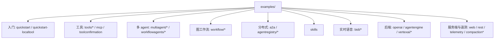

# 示例导览（Examples）

> `examples/` 下每个目录都是一个可直接 `go run` 的 `main` 程序，按能力分成入门、工具、多 agent、workflow、A2A/registry、skills、实时语音、部署后端、服务端与遥测几组；多数用 `full.NewLauncher()` 的 `console` 或 `web` 子 launcher 启动。

## 涉及代码

- `examples/README.md` —— launcher 关键字总览与统一的 `go run` 形式。
- `examples/quickstart/main.go` —— 最小 agent：Gemini + `GoogleSearch` + console/web。
- `examples/quickstart-localtool/main.go` —— 用 `functiontool.New` 包一个本地 Go 函数。**注意：该目录不在上游仓库里（`git status` 显示为未跟踪），是本机自行添加的练习示例。**
- `examples/tools/` —— `loadartifacts`、`loadmemory`、`multipletools` 三个工具示例。
- `examples/multiagent/` —— `collaboration`、`single_turn`、`task_sub_agent` 三种子 agent 协作模式。
- `examples/workflowagents/` —— `loop`、`parallel`、`sequential`、`sequentialCode` 四种组合式 agent。
- `examples/workflow/` —— 图工作流引擎：`basic`、`complex`、`routing/*`、`hitl_*`、`dynamic/*`，另有总览 README。
- `examples/a2a/main.go` —— 一个进程内 A2A server + `remoteagent` 客户端。
- `examples/agentregistry/` —— `discover`、`bind`、`a2a` 三个 Agent Registry 示例。
- `examples/skills/main.go` + `examples/skills/skills/` —— `skilltoolset` 与文件系统 skill 源。
- `examples/bidi/` —— 双向实时语音/视频：`main.go`、`sequential/`、`streamingtool/`。
- `examples/openai/main.go` —— 换用 `model/openaimodel`。
- `examples/agentengine/main.go`、`examples/vertexai/` —— Google Cloud 后端。
- `examples/web/main.go`、`examples/rest/main.go` —— Web UI 多 agent 与独立 REST server。
- `examples/compaction/`、`examples/compactionrecall/`、`examples/telemetry/`、`examples/toolconfirmation/`。

## 分组总览



统一约定：多数程序最后都调用 `full.NewLauncher()`，第一个参数是子 launcher（不传即 `console`）。下面「运行」列里的命令都从仓库根执行，除非特别说明。只有 Gemini 的示例需要 `GOOGLE_API_KEY`。

### 入门

| 目录 | 演示什么 | 运行 |
|---|---|---|
| `examples/quickstart/` | 最小可运行 agent：`gemini.NewModel` + `llmagent.New` + `GoogleSearch` 工具，`full.NewLauncher()` 启动 | `go run ./examples/quickstart console` |
| `examples/quickstart-localtool/` | 用 `functiontool.New(functiontool.Config{...}, getWeather)` 把本地 Go 函数做成工具，不依赖 Google 内置工具。**本机新增、未提交到上游** | `go run ./examples/quickstart-localtool console` |

### 工具

| 目录 | 演示什么 | 运行 |
|---|---|---|
| `examples/tools/loadartifacts/` | `loadartifactstool.New()`：把图片与文本存进 artifact service，再由 agent 读取并描述 | 见下方说明 |
| `examples/tools/loadmemory/` | `preloadmemorytool.New()` 与 `loadmemorytool.New()`：memory service 的预加载与按需检索 | `go run ./examples/tools/loadmemory/` |
| `examples/tools/multipletools/` | 把 `GoogleSearch` 与自定义工具分装到子 agent，绕过单 agent 的工具组合限制 | `go run ./examples/tools/multipletools console` |
| `examples/mcp/` | `mcptoolset.New`：`AGENT_MODE` 选 `local`（进程内 MCP server）或 `github`（远端 MCP server） | `AGENT_MODE=local go run ./examples/mcp console` |
| `examples/toolconfirmation/` | `tool.ErrConfirmationRequired` 与 `FunctionCallName`：工具调用要人工确认，直接驱动 `runner.New` | `go run ./examples/toolconfirmation/` |

`examples/tools/loadartifacts/` 会从**当前目录**读 `animal_picture.png`（该文件就在该目录里），所以必须进目录再跑：

```bash
cd examples/tools/loadartifacts && go run .
```

`examples/mcp/` 用 `AGENT_MODE=github` 时还需要 `GITHUB_PAT`。

### 多 agent

| 目录 | 演示什么 | 运行 |
|---|---|---|
| `examples/multiagent/collaboration/` | chat/single_turn/task 三种模式协作：root `travel_planner` 委派给 `weather_checker` 与 `flight_booker` | `go run ./examples/multiagent/collaboration console` |
| `examples/multiagent/single_turn/` | `Mode: llmagent.ModeSingleTurn` + `InputSchema`/`OutputSchema`，子 agent 一轮内完成、不与用户交互 | `go run ./examples/multiagent/single_turn console` |
| `examples/multiagent/task_sub_agent/` | `Mode: llmagent.ModeTask`：`order_collector`/`payment_collector` 向用户追问补齐结构化数据 | `go run ./examples/multiagent/task_sub_agent console` |

### 组合式 agent（workflowagents）

| 目录 | 演示什么 | 运行 |
|---|---|---|
| `examples/workflowagents/loop/` | `loopagent.New` 控制 `loop_agent` 反复跑子 agent，直到满足退出条件 | `go run ./examples/workflowagents/loop console` |
| `examples/workflowagents/parallel/` | `parallelagent.New` 并发跑两个子 agent | `go run ./examples/workflowagents/parallel console` |
| `examples/workflowagents/sequential/` | `sequentialagent.New` 顺序跑多个子 agent | `go run ./examples/workflowagents/sequential console` |
| `examples/workflowagents/sequentialCode/` | 代码写/审/改流水线：`CodeWriterAgent` → `CodeReviewerAgent` → `CodeRefactorerAgent` | `go run ./examples/workflowagents/sequentialCode console` |

### 图工作流引擎（workflow）

`examples/workflow/README.md` 是这一组的索引，每个子目录另有 README 与 mermaid 图。

| 目录 | 演示什么 | 需要 LLM |
|---|---|---|
| `examples/workflow/basic/` | 两个 `FunctionNode` 用 `workflow.Chain` 串起来，最小顺序流 | 否 |
| `examples/workflow/complex/` | `AddFanOut` 并发三个 researcher → `JoinNode` 汇聚 → LLM 合成 | 是 |
| `examples/workflow/routing/string/` | `workflow.StringRoute` 按消息结尾标点分三路 | 否 |
| `examples/workflow/routing/int/` | `workflow.IntRoute` / `MultiRoute[int]` 按数值区间分路 | 否 |
| `examples/workflow/routing/llm/` | `LlmAgent` 分类，普通函数发 `Event.Routes`，引擎分路 | 是 |
| `examples/workflow/hitl_simple/` | 两节点 HITL：`RequestInput` 暂停，回复进入下一个节点 | 否 |
| `examples/workflow/hitl_rerun/` | 单节点重入 HITL：`ResumeOrRequestInput` + `RerunOnResume` | 否 |
| `examples/workflow/dynamic/basic/` | `NewDynamicNode` + `RunNode`，用 Go 命令式编排子节点 | 否 |
| `examples/workflow/dynamic/hitl/` | 动态编排器暂停等人输入并恢复 | 否 |
| `examples/workflow/dynamic/llm/` | 动态编排器通过 `RunNode` 调用一个 `LlmAgent` | 是 |
| `examples/workflow/dynamic/use_as_output/` | `WithUseAsOutput` 把子节点输出提升为编排器输出 | 是 |

运行形式统一为：

```bash
go run ./examples/workflow/routing/string/ console
go run ./examples/workflow/complex/ console -streaming_mode none
```

### 分布式与 Agent Registry

| 目录 | 演示什么 | 运行 |
|---|---|---|
| `examples/a2a/` | 同一进程里起一个 A2A server（`adka2a.NewExecutor` + `a2asrv`），再用 `remoteagent.NewA2A` 连回来 | `go run ./examples/a2a console` |
| `examples/agentregistry/discover/` | 用 `agentregistry.New` 浏览 catalog：A2A agents、MCP servers、model endpoints | `go run ./examples/agentregistry/discover/` |
| `examples/agentregistry/bind/` | 按名字把 registry 里已注册的远端 tool 绑进 `root` agent | `REGISTRY_TOOL=<tool> go run ./examples/agentregistry/bind/ console` |
| `examples/agentregistry/a2a/` | 发布一个 echo agent，再经 registry 解析并调用它 | `go run ./examples/agentregistry/a2a/` |

`agentregistry/*` 三个示例都要求 ADC 与 `GOOGLE_CLOUD_PROJECT`（`a2a` 还需要写权限与 `A2A_ADDR`）。

### skills

| 目录 | 演示什么 | 运行 |
|---|---|---|
| `examples/skills/` | `skill.NewFileSystemSource(os.DirFS("./skills"))` + `skilltoolset.New`，把 `SKILL.md` 目录作为 agent 能力 | 见下 |

源码用相对路径 `./skills`，必须从该目录启动：

```bash
cd examples/skills && go run main.go console
```

### 实时双向流（bidi）

| 目录 | 演示什么 | 运行 |
|---|---|---|
| `examples/bidi/` | 实时语音/视频：`controllers.NewRuntimeAPIController` + WebSocket，自带静态前端，监听 `:8081` | `go run examples/bidi/main.go` |
| `examples/bidi/sequential/` | 两个 live agent 顺序交接（想法生成 → 讲故事） | `go run examples/bidi/sequential/main.go` |
| `examples/bidi/streamingtool/` | 流式工具：工具边算边 yield，配 `stop_streaming` | `go run examples/bidi/streamingtool/main.go` |

`bidi` 组不用 launcher，而是自己起 HTTP server（`examples/bidi/main.go` 里 `http.ListenAndServe(":8081", nil)`）。

### 模型与部署后端

| 目录 | 演示什么 | 运行 |
|---|---|---|
| `examples/openai/` | 把 `gemini.NewModel` 换成 `openaimodel.NewModel`，其余不变 | `go run ./examples/openai/ console` |
| `examples/agentengine/` | 跑在 Agent Engine 上：`cmd/launcher/agentengine` 的 `NewLauncher(agentEngineID)`、memory bank、session service | `go run ./examples/agentengine/` |
| `examples/vertexai/imagegenerator/` | Vertex 图像模型 + artifact 服务：生成图片、描述、按需存本地 | `go run ./examples/vertexai/imagegenerator console` |
| `examples/vertexai/vertexengine/` | 不是 agent：`createReasoningEngine` 演示如何建一个 Vertex Reasoning Engine 实例 | `go run ./examples/vertexai/vertexengine/` |

### 服务端、会话与遥测

| 目录 | 演示什么 | 运行 |
|---|---|---|
| `examples/web/` | `agent.NewMultiLoader` 装载多个 agent，配 authz 拦截器与 A2A，交给 `full.NewLauncher()` | `go run ./examples/web web api webui` |
| `examples/rest/` | 不用 launcher，直接把 `adkrest.NewServer` 挂到标准 `net/http` mux（`/api/` 前缀 + `/health`） | `go run ./examples/rest/` |
| `examples/compaction/` | 在 `launcher.Config.Compaction` 上启用会话压缩，跑几轮后观察 compaction 事件 | `go run ./examples/compaction console` |
| `examples/compactionrecall/` | 长时间对话的压缩与回忆，直接驱动 `runner.New`；用 `-model`、`-arms` 调参 | `go run ./examples/compactionrecall/` |
| `examples/telemetry/` | `telemetry.WithResource` 接 OpenTelemetry，随 launcher 自动启动 | `go run ./examples/telemetry console` |

## 代码走读

### 1. 本地函数工具：`examples/quickstart-localtool/main.go`

这个示例展示 ADK 工具系统里最常用的一条路径：普通 Go 函数 → `functiontool.New` → `tool.Tool`。

输入/输出是带 `jsonschema` tag 的结构体，schema 由 tag 推出：

```go
type getWeatherInput struct {
	City string `json:"city" jsonschema:"要查询天气的城市名，例如：北京"`
}

type getWeatherOutput struct {
	City      string `json:"city"`
	Condition string `json:"condition"`
	TempC     int    `json:"temperature_c"`
}
```

处理函数签名是 `func(ctx agent.Context, in getWeatherInput) (getWeatherOutput, error)`（此处实现为固定返回的本地模拟），再包成工具挂到 agent：

```go
weatherTool, err := functiontool.New(functiontool.Config{
	Name:        "get_weather",
	Description: "查询指定城市当前的天气。",
}, getWeather)

a, err := llmagent.New(llmagent.Config{
	Name:    "weather_agent",
	Model:   model,
	Tools:   []tool.Tool{weatherTool},
	// ...
})
```

要点：`functiontool.New[Args, Results]` 的 `Args`/`Results` 是结构体；工具名与描述是 LLM 唯一的调用依据，必须写清楚。更完整的工具系统见 `06-tool-system.md`。

### 2. 图工作流路由：`examples/workflow/routing/string/main.go`

这个示例把「节点设 `Event.Routes`、边按 route 匹配」讲得最清楚，且不需要 LLM。

节点分两种：普通 `workflow.NewFunctionNode` 和能发事件的 `workflow.NewEmittingFunctionNode`。后者在 `emit` 回调里构造事件、写入 `Routes` 与 `Output`：

```go
func classifyAndRoute(ctx agent.Context, msg string, emit func(*session.Event) error) (any, error) {
	ev := session.NewEvent(ctx, ctx.InvocationID())
	ev.Routes = []string{classify(msg)}
	ev.Output = msg // 传给后继节点的类型化输入
	if err := emit(ev); err != nil {
		return nil, err
	}
	return nil, nil
}

func classify(msg string) string {
	switch {
	case strings.HasSuffix(strings.TrimSpace(msg), "?"):
		return "question"
	case strings.HasSuffix(strings.TrimSpace(msg), "!"):
		return "exclamation"
	default:
		return "statement"
	}
}
```

三条 `StringRoute` 边把分类结果映射到三个 handler，节点用 `workflow.Start` 作为入口：

```go
edges := workflow.Concat(
	workflow.Chain(workflow.Start, classify),
	[]workflow.Edge{
		{From: classify, To: question, Route: workflow.StringRoute("question")},
		{From: classify, To: statement, Route: workflow.StringRoute("statement")},
		{From: classify, To: exclamation, Route: workflow.StringRoute("exclamation")},
	},
)

rootAgent, err := workflowagent.New(workflowagent.Config{
	Name:  "string_router",
	Edges: edges,
})
```

最后和其它示例一样交给 launcher。路由语义、`JoinNode`、HITL 的完整说明见 `11-graph-workflow-engine.md`。

### 3. 结构化单轮子 agent：`examples/multiagent/single_turn/main.go`

`single_turn` 子 agent 不与用户交互，接收结构化输入、返回结构化输出，适合替代旧的 AgentTool 模式。

工具仍是 `functiontool.New`；子 agent 的关键是 `Mode` 与两个 schema：

```go
phoneRecommender, err := llmagent.New(llmagent.Config{
	Name:         "phone_recommender",
	Model:        model,
	Mode:         llmagent.ModeSingleTurn,
	InputSchema:  userPreferencesSchema,  // *genai.Schema
	OutputSchema: phoneRecommendationSchema,
	Tools:        []tool.Tool{checkPhonePriceTool},
	// ...
})
```

`userPreferencesSchema`/`phoneRecommendationSchema` 是手写的 `*genai.Schema`（`Type: genai.TypeObject`，字段含 `Description`、`Required`）。父 agent 把子 agent 放进 `SubAgents`，并在 instruction 里点名委派：

```go
rootAgent, err := llmagent.New(llmagent.Config{
	Name:      "root_agent",
	Model:     model,
	SubAgents: []agent.Agent{phoneRecommender},
	Instruction: "use the `phone_recommender` to get a structured recommendation...",
})
```

`ModeSingleTurn`、`ModeTask` 与父子的交互差异，见 `05-agent-types.md` 与 `04-agent-execution.md`。

## 辅助目录（不是独立程序）

- `examples/internal/imagegen/` —— `package imagegen`，供示例复用的图像生成辅助。
- `examples/web/agents/` —— `package agents`，`examples/web` 用到的 `GetLLMAuditorAgent` / `GetImageGeneratorAgent`。
- `examples/bidi/static/` —— `examples/bidi` 的前端静态资源（`index.html`、`js/`、`css/`）。
- `examples/skills/skills/` —— 两个真实 skill 源目录 `weather/`、`grocery-prices/`，各带 `SKILL.md`。

## 相关页面

- [上手](./02-getting-started.md) —— 安装、最小 agent、launcher 关键字与本地开发命令。
- [Agent 类型](./05-agent-types.md) —— `llmagent` 的 Mode、`workflowagents` 与自定义 agent。
- [工具系统](./06-tool-system.md) —— `functiontool`、`mcptoolset`、schema、确认与长任务。
- [A2A 与分布式](./07-a2a-distributed.md) —— `examples/a2a` 与 `examples/agentregistry/*` 的协议细节。
- [图工作流引擎](./11-graph-workflow-engine.md) —— `examples/workflow/*` 背后的节点、边、HITL 与并发。
- [启动器与部署](./09-launcher-deployment.md) —— `console`/`web` 子 launcher 与部署示例。
