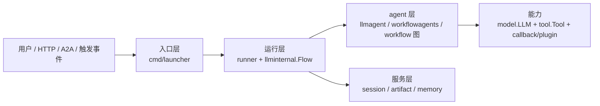

# ADK Go 本地 wiki

> 面向 `/workspace/github/adk-go` 这份检出的中文导览：模块划分、核心抽象、执行流程、工具与编排、服务与部署，每一条结论都回到本地代码核对过。组织方式参考了 DeepWiki 对 `google/adk-go` 的页面树，但**内容以本地代码为准**，与参考资料不一致的地方已在各页点明。

## 这份 wiki 的来路

- **对象**：`/workspace/github/adk-go`，模块 `google.golang.org/adk/v2`，检出在 `967bfab`（2026-09-28，*fix: preserve orphan response content during rearrangement (#1564)*）。该检出与 `upstream/main`（`google/adk-go`）完全一致，没有本地改动；唯一的未跟踪目录是 `examples/quickstart-localtool/`，属于本机自加的练习示例，已在示例页标注。
- **事实来源**：本地源码、`README.md`、`README-v2.md`、`AGENTS.md`，以及 `go list ./...` 的实际输出。所有引用的文件路径与导出符号都在本地校验过存在。
- **参考资料**：DeepWiki 的 `google/adk-go` wiki（用于确定选题与组织顺序）。它有几处已经滞后或与代码不符，本 wiki 按代码修正，并在下面「与参考资料的出入」一节列出。
- **位置**：放在父仓库 `docs/adk-go/` 下，**不写入 `adk-go/` 子模块**——那是上游代码的检出，只读。

## 页面索引

| 页面 | 内容 |
| --- | --- |
| [01-overview.md](./01-overview.md) | ADK Go 是什么、生态定位、多模块与版本线、v2 破坏性变更、仓库布局、贯穿全局的设计约定 |
| [02-getting-started.md](./02-getting-started.md) | 装依赖、最小 agent、launcher 关键字、本地开发命令、测试录制回放机制 |
| [03-core-concepts.md](./03-core-concepts.md) | `agent.Agent`、`InvocationContext` 的三层结构、Session/Event/State、Tool、Callback 与 Plugin |
| [04-agent-execution.md](./04-agent-execution.md) | `runner.Run` 的完整时序、LLM flow 的请求/响应处理器链、流式聚合、agent 转移 |
| [05-agent-types.md](./05-agent-types.md) | `llmagent` 全部配置、三种 `workflowagents`、`workflowagent`、`remoteagent`、自定义 agent |
| [06-tool-system.md](./06-tool-system.md) | Tool/Toolset 契约、`functiontool` 与 schema 生成、工具上下文、确认与长任务、MCP、内置工具、过滤 |
| [07-a2a-distributed.md](./07-a2a-distributed.md) | A2A 协议落点、Agent Card、服务端 `Executor`、客户端 `remoteagent`、`agentregistry` |
| [08-service-layer.md](./08-service-layer.md) | session/artifact/memory 三个服务接口与各类后端、Event 与 Actions 的持久化契约 |
| [09-launcher-deployment.md](./09-launcher-deployment.md) | `cmd/adkgo` CLI、launcher 与 sublauncher 分发、console 的 HITL、REST/WebUI/A2A、两朵部署路径 |
| [10-telemetry-observability.md](./10-telemetry-observability.md) | `telemetry.New` 的 options、span 层级与名称、OTLP 与 GCP 导出、内容捕获开关 |
| [11-graph-workflow-engine.md](./11-graph-workflow-engine.md) | `workflow` 包：节点、边、路由、HITL 挂起与恢复、并发 worker、重试、状态重建 |
| [12-advanced-topics.md](./12-advanced-topics.md) | 流式与 live、parent map、state 作用域、测试、事件重排、处理器、类型转换、插件、认证 |
| [13-examples.md](./13-examples.md) | `examples/` 全部 21 个目录的分组导览与运行方式，含 3 个代码走读 |
| [14-api-reference.md](./14-api-reference.md) | 公开包地图与代表符号，附「常见任务 → 该看哪个包」速查 |
| [99-glossary.md](./99-glossary.md) | 术语表：英文原词、中文解释、定义所在文件 |

## 先读哪几页

按你手上的问题挑：

- **想先跑起来**：[02-getting-started.md](./02-getting-started.md) → [13-examples.md](./13-examples.md)，照着 `examples/quickstart` 走。
- **想搞懂框架怎么运转**：[01-overview.md](./01-overview.md) → [03-core-concepts.md](./03-core-concepts.md) → [04-agent-execution.md](./04-agent-execution.md)，这一串读完就有了完整的执行图景。
- **想写自己的 agent**：[05-agent-types.md](./05-agent-types.md) + [06-tool-system.md](./06-tool-system.md)。
- **想做多 agent 编排**：[05-agent-types.md](./05-agent-types.md) 里的 `workflowagents`，或直接上 [11-graph-workflow-engine.md](./11-graph-workflow-engine.md) 的图引擎。
- **想换模型后端或接自己的模型**：[14-api-reference.md](./14-api-reference.md) 的 `model` 一节 + [03-core-concepts.md](./03-core-concepts.md)。
- **想上线**：[09-launcher-deployment.md](./09-launcher-deployment.md) + [10-telemetry-observability.md](./10-telemetry-observability.md) + [08-service-layer.md](./08-service-layer.md)（把内存后端换成真后端）。
- **要改这个仓库本身**：先读 [02-getting-started.md](./02-getting-started.md) 的开发命令与测试回放一节，再看 `adk-go/AGENTS.md`（仓库自己的开发规则，比本 wiki 更权威）。

## 四层结构一眼图

一句话记住各层的职责：入口层**把 agent 跑起来**，运行层**编排一次运行并落库**，agent 层是**可组合的执行单元**，服务层是**可替换的持久化后端**。层与层之间只靠接口连接。

## 与参考资料的出入（本 wiki 按代码修正的地方）

写作过程中发现 DeepWiki 的对应页面有几处已经对不上本地 v2 代码，各页已按代码写并在文中点明：

- 最低 Go 版本：参考页写的是旧值，本地 `go.mod` 是 `go 1.26.6`（见 02）。
- 遥测：`telemetry.New` 目前**没有** MeterProvider（源码里是 `TODO(#479)`）；`-otel_to_cloud` 只增加 GCP 的 **trace** exporter，日志到 Cloud Logging 尚不可用；span 的实现位置在 `internal/telemetry/node_tracing.go` 而非 `workflow/node_span.go`（见 10）。
- 图引擎：`Concat` 只合并 `Edge`/`[]Edge`；`RetryConfig` 字段名是 `InitialDelay`/`ShouldRetry`，`MaxAttempts` 默认 5；`RunState` 并不写进 `session.State`，跨轮靠扫历史重建（见 11）。
- 流式聚合：`streamingResponseAggregator.aggregateResponse` 当前对所有分支都返回 nil，所以中间聚合事件实际上不会被 yield（见 12）。
- agent 转移：Go 侧**没有**为 transfer 设跳数或深度上限，转移在 flow step 内联执行，真正的护栏是纯思考轮上限与 `ModeTask`/`ModeSingleTurn` 之类的模式排除（见 04）。

## 维护说明

- 本 wiki 是**某一时点**的快照，不对应任何发布版本。`adk-go` 子模块更新后，页面里引用的行号与实现细节可能滞后；引用路径与符号仍然可靠。
- 更新 `adk-go` 检出后，若要刷新本 wiki，按每页的「涉及代码」清单重新核对即可；结构与文件名不要改，交叉链接依赖它们。
- `adk-go/` 是只读的上游检出，改动请不要落在那里。
